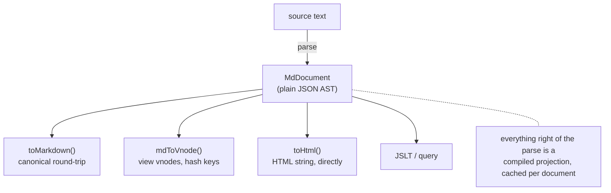

# @jarenjs/md Architecture

How the Markdown engine is put together, and where its speed comes
from. The user-facing story is the [README](README.md); the normative
contracts are [MD-FORMAT.md](docs/MD-FORMAT.md),
[PLUGINS.md](docs/PLUGINS.md) and [LOADER.md](docs/LOADER.md).

## Engine and component (the two layers)

The package is deliberately split in two, and the split is a hard
architectural boundary, not a filing convention:

| | Engine (part one) | Visual component (part two) |
|---|---|---|
| Entry points | `@jarenjs/md`, `@jarenjs/md/plugins` | `@jarenjs/md/component`, `@jarenjs/md/styles/md.css` |
| Source | `src/*.js`, `src/plugins/` | `src/component/`, `styles/` |
| Job | text ↔ AST ↔ vnode **values**; parse, print, load | package those values for a rendering **host** |
| Knows about | nothing outside `@jarenjs/view` (for the vnode shape) | the engine, plus `@jarenjs/app`'s viewModel/effect shapes |
| Ships CSS | no | yes (`styles/md.css`) |
| State | none — pure functions over data | memoization caches, a default plugin set |

The dependency arrow points **one way**: `src/component/` imports from
the engine; nothing in the engine imports from `src/component/` or from
`styles/`. So the engine remains a headless data toolchain usable in a
worker, an edge runtime or a build step with no notion of a host, and
the component is a thin, replaceable adapter — a second component (a
React binding, a different app framework's glue) could sit beside it
without touching the engine.

**What the component adds, and why it is not in the engine:**

- `createMdComponent()` — a `view()` projection memoized by source
  string and by parsed-document reference, so an `@jarenjs/app`
  viewModel gets reference-stable vnodes (the O(change) contract).
  Memoization *policy* (LRU size, what to key on) is a host concern,
  not a parsing concern.
- `effects` (`md-load`, `md-parse`) shaped for `createApp({ effects })`
  — the engine exposes `loadMarkdown`/`parseMarkdown` as plain
  functions; wrapping them in the app registry's
  `(props, dispatch) => …` contract is app-specific glue.
- `hydrate(container)` — walks host DOM running plugin hydrate hooks.
  The engine's `createMdRenderer` owns its own DOM; the component's
  `hydrate` upgrades DOM the *host* rendered, which only a host layer
  can coordinate.
- A default plugin set (highlighting on) and `styles/md.css` — opinions
  about presentation that a headless engine must not impose.

The jarenjs website consumes the component exactly this way: one shared
`createMdComponent()` instance feeds both the playground *Markdown* tab
and the docs-page README dialog — `view()` in the viewModel, `md-load`
in the effect registry, `md.css` imported once.

## Overview

The package follows the repository's one philosophy — **parse and
decide everything once at compile time, then run a specialized
closure** — applied to a text format instead of a JSON one:

Everything right of the parse is a compiled projection: dispatch tables
keyed on node `type`, built once per plugin set, cached per document.

### Two emitters over one AST

`mdToVnode` and `toHtml` are siblings, not layers, and there will not be
a third:

| | `mdToVnode` | `toHtml` |
|---|---|---|
| output | a patchable tree | bytes |
| identity | content-hash keys + per-node memo, so an unchanged block patches in O(1) | none — nothing downstream reconciles a string |
| raw HTML | drop / show as text / parse through an allow-list | escape (default) / skip / verbatim (`'raw'`, trusted input only) |
| conformance | limited by the format: a vnode cannot hold half an element | reaches the raw-HTML corner of CommonMark |

Implementing either in terms of the other would either import the
vnode's structural limit into the string path — defeating the point — or
cost the vnode path a serialization round trip. What they genuinely
share is factored instead: the escapers are `@jarenjs/view`'s (the same
ones its SSR renderer uses, which is what lets the two outputs be
byte-identical wherever a vnode can express the markup), the URL policy
is `@jarenjs/view/helpers`, heading slugs are `@jarenjs/core/string`'s
`slugify` behind `utils.js`, and plugin dispatch is the parser's own
table. `renderToString(mdToVnode(doc))` still works — it is simply no
longer how anyone gets a string.

A string built by folding into an accumulator beat one built from an
array of chunks joined at the end at every document size measured
(1.2–2.1× at 2–100 kB), so the emitter concatenates.

Every node type lands in both tables in the same change. A type that one
emitter knows and the other does not is the exact divergence this
arrangement exists to prevent, and the test suite drives one table of
documents through both and compares bytes rather than holding two
hand-written expectations.

## Module map

| File | Role |
|------|------|
| `src/scanner.js` | Stateless per-line classifiers (fence? heading? list marker? table row?) at char-code level; every regex compiled at module load |
| `src/parser.js` | The block parser (container stack + one open leaf), the inline parser (delimiter stack), plugin tables, `parseMarkdown`, `createIncrementalParser` |
| `src/frontmatter.js` | YAML-subset / JSON / TOML-subset parsers, written from scratch; `options.toml` injects `@jarenjs/josl` |
| `src/ast.js` | Node constructors (one hidden class per type), `walkAst`, compiled-visitor `visitAst` |
| `src/footnotes.js` | Which footnote definitions a document cites, in which order, and what to call them — the one answer both emitters use, because two implementations of an id rule is how a back-reference ends up pointing at nothing |
| `src/directives.js` | The `<!--ns:payload-->…<!--/ns-->` grammar and the pairing, once. Two scanners share it: one over the AST (what a renderer sees) and one over the source (where the bytes are), because the AST carries no offsets and giving it any would change every content-hash key |
| `src/bake.js` | Writes a derived value back into the source, splicing only the spans between markers so a hand-written document keeps every other byte |
| `src/compiler.js` | `compileMarkdown` — the closure bundle with cached projections; `frontmatterExternals`, `mdToForm` |
| `src/to-md.js` | Canonical printer (round-trip fixed point) |
| `src/to-html.js` | String emitter: AST → HTML bytes, the raw-HTML modes, `wrap` |
| `src/to-vnode.js` | Vnode emitter (per-node memo, content-hash keys), `createMdRenderer` with hydrate scheduling |
| `src/loader.js` | Shared core LRU + HTTP validators, in-flight sharing, AbortSignal, `streamMarkdown` |
| `src/plugins/` | `definePlugin` + the two reference plugins (highlight, mermaid) |
| `src/component/` | **the visual component** — `createMdComponent` (memoized `view()`, app `effects`, `hydrate`); imports the engine, never the reverse |
| `styles/md.css` | the component stylesheet (`.md` rhythm, `tok-*` token colors, mermaid placeholder), light/dark |

## The parser

### Block phase: a container stack and one open leaf

Each (detabbed) line runs through three steps:

1. **Match open containers.** The stack holds `blockquote`, `list` and
   `listItem` entries; each consumes its marker prefix (`>`, item
   indentation). A partial match either feeds a lazy paragraph
   continuation or closes the unmatched tail.
2. **Feed the open leaf.** Fences, HTML blocks, tables and plugin
   blocks consume raw lines before any block-start scanning — that is
   what makes fence content inert.
3. **Open new blocks.** One ordered scan (setext → table delimiter →
   fence → ATX → thematic break → blockquote → list marker → HTML →
   plugin rules → paragraph) that loops when a fresh container (`>`,
   list item) re-enters with the rest of the line.

The HTML-comment leaf recognizes a complete standalone `<!-- pagebreak -->`
as a core `pageBreak` node when it closes. This keeps container and streaming
behavior shared with ordinary comments while leaving inline comments,
code and larger HTML blocks opaque. Both render tables emit the same
separator; only the component stylesheet assigns screen and print layout.

Leaves buffer **raw text only**. A closed paragraph first sheds link
reference definitions into the document map, then waits.

### Inline phase: once per leaf, at close

Inline parsing runs once over each leaf's buffered text: a char-code
dispatch (backslash, backtick, `*_~` delimiter runs, brackets,
autolinks/raw HTML at `<`, entities at `&`, breaks at `\n`) with a
fast-skip loop over plain text, a delimiter stack for
emphasis/strong/strikethrough (flanking + rule of three), and a bracket
stack for links/images. Batch parsing resolves inlines after the whole
block phase (so later reference definitions bind); the incremental
parser resolves each block when it is yielded (the documented streaming
trade-off).

GFM's literal autolinks are the one construct that runs *after* that
pass rather than inside it, over the finished `text` nodes. Three
reasons, and all three are structural rather than stylistic: the trigger
characters are `w`, `h`, `f` and `@`, so putting them in the dispatch
table would break the plain-text fast path on roughly every tenth
character of English prose; an email address begins to the LEFT of its
trigger, which a forward scanner cannot see; and the rule that pulls
`&hl;` back out of a link is only meaningful once character references
have been resolved, because a REAL entity is no longer spelled `&…;` by
then. It costs ~0.27 ms on a 100 kB GFM document, measured A/B, and
nothing at all with `gfm: false`.

### Plugin tables

`buildPluginTables(plugins)` merges a plugin array into five maps —
fence claims by info word, block rules by first character, inline rules
by trigger character, renderers and hydrators by node type — memoized
by array identity, so a module-level plugin array is compiled exactly
once per process. With no plugins the parser shares one frozen
empty-table object; the hot loop's only cost is a `Map.get` on lines
and trigger characters that already look special.

## Structural sharing, end to end

Three layers cooperate to make the *re-render* path O(changes), the
same design the view/app stack is built on:

1. **The AST is share-friendly.** Plain JSON, fresh per parse, never
   mutated after return — so JSLT's copy-on-write engine keeps every
   unmatched subtree reference-equal, and an identity transform returns
   the input itself.
2. **The vnode emitter is memoized per node reference.** Same AST node
   → same vnode reference (a `WeakMap` on the plugin-table object), so
   a transformed document only re-emits the blocks that actually
   changed. The memo outlives one emission — a `CompiledMd` carries it
   — so its cache identity is the node *plus every option that changes
   the output*: `keyed`, `html` and `sanitizeUrl` are stored with the
   entry and compared on hit. Re-emitting the same compiled document
   with `html: 'text'`, or with a different sanitizer, therefore can
   never be served a vnode the previous option produced. `sanitizeUrl`
   is compared by function identity, so pass a stable reference (the
   default one is) rather than a fresh closure per render.
3. **Block vnodes carry content-hash keys** (structural FNV-1a, no
   intermediate JSON string), so the keyed patcher reorders moved
   blocks instead of rebuilding them, and equal content keeps its key
   across documents.

`compileMarkdown` adds the last cache: `toVnode()`/`toMarkdown()`
compute once per compiled document.

## The loader

`loadMarkdown` = normalize URL → cache lookup → fetch. Cache keys include
the URL, compile/render options and plugin/callback identities; the default
configuration keeps the URL itself as its key. The cache stores the compiled document plus its
`ETag`/`Last-Modified`; hits resolve immediately and revalidate in the
background; in-flight promises are cached so concurrent loads share one
request; failures and aborts evict. Streaming bodies feed
`createIncrementalParser` chunk by chunk, and `streamMarkdown` exposes
the same core as an async generator of completed top-level blocks whose
return value is the finished document.

`createMdCache` adapts `@jarenjs/core/cache`'s bounded LRU to the loader's
`get`/`set`/`delete`/`clear` interface and numeric-capacity policy. Recency,
entry deletion and eviction have one implementation in core.

## Performance notes

- **No per-call patterns.** Every regex in the package is a module
  constant; the highlighter compiles grammar tables to closures with a
  `Uint8Array` char-class map; the inline scanner and the tokenizer are
  single-pass with fast-skip loops.
- **Monomorphic nodes.** Constructors in `ast.js` build every node of a
  type with the same member order, which also makes the structural
  hash deterministic.
- **Do not dedup the space scanner.** `scanner.js`'s `isSpaceCode`
  matches space or tab only; `@jarenjs/core/scan`'s `isWhitespaceCode`
  matches space, tab, LF *and* CR (RFC 9535 blank space). The character
  sets differ, so md deliberately keeps its own char-code predicate
  rather than folding it into core's — Markdown line scanning treats
  line terminators as structural, not as inline whitespace.
- **Honest numbers.** `npm run benchmark:markdown` measures against
  marked/markdown-it/micromark and scores the official CommonMark
  examples; the README quotes the results with date and Node version.
  The one-shot parse+render row is within ~1.1–1.5x of the fastest
  mainstream parsers; the compiled/shared re-render path — this
  package's actual job in the suite — has no equivalent there.

## Known limits (v0.1)

- The dialect is pragmatic, not fully CommonMark-conformant (87.2% of
  spec examples, 571 of 655; the scorecard attributes the rest, raw-HTML
  pass-through being the largest deliberate class).
- Inline HTML and HTML blocks are preserved in the AST but not rendered
  to vnodes by default (`html: 'text'` shows them literally).
- Streaming resolves inlines per yielded block, so a reference
  definition only binds links in blocks completed after it.
- The YAML/TOML frontmatter parsers are documented subsets
  (MD-FORMAT.md §3), with `@jarenjs/josl` as the full-TOML companion.
