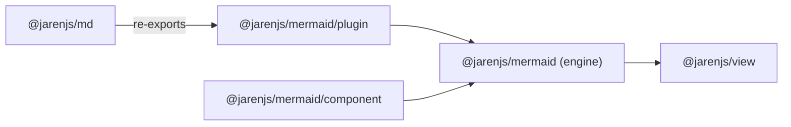
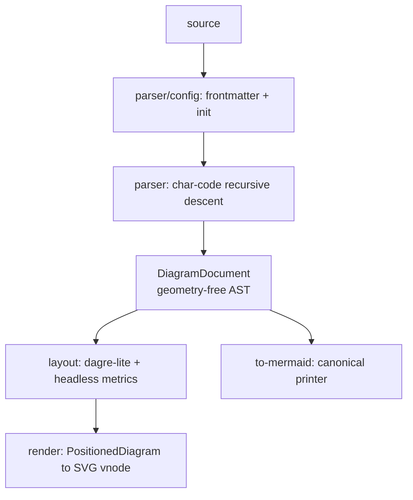

# @jarenjs/mermaid Architecture

How the headless Mermaid engine is put together, and where its speed
comes from. The user-facing story is the [README](README.md); the
normative contracts are [MERMAID-FORMAT.md](docs/MERMAID-FORMAT.md) and
the AST schema. The design mirrors [`@jarenjs/md`](../md/ARCHITECTURE.md)
deliberately.

## Engine and component (the two layers)

| | Engine (part one) | Visual component (part two) |
|---|---|---|
| Entry points | `@jarenjs/mermaid`, `@jarenjs/mermaid/plugin`, `@jarenjs/mermaid/theme` | `@jarenjs/mermaid/component`, `@jarenjs/mermaid/styles/mermaid.css` |
| Source | `src/*.js`, `src/parser/`, `src/layout/`, `src/render/` | `src/component/`, `styles/` |
| Job | text ⇄ AST ⇄ vnode **values**; parse, layout, render, print | package those values for a rendering **host** |
| Knows about | `@jarenjs/core` + `@jarenjs/view` (shared SVG builders in `@jarenjs/view/helpers`, `hashContent` from core) | the engine, plus `@jarenjs/app`'s viewModel/effect shapes |
| Ships CSS | no | yes (`styles/mermaid.css`) |
| State | none — pure functions over data | memoization caches |

The dependency arrow points **one way**. The engine never imports the
component, `@jarenjs/app`, the DOM, or `@jarenjs/md` — so it runs in a
worker, an edge runtime or a build step. The Markdown plugin sits on the
**md → mermaid** arrow (never the reverse):

`@jarenjs/mermaid/plugin` returns a self-frozen `MdPlugin`-shaped object
**without** importing `definePlugin` from md, so there is no cycle;
mermaid stays opt-in (not in md's `DEFAULT_PLUGINS`).

## Overview — parse once, then specialized closures

Everything right of the parse is a compiled projection specialized per
diagram type. `compileMermaid` caches `toVnode`/`toSvgString`/`toText`
so each computes at most once.

## Module map

| Path | Role |
|------|------|
| `src/parser/config.js` | `---` front-matter + `%%{init}%%` → `config` (built-in YAML subset; md parser injectable) |
| `src/parser/{flowchart,sequence,class,er,state,gantt,pie}.js` | char-code recursive descent; module-const sticky regexes; `fail(msg, line)` |
| `src/parser/index.js` | detect type on the first non-config line, dispatch, assemble the envelope |
| `src/ast.js` | monomorphic node constructors + `walkSequence` |
| `src/to-mermaid.js` | canonical AST → text printer (round-trip fixed point) |
| `src/layout/metrics.js` | `measureText` from a precomputed advance-width table (no `getBBox`) |
| `src/layout/{flowchart,sequence}.js` | pure, deterministic `PositionedDiagram` scene graphs |
| `@jarenjs/view/helpers` | shared tagged-array SVG vnode builders over `h()`; `sanitizeHref` (the engine imports them, no local copy) |
| `src/render/{flowchart,sequence,misc,error}.js` | specialized `PositionedDiagram → vnode` closures + the D7 error box |
| `src/theme.js` | `--mm-*` token tables resolved through the shared `@jarenjs/view/helpers` `resolveTheme` (concrete colors **and** CSS variables) |
| `src/plugin.js` | the self-frozen Markdown plugin (D9) + `refreshMermaidFence` |
| `src/component/index.js` | `createMermaidComponent` (memoized `view()`, app effects, no-op hydrate) |

## Structural sharing, end to end

The same design as the view/app stack makes the *re-render* path
O(change):

1. **The AST is share-friendly** — plain JSON, fresh per parse, never
   mutated, so JSLT's copy-on-write keeps unchanged subtrees
   reference-equal.
2. **The vnode is memoized per compiled document** — same source → same
   vnode reference, which the view patcher skips in O(1) (VIEW-FORMAT
   §5.1).
3. **Vnodes carry content-hash keys** — `hashContent` (the suite's single
   copy, from `@jarenjs/core`) keys the root and reused sub-scenes, so the
   keyed patcher moves rather than rebuilds.

## Layout & metrics

Text is measured with a per-codepoint advance-width table for a default
sans-serif at unit em — an approximation, single-pass, no allocation, no
DOM. Flowchart layout is a compact dagre-lite: longest-path rank
assignment, stable within-rank ordering, banded coordinate assignment,
straight border-clipped edges. Sequence layout resolves lifelines,
message y-advance, activation bars, notes and nested block frames. All
pure and deterministic, so golden-JSON tests review any geometry drift.

## SVG vnodes, not innerHTML (D2)

The old `@jarenjs/md` mermaid plugin injected a caller-supplied
`mermaid` instance and swapped in `innerHTML` after mount. This engine
emits **tagged-array vnodes** rooted at `['svg', …]`; the view patcher
creates the whole subtree in the SVG namespace and escapes text and
attributes. That inherits, for free: O(change) diffing, keyed
reconciliation, SSR via `renderToString`, and CSP-safety. `render` is
synchronous and complete, so a Markdown document with a `mermaid` fence
renders to a full SVG string through SSR with **no browser** — a
capability real Mermaid lacks. `hydrate` is therefore a no-op in v1,
reserved for optional pan/zoom later.

## Known limits (v0.1)

- No `foreignObject`/`htmlLabels:true` (blocked by `@jarenjs/view` 0.1) —
  labels are SVG `<text>`. See ROADMAP.
- Pixel parity with browser-Mermaid is a non-goal; layout is a
  deterministic approximation.
- Class/ER/state/gantt render as structured panels (not full
  domain-specific layouts); secondary types render a labeled
  placeholder.
