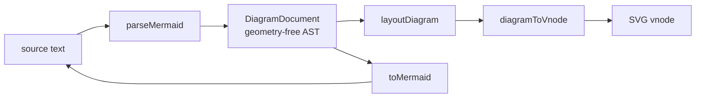
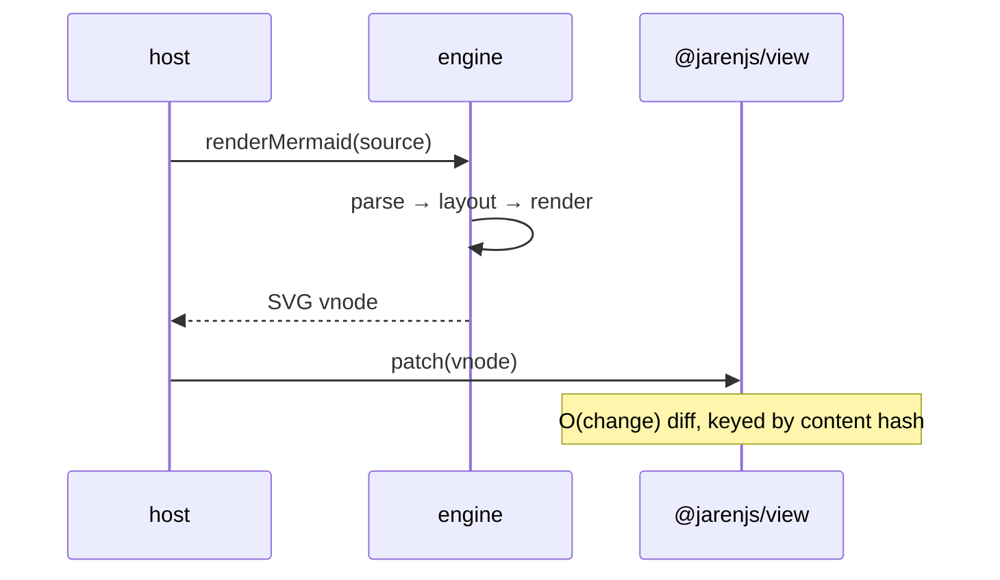
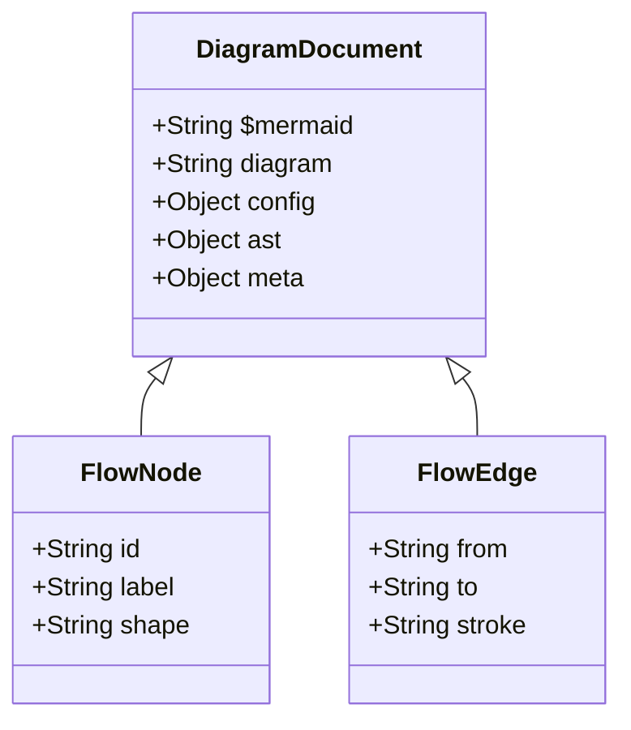
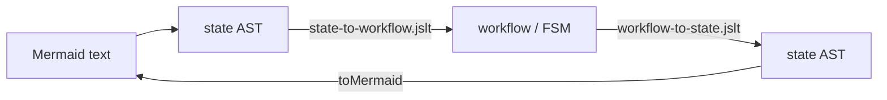

# @jarenjs/mermaid

A native, **headless** Mermaid clone: diagrams-as-code parsed to a
geometry-free JSON AST and rendered as **pure-vnode SVG** through
[`@jarenjs/view`](../../packages/view) — no `innerHTML`, no browser, no
runtime dependency on mermaid.js. It is architecturally native to the
Jaren stack: parse-once/compile-to-closures, structurally shared,
content-hash-keyed, and **bidirectional** (`parseMermaid` ⇄
`toMermaid`).

Like [`@jarenjs/md`](../md), it ships in **two layers**: a pure engine
(text ⇄ AST ⇄ vnode) that knows only the vnode shape, and a visual
component that packages it for an `@jarenjs/app` host.

## Format in one glance

```js
import { parseMermaid, toMermaid, renderMermaid } from '@jarenjs/mermaid';

const doc = parseMermaid(`flowchart TD
  A[Start] --> B{OK?}
  B -->|yes| C((Done))`);

doc.diagram;        // 'flowchart'
doc.ast.nodes[1];   // { id: 'B', label: 'OK?', shape: 'diamond' }
toMermaid(doc);     // canonical text — parseMermaid(toMermaid(doc)) deep-equals doc.ast
renderMermaid(doc); // ['svg', { viewBox, … }, …]  — a pure-vnode SVG, error-safe
```

The AST is **geometry-free**: layout is a separate pass, so the AST is a
faithful semantic model — a directed graph, an ordered interaction, a
finite state machine — that other engines project. This is the two-layer
pipeline, drawn in Mermaid (and rendered by this engine on the website):



## Usage

**Parse / print / compile (pure):**

```js
import { parseMermaid, toMermaid, compileMermaid } from '@jarenjs/mermaid';

const c = compileMermaid(source);   // parse once; cached projections
c.doc;                              // the DiagramDocument
c.toVnode();                        // pure-vnode SVG (reference-stable)
c.toSvgString();                    // standalone SVG string — SSR, no browser
c.toText();                         // canonical Mermaid (toMermaid)
```

**Render pipeline:**



**Component (host):**

```js
import { createMermaidComponent } from '@jarenjs/mermaid/component';
const mermaid = createMermaidComponent();
createApp(appDoc, {
  effects: { ...mermaid.effects },                       // mermaid-render, mermaid-load
  viewModel: (state) => ({ ...state, diagram: mermaid.view(state.source) }),
});
```

**Markdown plugin** — a `mermaid` fence renders inline, SSR-safe:

```js
import { parseMarkdown, mdToVnode } from '@jarenjs/md';
import { mermaidPlugin } from '@jarenjs/mermaid/plugin';
const plugins = [mermaidPlugin()];
mdToVnode(parseMarkdown(md, { plugins }), { plugins }); // fence → inline <svg>
```

## The AST node types



## Bidirectional semantic model

The geometry-free AST doubles as a reusable domain model. The flagship:
a `stateDiagram-v2` projects via a JSLT stylesheet
(`stylesheets/state-to-workflow.jslt.json`) into an `@jarenjs/app`
workflow / FSM `{ initial, states, transitions }`, validated by
`schemas/jaren-workflow.schema.json`; the reverse stylesheet plus
`toMermaid` turns a workflow back into editable diagram text.



## Diagram coverage

Fully laid out: **flowchart**, **sequence**. Structured panels / chart:
**class**, **ER**, **state**, **gantt**, **pie**. Parse-accepted with an
honest "not yet laid out" placeholder: mindmap, gitGraph, journey,
timeline, quadrantChart. The benchmark's coverage scorecard reports this
without hiding gaps.

## Performance (measured)

Node v22.22.2, 2026-07-19, `npm run benchmark:mermaid` (run it
yourself). Mermaid has **two** parsers, so there are two honest
head-to-heads:

- **`@mermaid-js/parser`** is the standalone **Langium** parser — it
  covers only the grammars migrated off Jison (pie, gitGraph, …) and
  **cannot parse flowchart or sequence**. The overlapping type is
  **pie**, where `@jarenjs/mermaid` is comparable (~0.003–0.006 ms/op
  either way).
- **Flowchart and sequence** are still parsed by Mermaid's original
  in-tree **Jison** grammars inside the full `mermaid` package (not by
  `@mermaid-js/parser`). Against `mermaid.parse()` (DOM-coupled, run
  under jsdom), `@jarenjs/mermaid` parses the same sources **roughly two
  orders of magnitude faster**:

| flowchart/sequence parse (ms/op) | jaren-mermaid | mermaid.parse (Jison) |
|---|---|---|
| flowchart ~5 nodes | ~0.04 | ~10 |
| sequence ~5 nodes | ~0.02 | ~1.4 |
| flowchart ~25 nodes | ~0.09 | ~7 |
| sequence ~25 nodes | ~0.05 | ~4 |

(`mermaid.parse` is async and runs the whole parse front-end — type
detection + Jison + validation — so it is heavy and noisy; these are
representative, not a bare-grammar microbenchmark.)

The headless **parse → layout → SVG string** rows are jaren-only
(~0.35 ms for a 25-node flowchart, ~1.1 ms at 100 nodes): mermaid.js
needs a browser DOM (`getBBox`) to render, so there is no fair
full-render head-to-head — producing a complete standalone SVG in pure
Node is a capability it lacks.

## Design notes

- **Two layers, one-way arrow.** The engine imports only `@jarenjs/view`
  (+ a copied `hashContent`); the component adds the app glue. The
  Markdown plugin lives on the md→mermaid arrow with no cycle.
- **CSP-safe.** No `eval`, no `new Function`, no `innerHTML`. Text and
  attributes are escaped by the view serializer.
- **Structural sharing.** Same source → reference-equal vnode; a small
  source change re-emits only affected sub-scenes; block vnodes carry
  content-hash keys.

See [ARCHITECTURE.md](ARCHITECTURE.md) and
[docs/MERMAID-FORMAT.md](docs/MERMAID-FORMAT.md).
