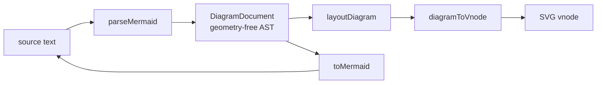
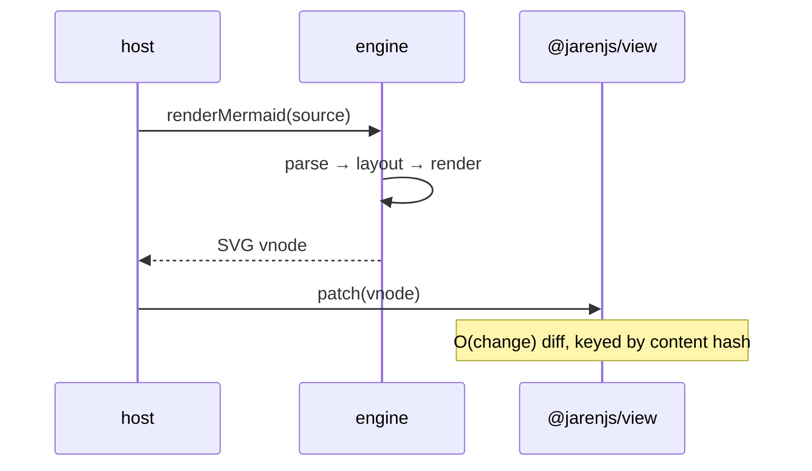
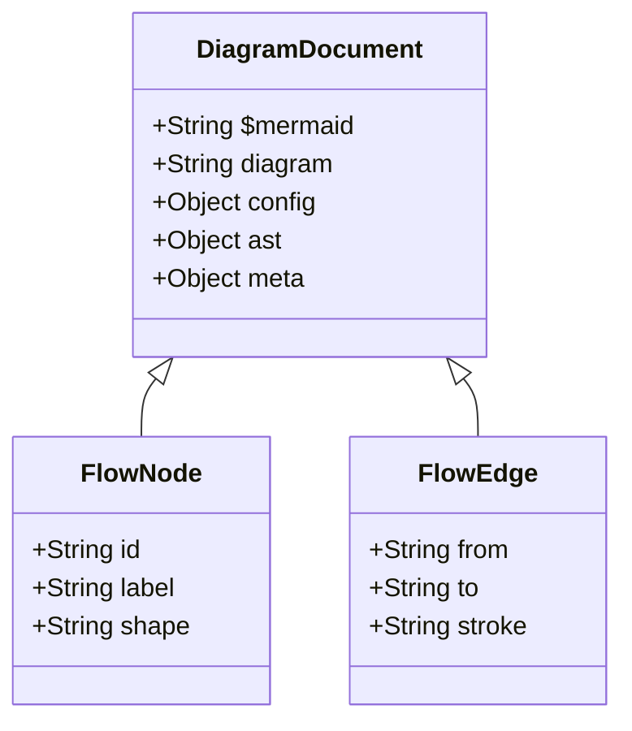
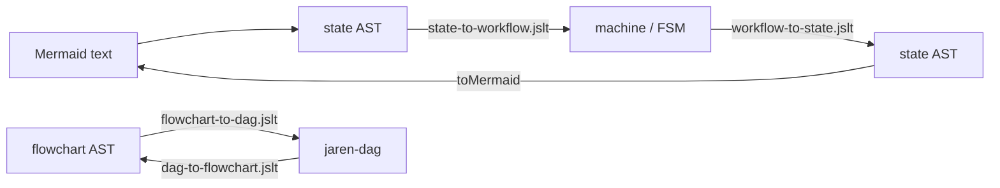
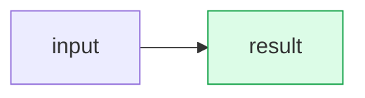
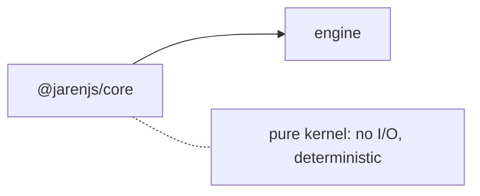

# @jarenjs/mermaid

A native, **headless** Mermaid clone: diagrams-as-code parsed to a
geometry-free JSON AST and rendered as **pure-vnode SVG** through
[`@jarenjs/view`](../../packages/view) — no `innerHTML`, no browser, no
runtime dependency on mermaid.js. It is architecturally native to the
Jaren stack: parse-once/compile-to-closures, structurally shared,
content-hash-keyed, and **bidirectional** (`parseMermaid` ⇄
`toMermaid`).

Like [`@jarenjs/md`](../md), it ships in **two layers**: a pure engine
(text ⇄ AST ⇄ vnode) that knows only the vnode shape, and a visual
component that packages it for an `@jarenjs/app` host.

## Format in one glance

```js
import { parseMermaid, toMermaid, renderMermaid } from '@jarenjs/mermaid';

const doc = parseMermaid(`flowchart TD
  A[Start] --> B{OK?}
  B -->|yes| C((Done))`);

doc.diagram;        // 'flowchart'
doc.ast.nodes[1];   // { id: 'B', label: 'OK?', shape: 'diamond' }
toMermaid(doc);     // canonical text — parseMermaid(toMermaid(doc)) deep-equals doc.ast
renderMermaid(doc); // ['svg', { viewBox, … }, …]  — a pure-vnode SVG, error-safe
```

The AST is **geometry-free**: layout is a separate pass, so the AST is a
faithful semantic model — a directed graph, an ordered interaction, a
finite state machine — that other engines project. This is the two-layer
pipeline, drawn in Mermaid (and rendered by this engine on the website):



## Usage

**Parse / print / compile (pure):**

```js
import { parseMermaid, toMermaid, compileMermaid } from '@jarenjs/mermaid';

const c = compileMermaid(source);   // parse once; cached projections
c.doc;                              // the DiagramDocument
c.toVnode();                        // pure-vnode SVG (reference-stable)
c.toSvgString();                    // standalone SVG string — SSR, no browser
c.toText();                         // canonical Mermaid (toMermaid)
c.toLayout();                       // the PositionedDiagram — pure geometry
                                    // (nodes x/y/w/h, routed edges); null for
                                    // types without a layout. The rendered
                                    // SVG also marks every node/edge with
                                    // data-id / data-edge+data-from+data-to,
                                    // so editors hit-test without re-layout.
```

**Render pipeline:**



**Component (host):**

```js
import { createMermaidComponent } from '@jarenjs/mermaid/component';
const mermaid = createMermaidComponent();
createApp(appDoc, {
  effects: { ...mermaid.effects },                       // mermaid-render, mermaid-load
  viewModel: (state) => ({ ...state, diagram: mermaid.view(state.source) }),
});
```

**Markdown plugin** — a `mermaid` fence renders inline, SSR-safe:

```js
import { parseMarkdown, mdToVnode } from '@jarenjs/md';
import { mermaidPlugin } from '@jarenjs/mermaid/plugin';
const plugins = [mermaidPlugin()];
mdToVnode(parseMarkdown(md, { plugins }), { plugins }); // fence → inline <svg>
```

## The AST node types



## Bidirectional semantic model

The geometry-free AST doubles as a reusable domain model, projected
both ways by plain JSLT stylesheets — no code, just documents. The
flagship: a `stateDiagram-v2` projects via
`stylesheets/state-to-workflow.jslt.json` into an executable machine
(the `@jarenjs/flow` jaren-fsm superset shape `{ initial, states,
transitions }`, validated by `schemas/jaren-workflow.schema.json`),
with a transition label's UML parts parsed for it: `event [guard] /
effect` become the machine's event, guard and `{ "run": effect }`
descriptor. The reverse stylesheet plus `toMermaid` turns a machine
back into editable diagram text — string guards round-trip exactly,
structured members print as documented `[…]` placeholders.

The same arrow exists for dataflow: `flowchart-to-dag.jslt.json`
projects a flowchart into a jaren-dag **skeleton** (task stubs named by
node id, edge labels becoming ports), and `dag-to-flowchart.jslt.json`
draws a real dag document as a flowchart — one shape per node kind,
ports and selects on the edge labels. Acyclicity stays `compileDag`'s
job; the projection just draws.



## Diagram coverage

Fully laid out: **flowchart**, **sequence**, **state** (through the
flowchart engine via an adapter — states as rounded nodes, `[*]` as a
filled start dot and an end ring, verbatim transition labels on the
edges; composite states stay flattened in v1). Structured panels /
chart: **class**, **ER**, **gantt**, **pie**. Parse-accepted with an
honest "not yet laid out" placeholder: mindmap, gitGraph, journey,
timeline, quadrantChart, requirement. The benchmark's coverage scorecard reports this
without hiding gaps.


## Styling, notes and interaction

**`classDef` / `class` / `style` now paint.** The parser always recorded them;
nothing consumed them, so a styled node rendered exactly like an unstyled one.
They resolve per node in Mermaid's own precedence — classDef in application
order, then a per-node `style` — and reach the shape as SVG attributes:



**`note` is a built-in class.** Mermaid has no flowchart note, and a diagram
that cannot annotate a node loses exactly what an ASCII drawing used to carry
in a margin comment. Rather than invent syntax, apply the standard `class`
statement and the node is themed from the same `note*` tokens the sequence
renderer uses — dashed border, note fill, following light/dark:



A dotted link to a note-classed node reads as an annotation, and the document
stays valid Mermaid that any other tool can still parse — no dialect, no
compatibility cost.

**The label stays readable on whatever fill you pick.** A `fill` you name is a
constant — it does not follow light/dark — so the ink over it must not follow
the theme either, or a pale box under a dark theme gets pale text and the
label vanishes into it. The ink is derived from the fill's measured contrast
instead, and is guaranteed to clear WCAG AA for any colour. Name a `color`
yourself and that always wins.

**Pan, zoom and touch are opt-in.** `mermaidPlugin({ interactive: true })`
adds a `hydrate` that attaches to the finished SVG; the render is unchanged
and server output is byte-identical either way, so a page that does not ask
for it never loads the module.

```javascript
createMdComponent({ plugins: [mermaidPlugin({ theme: 'host', interactive: true })] });
```

The interaction rules are chosen so a figure never fights the page it sits in:

| gesture | behaviour |
|---|---|
| plain wheel | **scrolls the page** — hijacking it is how embedded viewers ruin a document |
| ctrl/⌘ + wheel | zooms toward the pointer |
| one-finger drag | pans **only once zoomed in**; at rest the swipe is the page's, and `touch-action` is switched to say so |
| two fingers | always pinch-zooms |
| double-click / tap | zooms in, or resets when already zoomed |
| keyboard | `+` `-` `0` and arrows, on a focusable figure with an aria-label |

Everything runs on the SVG's `viewBox` — four numbers changing. Nothing
re-renders, nothing re-parses, and the view is clamped so it can never be
panned off its own canvas.

Pie rendering delegates to [`@jarenjs/charts`](../charts) (the pie
engine's single home) — the emitted SVG is unchanged; mermaid passes
its class names, palette and theme through the render options.

## Performance (measured)

Node v22.22.2, 2026-07-19, `npm run benchmark:mermaid` (run it
yourself). Mermaid has **two** parsers, so there are two honest
head-to-heads:

- **`@mermaid-js/parser`** is the standalone **Langium** parser — it
  covers only the grammars migrated off Jison (pie, gitGraph, …) and
  **cannot parse flowchart or sequence**. The overlapping type is
  **pie**, where `@jarenjs/mermaid` is comparable (~0.003–0.006 ms/op
  either way).
- **Flowchart and sequence** are still parsed by Mermaid's original
  in-tree **Jison** grammars inside the full `mermaid` package (not by
  `@mermaid-js/parser`). Against `mermaid.parse()` (DOM-coupled, run
  under jsdom), `@jarenjs/mermaid` parses the same sources **roughly two
  orders of magnitude faster**:

| flowchart/sequence parse (ms/op) | jaren-mermaid | mermaid.parse (Jison) |
|---|---|---|
| flowchart ~5 nodes | ~0.04 | ~10 |
| sequence ~5 nodes | ~0.02 | ~1.4 |
| flowchart ~25 nodes | ~0.09 | ~7 |
| sequence ~25 nodes | ~0.05 | ~4 |

(`mermaid.parse` is async and runs the whole parse front-end — type
detection + Jison + validation — so it is heavy and noisy; these are
representative, not a bare-grammar microbenchmark.)

The headless **parse → layout → SVG string** rows are jaren-only
(~0.35 ms for a 25-node flowchart, ~1.1 ms at 100 nodes): mermaid.js
needs a browser DOM (`getBBox`) to render, so there is no fair
full-render head-to-head — producing a complete standalone SVG in pure
Node is a capability it lacks.

## Design notes

- **Two layers, one-way arrow.** The engine imports only `@jarenjs/core`
  and `@jarenjs/view` (shared SVG builders from `@jarenjs/view/helpers`,
  `hashContent` from core); the component adds the app glue. The Markdown
  plugin lives on the md→mermaid arrow with no cycle.
- **CSP-safe.** No `eval`, no `new Function`, no `innerHTML`. Text and
  attributes are escaped by the view serializer.
- **Structural sharing.** Same source → reference-equal vnode; a small
  source change re-emits only affected sub-scenes; block vnodes carry
  content-hash keys.

See [ARCHITECTURE.md](ARCHITECTURE.md) and
[docs/MERMAID-FORMAT.md](docs/MERMAID-FORMAT.md).
