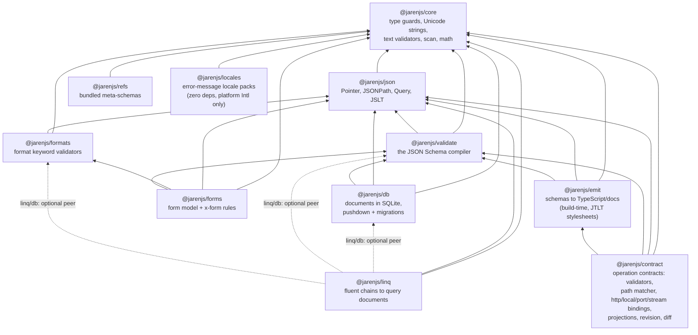
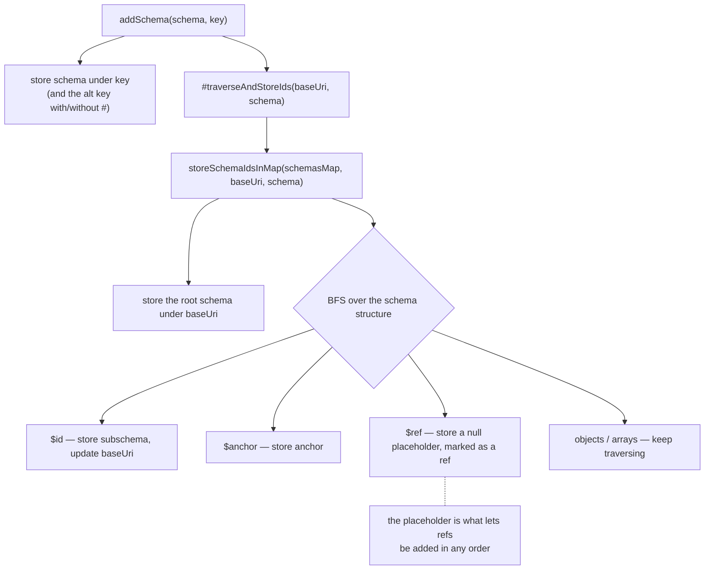

# JarenJS Architecture

This document describes the architecture of the JarenJS monorepo: how the packages fit together, the compile-to-closures design philosophy they all share, and the internal architecture of the JSON Schema validating compiler at the center of it. Deeper per-package internals live in each package's own ARCHITECTURE document (linked below); the user-facing stories are the package READMEs.

## Table of Contents

- [Overview](#overview)
- [Monorepo Layout](#monorepo-layout)
- [Core Design Principles](#core-design-principles)
- [Four-Phase Architecture](#four-phase-architecture)
  - [Phase 1: Schema Registration](#phase-1-schema-registration)
  - [Phase 2: Schema Traversal](#phase-2-schema-traversal)
  - [Phase 3: Compilation](#phase-3-compilation)
  - [Phase 4: Validation](#phase-4-validation)
- [Key Components](#key-components)
  - [JarenValidator](#jarenvalidator)
  - [ValidationRoot](#validationroot)
  - [ValidationObject](#validationobject)
- [$ref Resolution](#ref-resolution)
- [Annotation Tracking](#annotation-tracking-unevaluatedproperties--unevaluateditems)
- [Dynamic References](#dynamic-references)
- [Drafts and Vocabularies](#drafts-and-vocabularies)
- [Data Structures](#data-structures)
- [Performance Optimizations](#performance-optimizations)
- [Error Handling](#error-handling)
- [Testing, Benchmarks and Debugging](#testing-benchmarks-and-debugging)

---

## Overview

JarenJS is a JSON toolchain built around a JSON Schema validator that compiles schemas into optimized validation functions. The architecture separates schema loading (URI resolution), compilation (validator creation), and validation (data checking) into distinct phases to enable compile-time optimizations and fast runtime performance.

The sections from [Core Design Principles](#core-design-principles) onward describe the validator (`@jarenjs/validate`); the compile-to-closures philosophy laid out there is shared by every compiler in the repository — the JSONPath, pointer, query and JSLT engines apply the same two-stage split.

## Monorepo Layout

The workspace is a dependency chain; every published workspace declares its Jaren dependencies as ordinary `dependencies`, pinned to the shared version, and carries **zero runtime dependencies** outside the repository. "Zero dependencies" throughout this repo always means *outside the `@jarenjs` scope* — a package leaning on `@jarenjs/core` rather than re-implementing a primitive is the intended shape, not an exception to the rule. The graph below is the core library stack around the validator; the vnode presentation layer and the format components build on top of it (summarized in the table that follows):



| Package | Role | Internals documented in |
|---|---|---|
| [`@jarenjs/core`](../packages/core) | Zero-dependency foundation; no JSON Schema knowledge. The suite's one home for spatial arithmetic (`core/geo`: exact orientation, geodesic measurement, boxes, geohash, the WKT round trip on one grammar walk, Mercator out) and for vector arithmetic (`core/vector`: dot, cosine and Euclidean similarity, l2 normalization and the packed binary32 form, over plain arrays — a malformed pair scores 0 rather than throwing, and nothing truncates or pads a vector into the width it was supposed to have) and for temporal algebra (`core/series`: instants, stably sorted samples and half-open `[start, end)` intervals as plain records — overlap, merge, subtract, gaps, coverage and slot enumeration, plus a static interval index whose prefix maximum end keeps a long span from being cut away, and no operation anywhere that reads a clock), and for the runtime record (`core/runtime`: the clock, the identifiers, the randomness and the zone provider a host hands once to the store, the job engine, the migration runner, every contract binding and the contract memory ledger — each subsystem's own explicit option still winning) | [core ARCHITECTURE](../packages/core/ARCHITECTURE.md) |
| [`@jarenjs/json`](../packages/json) | The addressing/query/stylesheet compilers; no JSON Schema dependency (schema *literals* compile through a host-supplied `compileTypeTest` hook). Thirteen spatial operators over GeoJSON (§8.14, conversions included), the GeoJSON meta-schema artifacts, and `$similarity` (§8.15) — the one vector operator, from which k-nearest is composed out of `$orderby` and `$subsequence` rather than spelled as a keyword | [json ARCHITECTURE](../packages/json/ARCHITECTURE.md) |
| [`@jarenjs/validate`](../packages/validate) | The validating compiler; consumes core primitives and json's compiled pointers/queries | [validate ARCHITECTURE](../packages/validate/ARCHITECTURE.md) |
| [`@jarenjs/formats`](../packages/formats) | The canonical format-tester registry plus validator-contract compilers | — (single-layer; see its [README](../packages/formats/README.md)) |
| [`@jarenjs/refs`](../packages/refs) | Data-only meta-schema bundle | — |
| [`@jarenjs/emit`](../packages/emit) | Build-time artifacts: a schema-analysis pass producing a published type model, then a JTLT stylesheet per target language | [ARCHITECTURE](../packages/emit/ARCHITECTURE.md) · [FORMAT](../packages/emit/docs/EMIT-FORMAT.md) |
| [`@jarenjs/contract`](../packages/contract) | Operation contracts: the `$contract` document compiled once into per-operation validators, transport normalizers (path/query strings decoded through the input schema's own `coerceTypes` normalizer) and a static-segment path matcher, served over HTTP, in-process (`local`) and over message channels (`port`, with collision-free client-scoped request ids), streaming `subscribe` operations (LIVE-FORMAT `{ patch, seq }` emissions as SSE and port push frames, resumable by seq) and called with JSON outcomes, projected to OpenAPI/TypeScript/Markdown/AI tools, revisioned (SHA-256 over the canonical public projection) and diffed by a published rule table; depends on core, json and validate — plus emit, reached only from the `./project` subpath — and cooperates with app/db/flow/ai by generated documents, never an import | [CONTRACT-FORMAT](../packages/contract/docs/CONTRACT-FORMAT.md) |
| [`@jarenjs/forms`](../packages/forms) | Schema → form model; imports only the pure `$ref` normalization from `@jarenjs/validate/normalize` and never runs the validator (apps wire the authoritative layer); a `geojson` field carries a `preview` hint a host with a map renderer may draw | — (see its [README](../packages/forms/README.md)) |
| [`@jarenjs/locales`](../packages/locales) | Locale packs (message catalogs) for validate & forms errors; deliberately free of any *consumer* dependency — it sits on `@jarenjs/core` like its siblings but never imports validate or forms, so either can serve any pack, and key parity with the built-in English catalogs is enforced by repo tests rather than imports; beside the packs, two opt-in `Intl` providers on their own subpaths — `intl-dates` (the calendar language from the host's ICU) and `intl-zones` (the `ZoneProvider` `@jarenjs/core/series` takes for a named zone, over the host's ICU, never reading the host's own zone) — so `core` bundles no host assumption and the default path constructs no `Intl` object | — (see its [README](../packages/locales/README.md) and [ERROR-MESSAGES](../packages/validate/docs/ERROR-MESSAGES.md)) |
| [`@jarenjs/view`](../packages/view) | The vnode format (UIs as JSON) with a keyed DOM patcher and SSR; the only DOM-touching package, depends only on core | [VIEW-FORMAT](../packages/view/docs/VIEW-FORMAT.md) |
| [`@jarenjs/app`](../packages/app) | Applications as JSON documents; the compiled dispatch loop composing view (JSLT → vnodes) and json (query actions) | [APP-FORMAT](../packages/app/docs/APP-FORMAT.md) |
| [`@jarenjs/flow`](../packages/flow) | Executable workflow documents: jaren-fsm machines as a pure step function and jaren-dag dataflow over the json engines; depends only on json, hosts in app by *emitting* standard action documents (never an import), and mermaid projects both formats as JSLT stylesheets | [FLOW-FORMAT](../packages/flow/docs/FLOW-FORMAT.md) · [APP-INTEGRATION](../packages/flow/docs/APP-INTEGRATION.md) |
| [`@jarenjs/md`](../components/md) | Markdown + frontmatter → JSON AST, rendered through view; a format component | [md ARCHITECTURE](../components/md/ARCHITECTURE.md) |
| [`@jarenjs/mermaid`](../components/mermaid) | Headless Mermaid clone → geometry-free JSON AST → pure-vnode SVG through view; a format component | [mermaid ARCHITECTURE](../components/mermaid/ARCHITECTURE.md) |
| [`@jarenjs/calc`](../components/calc) | Multi-mode calculator as an app document with pure-vnode SVG plots; its numeric kernel lives in core | [calc ARCHITECTURE](../components/calc/ARCHITECTURE.md) |
| [`@jarenjs/charts`](../components/charts) | Headless charts: definition + data → geometry-free AST → pure-vnode SVG through view, with a stream adapter over the josl readers' unified events; mermaid's pie delegates here | [charts ARCHITECTURE](../components/charts/ARCHITECTURE.md) |
| [`@jarenjs/studio`](../components/studio) | The jaren project IDE: a multi-file project (schema, view, actions, model, queries, flow) as one document, each file validated against its own grammar and assembled into runnable artifacts, hosted by an embeddable widget | [PROJECT-FORMAT](../components/studio/docs/PROJECT-FORMAT.md) |
| [`@jarenjs/play`](../components/play) | The single-engine playground: an engine is a pure function of `(source, data)`, so adding one costs a descriptor plus examples and no UI code | [PLAY-FORMAT](../components/play/docs/PLAY-FORMAT.md) |
| [`@jarenjs/josl`](../packages/josl) | JOSL (a streaming TOML superset), JSONX, and a self-healing CSV reader/writer, with incremental streaming readers for every dialect | [FORMAT](../packages/josl/FORMAT.md) |
| [`@jarenjs/linq`](../packages/linq) | Fluent chains captured by a recording proxy into plain query documents; deferred sequences, a typed surface, the async boundary, the provider contract `@jarenjs/db` fulfils (the chain imports no store), the pens that write the suite's other documents by code (one document per pen, indexed by the binder) — and, under `./db`, the store's typed front door: the package's one runtime edge, to db, validate and formats as OPTIONAL peers (dashed above), proven droppable from every other entry | [linq ARCHITECTURE](../packages/linq/ARCHITECTURE.md) · [QUERY PEN](../packages/linq/docs/QUERY-PEN.md) · [PENS](../packages/linq/docs/LINQ-FORMAT.md) |
| [`@jarenjs/db`](../packages/db) | Documents in SQLite behind driver and dialect seams: model-declared collections, the pushdown planner with honest residuals, spatial storage (derived geohash/bbox index columns, the two-stage spatial plan, geofencing live queries — one committed spatial corpus holds the engine, SQLite in Node and SQLite-in-wasm in a browser tab to the same answers), vector storage (a packed l2-normalized Float32 column per declared width, stored on every driver and never virtual, and a k-nearest plan in which the column CUTS the candidates and the engine decides the order — with the price, the rival and the brute-force ceiling published rather than claimed), the safe execution profile applied to every engine alike, real row cursors on the collection, entity and graph engines (a `for await` over a chain pulls one row per item), per-root include bounds, composite keysets with bounded pages and an unsigned structural continuation, a bounded change reader with watermarks and an explicit retention gap, an `explain()` that answers for the bound run (`streaming`, `barrier`, `budget`), document migrations | [db ARCHITECTURE](../packages/db/ARCHITECTURE.md) · [MODEL-FORMAT](../packages/db/docs/MODEL-FORMAT.md) · [MIGRATION-FORMAT](../packages/db/docs/MIGRATION-FORMAT.md) |
| [`@jarenjs/ai`](../packages/ai) | Browser-side AI: one OpenAI-compatible chat client (OpenRouter/Ollama/LM Studio, bring-your-own-key), an embeddings client over the same providers behind one embedder seam (replies reassembled by index and refused unless one finite vector of the expected width arrived per input; a deterministic demo-grade reference embedder for tests), an SSE decoder, a tool registry whose inputs `@jarenjs/validate` checks before every call, a bounded agent loop, and WebMCP registration — plus the **ledger**: a schema-validated durable goal, evidenced memories, skills and content-addressed slots over an injected storage adapter, so compaction archives a dropped round instead of destroying it and a run survives a closed tab. Above it the **environment** holds a corpus outside the context — the model sees a capped digest and works by naming slots — and the **action language** lets it author a compile-gated program over them: `map` is the only step that calls a model, its fan-out is concurrent and abortable, and a program that does not compile never runs. A `map` piece may itself be a **child agent** over its own prefix-scoped slice — depth-capped at 3, sharing one budget with the whole tree, and recording a serializable trajectory — which is the difference between an assistant and something you hand a job to. Everything heavy arrives through a seam (storage, the query compiler a `select`/`reduce` and retrieval need, the RFC 6902 patch engine a refinement applies); depends only on core and validate | [ai README](../packages/ai/README.md) |
| [`@jarenjs/website`](../packages/website) | The GitHub Pages site: the Play host, the AI assistant and the Studio (a meta-schema-gated host for AI-authored app documents), with its own data plane on a compiled `$contract`, its content collected from a `site.md` each workspace commits, and the data studio's Store pane as the browser runner of the spatial corpus — the third executor, driven by the browser suite in three engines — and its Round trip card running CSV → stylesheet → meta-schema → a throwaway store with derived spatial indexes → a linq `$within` → `explain()` → a map, in the tab (not part of the library chain) | [website README](../packages/website/README.md) |

Two deliberate inversions and one boundary pattern keep the graph acyclic while letting the layers cooperate:

- **JSON Schema as the query type system**: `@jarenjs/json`'s `$valid`/`$assert`/`$as` and JSLT schema matches accept schema literals but compile them through an injected `compileTypeTest` hook; [`@jarenjs/validate/query`](../packages/validate/src/query.js) supplies the reference hook. Dependency direction stays validate → json.
- **Queries inside schemas**: `@jarenjs/validate`'s `$query` keyword compiles a Jaren JSON Query per schema location — validate consumes json, never the other way around.
- **Generated documents across package boundaries**: `@jarenjs/contract`'s app and AI bindings are plain JSON documents plus handler factories that take a *client* — `contractAppBinding` emits a state slice, actions and a schema the consumer feeds to `@jarenjs/app`, `createContractEffect(client, { createTaskEffect })` receives the task-effect factory from the host, and `contractTools` produces the `ToolDef` shape `@jarenjs/ai` reads — so the contract package never imports app, ai, db or flow (the same pattern `fsmToApp` and the db live binding established).
- **One declared edge, one direction**: `@jarenjs/linq/db` — the store's front door — imports `@jarenjs/db`, `@jarenjs/validate` and `@jarenjs/formats` as OPTIONAL peer dependencies (the dashed edges above); the chain and every pen of `@jarenjs/linq` import none of them, the store never imports linq, and three gates hold the direction (a tree-shaking probe per entry, the packed-consumer probe without and with the peers, and an edge suite over both packages' sources and declarations).
- **One corpus, three executors**: the spatial corpus (`test/json/fixtures/spatial-corpus.json`) is generated by the `@jarenjs/json` engine and re-run, unchanged, by `@jarenjs/db` over `node:sqlite` and by the website's data studio over the wasm build in Chromium, Firefox and WebKit — the same query document, three executors, one recorded answer per entry — so a planner promotion or a driver difference that changes an answer fails a test rather than a benchmark. The projection an executor needs (documents, query, model) lives once, in `scripts/lib/spatial-corpus.js`, shared by the Node runner and the site build; the browser leg proves execution, not durability, since a tab without OPFS runs the corpus in memory. The vector corpus (`test/json/fixtures/vector-corpus.json`, projected by `scripts/lib/vector-corpus.js`) is the same instrument for k-nearest, with its three executors all inside `npm test`: the engine, `node:sqlite` and the real wasm build, each entry run against a collection that declares the vector column and one that declares nothing, so the physical mapping is never allowed to be visible in an answer. Ties, offsets and the errors a refused shape raises are part of what must match, and every k-nearest entry also asserts the plan MODE — a query that quietly fell back to reading the whole collection would agree forever and scan forever.

### Key Files of the validator

The rest of this document describes `@jarenjs/validate`. Its main source files:

| File | Purpose |
|------|---------|
| `packages/validate/src/index.js` | Main validator classes (`JarenValidator`, `ValidationRoot`, `ValidationObject`) |
| `packages/validate/src/traverse.js` | Schema traversal and ref resolution (`storeSchemaIdsInMap`, `restoreSchemaRefsInMap`) |
| `packages/validate/src/schema.js` | Schema compilation dispatcher (`compileSchemaObject`), `$recursiveRef`/`$dynamicRef` |
| `packages/validate/src/messages.js` | Report-time error conversion, message catalogs & the `errorMessage` keyword (`ValidationError`, `messagesEn`, `localizeErrors`) |
| `packages/validate/src/query-keyword.js` | The `$query` extension keyword (Jaren JSON Query assertions inside schemas) |
| `packages/validate/src/array.js` | Array validation logic |
| `packages/validate/src/object.js` | Object validation logic |
| `packages/validate/src/string.js` | String validation logic |
| `packages/validate/src/number.js` | Number validation logic |
| `packages/validate/src/combine.js` | `allOf`/`anyOf`/`oneOf`/`not` |
| `packages/validate/src/condition.js` | `if`/`then`/`else` |
| `packages/validate/src/unevaluated.js` | `unevaluatedProperties`/`unevaluatedItems` final-stage validators |
| `packages/validate/src/dynamic-ref.js` | Dynamic-scope helpers and `$dynamicAnchor` collection |
| `packages/validate/src/tools.js` | Shared helpers, `EvalLog` annotation log, `ValidationResult` |
| `packages/validate/src/format.js` | The `format` keyword and format-compiler registry |
| `packages/validate/src/dollar-data.js` | Ajv-style `$data` references |
| `packages/validate/src/data.js` | json-everything `data` (data-ref) keyword |

---

## Core Design Principles

### 1. Compile-Time Optimization

The most important insight from Jaren's development: **all ref resolution must happen at compile time**. This means:

- `$ref` chains are flattened during schema loading
- Validation functions are pre-compiled before any data is validated
- No URI resolution happens during validation

### 2. Eager Evaluation

Refs are resolved eagerly at compile time, never lazily on first validation. This keeps the first `validate(data)` call as fast as every subsequent one:

```javascript
const validate = compile(schema); // All refs resolved here
validate(data); // Direct function call, no resolution
```

### 3. Three-Layer Caching Strategy

| Layer | What | Lifetime |
|-------|------|----------|
| Schema Map | Schemas by URI | Per `JarenValidator` instance |
| Validation Objects | Compiled validators | Per `compile()` call |
| Regex Cache | Compiled RegExp objects | Global (1000 entry limit) |

### 4. Function Inlining

To reduce call stack depth, simple schemas compile to inline validation functions rather than delegating to helper functions:

```javascript
// Before: Multiple function calls
function validate(data) {
  return validateType(data) && validateString(data);
}

// After: Inlined for simple cases
function validate(data) {
  if (typeof data !== 'string') return false;
  if (data.length > maxLength) return false;
  return true;
}
```

---

## Four-Phase Architecture

### Phase 1: Schema Registration

**Purpose**: Build a map of all reachable schemas by URI.

**Entry Point**: `JarenValidator.addSchema(schema, key)`

**Flow**:


**Key Data Structure**: `#schemas Map<string, schema|null>`

- Keys are normalized URIs (e.g., `http://example.com/schema#`, `#/$defs/foo`)
- Values are either the schema object or `null` (for refs that point elsewhere)
- Stored at `JarenValidator` instance level (survives multiple `compile()` calls)

**Important**: At this phase, refs are stored as `null` placeholders. The actual resolution happens later.

### Phase 2: Schema Traversal

**Purpose**: Create a schemas map for a specific compilation, merging instance schemas with passed schemas.

**Entry Point**: `JarenValidator.compile(schema, schemas)`

**Flow**:
```
compile(schema, schemas)
  └── #traverseSchema(schema, schemas, instanceSchemas)
        ├── Create new schemaMap from instanceSchemas
        ├── storeSchemaIdsInMap(schemaMap, origin, schema)
        ├── (Optional) storeSchemaIdsInMap for additional schemas
        └── restoreSchemaRefsInMap(schemaMap)
              └── For each null entry:
                    ├── Try resolveRefSchemaDeep (flatten chains)
                    └── On failure: resolveRefSchemaShallow (single hop)
```

**Key Data Structure**: `schemaMap Map<string, schema>` (local to this compilation)

- Merges instance-level schemas (`this.#schemas`) with compile-time schemas
- After `restoreSchemaRefsInMap`, all ref values are resolved schemas (not null)
- **Ref chains are flattened**: `A → B → C` becomes `A → C`

**The Critical Optimization**: `restoreSchemaRefsInMap` uses `resolveRefSchemaDeep` to follow the entire ref chain at load time and store the final schema directly.

### Phase 3: Compilation

**Purpose**: Create compiled validator functions from schemas.

**Entry Point**: `JarenValidator.#compileSchemaWithRoot(...)`

**Flow**:
```
compile()
  ├── Create ValidationRoot(origin, schemaMap, formats, options)
  ├── #precompileRefs(root, schemaMap, origin)
  │     └── For each ref in schemaMap:
  │           ├── Skip if already compiled
  │           └── root.createObject(id, schema, origin)
  │                 └── ValidationObject(root, id, schema, baseUri)
  │                       └── compileValidator() → returns validator function
  └── Return jarenValidateSchema(data) function
```

**Key Classes**:

#### ValidationRoot
- Manages the `Map<string, ValidationObject>` called `#objects`
- Entry point: `validate(data)` clears errors and calls `#firstSchema.validate(data, data)`
- Creates objects via `createObject()` and caches them in `#objects`
- **Pre-compilation**: creates ValidationObjects for ALL refs before returning

#### ValidationObject
- Represents a single schema location (identified by URI)
- **Constructor**: Immediately compiles validator via `compileValidator()`
- **Key property**: `#validator` - the compiled function that validates data
- For refs: `#validator` is the target validator function (direct reference)

**The Critical Optimization**: `#precompileRefs()` iterates through `schemaMap` and creates `ValidationObject` instances for every ref. This moves object creation from validation-time to compile-time.

### Phase 4: Validation

**Purpose**: Validate data against compiled schema.

**Entry Point**: `jarenValidateSchema(data)`

**Flow**:
```
jarenValidateSchema(data)
  └── root.validate(data)
        └── #firstSchema.validate(data, dataRoot)
              └── this.#validator(data, dataRoot)
                    └── Either:
                          ├── compileSchemaObject() result (for non-ref schemas)
                          └── Target validator function (for refs, pre-compiled)
```

**Key Insight**: For refs, `this.#validator` is **already** the target validator function (set during Phase 3 pre-compilation). No resolution happens at validation time.

---

## Key Components

### JarenValidator

The main entry point for schema compilation and validation.

```javascript
const validator = new JarenValidator()
  .addFormats(formats)
  .addSchema(metaSchema);

const validate = validator.compile({
  type: 'object',
  properties: { name: { type: 'string' } }
});

const isValid = validate({ name: 'John' });
```

**Key Methods**:
- `addSchema(schema, key)` - Register a schema for reuse
- `addFormats(formats)` - Register format validators
- `compile(schema, schemas)` - Compile a schema into a validation function

### ValidationRoot

Manages the validation context for a single `compile()` call.

**Responsibilities**:
- Store all `ValidationObject` instances in `#objects` Map
- Provide `validate(data)` entry point
- Manage error collection (when `skipErrors: false`)

**Key Properties**:
- `#objects: Map<string, ValidationObject>` - All compiled validators
- `#errors: InternalValidationError[]` - Collected errors
- `#firstSchema: ValidationObject` - Entry point schema

### ValidationObject

Represents a single schema location and its compiled validator.

**Constructor**:
```javascript
new ValidationObject(root, id, schema, baseUri)
  └── compileValidator() // Compiles schema to function immediately
```

**Key Properties**:
- `#path: string` - The URI identifying this schema location
- `#schema: object` - The schema object
- `#validator: function` - The compiled validation function
- `#root: ValidationRoot` - Parent root

**For `$ref` schemas**:
- The `#validator` is set to the target's validator function directly
- No indirection or lookup at validation time

---

## $ref Resolution

### Complete Flow Example

Given schema:
```json
{
  "$ref": "#/$defs/foo"
}
```

**Phase 1 (Registration)**:
- `storeSchemaIdsInMap` stores `#/$defs/foo` as a null placeholder in schemasMap

**Phase 2 (Schema Traversal)**:
- `restoreSchemaRefsInMap` sees the null entry for `#/$defs/foo`
- Calls `resolveRefSchemaDeep` to find the final schema
- If `/$defs/foo` contains `{ "$ref": "#/$defs/bar" }`, it follows that too
- Eventually finds the final schema (e.g., `{ "type": "string" }`)
- Stores final schema directly: `schemasMap.set("#/$defs/foo", { type: "string" })`

**Phase 3 (Compilation)**:
- `#precompileRefs` iterates through schemasMap
- For entry `#/$defs/foo`, creates ValidationObject
- `compileValidator` sees this is a ref (has `$ref` property)
- Resolves the ref to the target ValidationObject (which was just created)
- Sets `this.#validator = targetValidator` (direct function reference)

**Phase 4 (Validation)**:
- Validator function is called with data
- For the ref schema, directly calls the target validator (no lookup)

### Base URI Resolution

When schemas have `$id` that changes the base URI:

```jsonc
{
  "$id": "http://example.com/schema",
  "$defs": {
    "nested": {
      "$id": "nested/",
      "$defs": {
        "deep": {
          "$ref": "folder/file.json"  // Resolves against http://example.com/nested/
        }
      }
    }
  }
}
```

**Resolution Rules**:
1. `$id` changes the base URI for itself and all children
2. `$ref` is resolved against the current base URI. In draft 2019-09 and later this includes a sibling `$id` on the same schema object; in draft 7 and earlier `$ref` replaces the whole schema, so a sibling `$id` does not affect it
3. Relative `$id` values resolve against the parent's base URI
4. Trailing `#` is stripped for URL resolution

---

## Annotation Tracking (unevaluatedProperties / unevaluatedItems)

The `unevaluatedProperties` and `unevaluatedItems` keywords apply to whatever the rest of the schema did NOT evaluate. Supporting them requires knowing, at validation time, which properties and items were successfully evaluated by sibling keywords and by in-place applicators (`allOf`/`anyOf`/`oneOf`/`if-then-else`/`$ref`/`$recursiveRef`/`dependentSchemas`).

### EvalLog

`EvalLog` (in `tools.js`) is a per-`ValidationRoot` log of `(instance, key)` pairs:

- **Producers**: `properties`, `patternProperties`, `additionalProperties`, `items`, `prefixItems` and `additionalItems` record each successful evaluation. String keys mark object properties; numeric keys mark array indexes; the numeric key `-1` means "all items of this array". `contains` contributes item annotations in draft 2020-12 only. `propertyNames` contributes nothing.
- **Instance identity**: entries are keyed by object reference, so annotations naturally scope to the correct instance through `$ref` chains and recursion.
- **mark/rollback**: applicators that discard annotations take a `mark()` before running a subschema and `rollback(mark)` afterwards. Failed `anyOf`/`oneOf` branches roll back, `not` always rolls back, and a failed `if` rolls back before `else` runs. With tracking active, `anyOf` runs every branch (annotations from ALL successful branches count), and a lone `if` without `then`/`else` still runs for its annotations.
- **The check runs last**: `wrapUnevaluated` (in `unevaluated.js`) wraps the compiled schema validator, takes its mark before the schema starts (including a sibling `$ref`, so the ref target's annotations are visible), runs everything, and then validates the leftovers. `unevaluatedProperties`/`unevaluatedItems` themselves annotate what they validate, so outer `unevaluated*` keywords see their work too.

### Zero cost when unused

At compile time the schema set is scanned once for `unevaluatedProperties`/`unevaluatedItems` keywords (the scan knows that keys inside `properties`/`$defs`-style maps are names, not keywords). When absent, no tracking code is compiled into any validator and the log is never touched.

---

## Dynamic References

`$recursiveRef`/`$recursiveAnchor` (draft 2019-09) and `$dynamicRef`/`$dynamicAnchor` (draft 2020-12) resolve against the **dynamic scope**: the chain of schema resources entered during evaluation.

- **Resource entry**: validation of the root schema, and every `$ref` crossing into another resource, pushes ALL `$dynamicAnchor`s of that resource onto per-anchor-name stacks (`collectDynamicAnchorsDeep` gathers them wherever they sit — `$defs`, `allOf` branches, `properties` — stopping at embedded `$id` boundaries). The stacks are popped when the resource is exited (`try/finally`).
- **Resolution**: a `$dynamicRef "#name"` first checks the bookending requirement (the resolved lexical target must carry a matching `$dynamicAnchor`), then resolves to the anchor in the **outermost** resource of the dynamic scope — the bottom of the stack. `$recursiveRef "#"` behaves similarly with the anonymous anchor.
- **Pointer fragments**: a `$dynamicRef` whose fragment is a JSON pointer (e.g. `#/$defs/x`) behaves identically to `$ref`, with no dynamic resolution.

---

## Drafts and Vocabularies

The draft a schema is processed under is detected from its `$schema` declaration (`detectSchemaDraft`), with draft 7 as the default.

- **Per-document drafts (cross-draft references)**: every `ValidationObject` tracks the draft its *document* declares, inherited by subschemas. A referenced document that declares another draft is processed with that draft's keyword set: a draft-07 document ignores `dependentRequired`/`dependentSchemas`, and a pre-2020 document ignores `prefixItems`.
- **$vocabulary**: when the schema's `$schema` points to a registered custom metaschema, its `$vocabulary` selects keyword behavior. A metaschema that omits the validation vocabulary turns keywords like `type`, `enum` and `minimum` into annotations that assert nothing (applicator keywords keep working). A metaschema that declares the `format-assertion` vocabulary turns format assertion on.
- **format assertion**: through draft 2019-09 the `format` keyword asserts by default; from draft 2020-12 on it is annotation-only. The `formatAssertion` option overrides the default in either direction.
- **content keywords**: `contentEncoding`/`contentMediaType` assert in draft 7 and are annotation-only from 2019-09 on, controlled by the `contentValidation` option.

---

## Data Structures

### schemasMap Structure

```typescript
Map<string, schema | null> {
  // Root schemas
  "http://example.com/schema#" → { type: "object", properties: {...} }

  // Internal refs (after Phase 2, these point to final schemas)
  "#/$defs/foo" → { type: "string" }  // Flattened: was A→B→C, now A→C
  "#/$defs/bar" → { $ref: "#/$defs/foo" }  // If not yet resolved

  // Anchors
  "http://example.com/schema#myAnchor" → { type: "number" }
  "#myAnchor" → { type: "number" }  // Global anchor
}
```

### ValidationRoot.#objects Structure

```typescript
Map<string, ValidationObject> {
  "http://example.com/schema#" → ValidationObject {
    #path: "http://example.com/schema#",
    #validator: function validateObject(data, root) {...},
    #schema: { type: "object", ... },
    #root: ValidationRoot
  },

  "#/$defs/foo" → ValidationObject {
    #path: "#/$defs/foo",
    #validator: function validateString(data, root) {...},  // Direct reference
    #schema: { type: "string" },
    #root: ValidationRoot
  }
}
```

### Key Functions Reference

| Function | File | Purpose |
|----------|------|---------|
| `storeSchemaIdsInMap` | traverse.js | BFS traversal storing all schema IDs and refs |
| `resolveRefSchemaShallow` | traverse.js | Resolve single ref hop (baseUri + fragment) |
| `resolveRefSchemaDeep` | traverse.js | Follow ref chain to final schema |
| `restoreSchemaRefsInMap` | traverse.js | Flatten all ref chains at load time |
| `createJsonPointer` | traverse.js | Parse URI into components (id, leftUri, fragment) |
| `JarenValidator.compile` | index.js | Main entry point for schema compilation |
| `JarenValidator.#precompileRefs` | index.js | Pre-create ValidationObjects for all refs |
| `ValidationObject.compileValidator` | index.js | Compile validator, now with pre-compilation |
| `ValidationRoot.resolveObject` | index.js | Resolve ref to ValidationObject (fallback only) |

---

## Performance Optimizations

### 1. Allocation-Free Validation Calls

`ValidationRoot.validate()` performs no allocations: per-validation constants (the root validator, its dynamic-anchor registration, the root resource's `$dynamicAnchor` list) are precomputed at compile time, and reusable structures (the errors array, the dynamic-anchor stacks, the evaluation log) are cleared rather than reallocated.

### 2. Ref Chain Flattening

Ref chains (`A -> B -> C`) are flattened at load time by `restoreSchemaRefsInMap`, so a `$ref` costs a single direct function call at validation time instead of a chain of lookups.

### 3. Pre-compilation of All Refs

`#precompileRefs` creates `ValidationObject`s for every ref in the schema map during `compile()`, so the first validation is as fast as every subsequent one.

### 4. Fast Paths for Simple Schemas

Common schema shapes compile to specialized inline validators instead of composed closure chains:

- Type-only schemas (`{ "type": "string" }`) compile to a single `typeof` check.
- Single-constraint number, string, array and object schemas call their one validator directly, without pass-through stubs.
- Properties-only object schemas iterate the (fixed) schema keys with `Object.hasOwn` instead of allocating `Object.keys(data)` and doing a map lookup per data key.
- The default object-children loop is a fused per-key pass over `properties`/`patternProperties`/`additionalProperties`/dependencies that bails on the first failure without per-key result objects.

### 5. Skip Error Creation

When `skipErrors: true` (default), failed validations just return `false`; error handlers compile to constant-false functions and no error objects are ever created:

```javascript
return pattern.test(data); // No error creation
```

### 6. Compile-Time Feature Detection

The schema set is scanned once at compile time for features with runtime cost:

- `$data` references — without them, child data-path strings are never built during object validation.
- `unevaluatedProperties`/`unevaluatedItems` — without them, no annotation tracking code is compiled into any validator.

### 7. uniqueItems Without Deep Comparison

`uniqueItems` dedupes scalars through pairwise `===` (small arrays) or a `Set` (larger/mixed arrays); the pairwise deep comparison runs only among items that are actually objects or arrays.

### 8. Unicode String Length Fast Paths

Grapheme-aware string length (`useGrapheme: true`, the default) avoids `Intl.Segmenter` whenever it can:

- ASCII-only strings use `str.length` directly.
- Non-ASCII strings without cluster-forming characters (combining marks, ZWJ, variation selectors, regional indicators, Hangul jamo, emoji modifiers) count code points with a simple surrogate-aware loop.
- Only strings that can actually form multi-codepoint grapheme clusters pay for the segmenter.

### 9. Format Fast Paths

Format validators try a cheap common-case check before a comprehensive one, e.g. email validates the dot-atom form with a single regex and only falls back to RFC 5321 quoted-string/address-literal parsing when that fails; IRI validation uses a simple regex for ASCII-only input.

---

## Error Handling

### Error Collection

Internally, `skipErrors: false` accumulates raw `InternalValidationError`
records in `ValidationRoot.#errors`. Those records are an implementation
detail: they carry the offending object, the expected value and a timestamp,
keyed for cheap allocation on the failure path rather than for reading.

`collectErrors: true` is the public surface. It implies `skipErrors: false`
and additionally converts the internal records into `ValidationError`
instances at the end of a validation, which the compiled validator returns:

```javascript
const validator = new JarenValidator({ collectErrors: true });
const validate = validator.compile(schema);

const { valid, errors } = validate(data);
```

There is no `errors` property on the validator instance — the result is
returned, which is what keeps a compiled validator reentrant.

### Error Structure

```typescript
interface ValidationError {
  keyword: string;        // 'type', 'minLength', etc.
  instancePath: string;   // RFC 6901 JSON Pointer into the data
  schemaPath: string;     // Absolute URI into the schema
  params: object;         // Raw structured values, never prose
  msgid: string;          // Stable catalog key (defaults to keyword)
  message: string;        // Rendered text; '' when messages: false
}
```

The `msgid`/`params` pair is what makes report-time i18n possible without
recompiling; see [ERROR-MESSAGES.md](../packages/validate/docs/ERROR-MESSAGES.md)
for the normative contract.

### Error Handler Optimization

The `createErrorHandler` method returns different functions based on `skipErrors`:

```javascript
createErrorHandler(expected, key) {
  // Fast path: just return false
  if (this.#root.options.skipErrors) {
    return () => false;
  }

  // Full path: create and store error
  return (data, ...meta) => {
    this.#root.errors.push(new InternalValidationError(...));
    return false;
  };
}
```

---

## Testing, Benchmarks and Debugging

Unit tests live in `test/` at the repository root, organized per package (`npm test`, or `npm run test:core` / `test:json` / `test:validate`). The conformance suites, performance profilers and analysis tools all live in the benchmark workspace and are documented in [benchmark/README.md](../benchmark/README.md):

- `profiler.js` — JSON Schema performance vs Ajv over the official test suite (the source of the README's conformance table);
- `debug.js` — inspect, run, export and step through individual suite test cases, with Jaren-vs-Ajv comparison;
- `coverage.js` — merged function-coverage analysis over the suite and/or unit tests (untouched-function and dead-code reports);
- `callgraph.js` — hot-path call graphs via the Node.js profiler;
- `jsonpath.js`, `jsonpointer.js`, `jsonquery.js`, `jslt.js` — compliance and performance for the `@jarenjs/json` engines;
- `qt3-runner.js` — the tiered W3C QT3 scorecard (see [benchmark/qt3-README.md](../benchmark/qt3-README.md)).

Validator-specific troubleshooting recipes — "Can not resolve schema for 'X'", first-validation slowness, test interference, ref-resolution logging — are collected in the [validate ARCHITECTURE debugging guide](../packages/validate/ARCHITECTURE.md#debugging-guide).

---

## Implementation Notes

### How $ref Works

1. **Draft 7 and earlier - $ref ignores siblings**: when a schema has `$ref`, all other keywords are ignored, the referenced schema completely replaces the current schema, and a sibling `$id` does not affect `$ref` resolution
2. **Draft 2019-09 and later - $ref has siblings**: `$ref` is just another keyword; sibling keywords (including `unevaluatedProperties`/`unevaluatedItems`) apply together with the referenced schema, and a sibling `$id` DOES establish the base URI the `$ref` resolves against
3. **Location-independent identifiers**: Anchors like `#foo` should be resolvable within their document
4. **Ref chain resolution happens at compile time**: pre-resolved via `restoreSchemaRefsInMap` and `#precompileRefs`

### ECMAScript Regex in JSON Schema

1. **Unicode flag required**: All regex patterns use the `u` flag for proper Unicode support
2. **Unicode property escapes**: Patterns using `\p{...}` require the `u` flag
3. **Surrogate pairs**: Non-BMP characters (like emojis) are represented as surrogate pairs in JavaScript

---

## Summary

JarenJS validates all of draft-06, draft-07, 2019-09 and 2020-12 - passing the official JSON-Schema-Test-Suite for draft-07 and 2019-09 in full, and all of 2020-12 except the `$dynamicRef` cases named in `ROADMAP.md` - and achieves high performance through:

1. **Compile-time ref resolution** - All refs resolved before validation
2. **Function inlining** - Simple schemas compile to direct checks
3. **Fast paths** - ASCII-only checks skip expensive Unicode operations
4. **Error skipping** - Default mode avoids error object creation
5. **Efficient data structures** - Maps for O(1) lookups, allocation-free validation calls
6. **Compile-time feature detection** - annotation tracking and data-path building only exist in compiled validators that need them

The architecture cleanly separates concerns:
- **Schema loading** handles URI resolution and ref flattening
- **Compilation** creates optimized validation functions, selects draft and vocabulary behavior
- **Validation** executes compiled functions with minimal overhead, tracking annotations and dynamic scope only when the schema requires it
