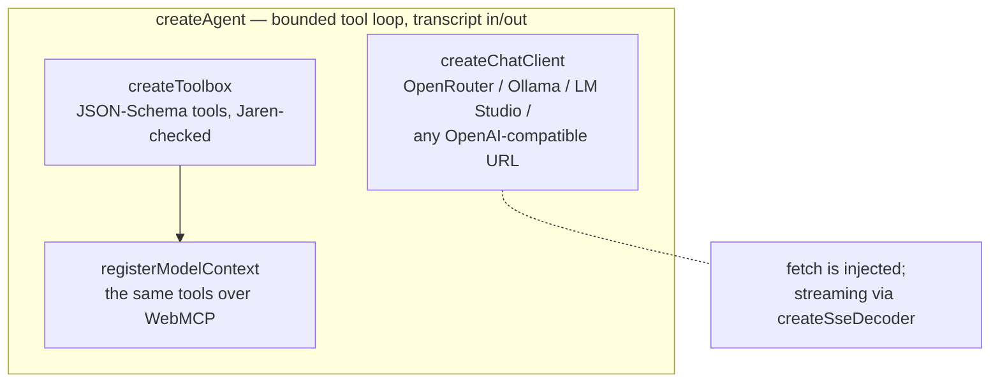

# @jarenjs/ai

Browser-side AI that actually makes sense. No server, no proxy, no SDK tower: the user
brings their own key (OpenRouter) or their own local runtime URL (Ollama, LM Studio), and
one small client speaks the OpenAI-compatible `/chat/completions` wire format all three
share. Tools are declared with JSON Schema and validated by Jaren itself before they run —
the suite guarding its own tools — and a bounded agent loop keeps even weak local models
on the rails.



## Why browser-side?

Most "AI in the app" designs put a server between the page and the model, because the
server owns the API key. When the key is the *user's own* — a personal OpenRouter key, or
`http://localhost:11434` where their Ollama runs — the server adds nothing but latency and
a place for the key to leak. The key stays in the page, requests go straight to the
provider, and a static site can ship a full assistant.

## The client

```js
import { createChatClient } from '@jarenjs/ai';

const client = createChatClient({
  provider: 'openrouter',            // 'openrouter' | 'ollama' | 'lmstudio' | 'custom'
  apiKey: userKey,                   // omit for local runtimes
  model: 'qwen/qwen3-4b',
});

const { message } = await client.complete({
  messages: [{ role: 'user', content: 'Say hi.' }],
  onDelta: (text) => process.stdout.write(text),   // streamed by default
});
```

Base URLs are forgiving: `http://localhost:11434` becomes `http://localhost:11434/v1`, a
pasted `…/chat/completions` suffix is stripped. `fetch` is injectable
(`createChatClient({ fetch: myFetch })`) so the client runs identically in the browser, in
Node, and in tests against a scripted stub. Failures carry stable codes: `AI0001` (caller
error), `AI0002` (HTTP error status), `AI0003` (malformed payload).

**Retries are built in.** Transient failures — network errors, 408, 429, 5xx — back off
exponentially with full jitter and try again (`retry: { attempts, baseMs, maxMs }`,
default 3 total tries; `attempts: 1` disables). A provider `Retry-After` header (seconds
or HTTP-date) overrides the computed delay, capped at `maxMs`. Two hard rules: a request
never retries once the caller has observed a streamed delta, and an abort cancels the
backoff immediately. The final `AI0002` reports what happened: `status`, `attempts`,
`retryAfterMs`.

**Reasoning models are first-class.** Thinking streamed as `delta.reasoning` (or
`reasoning_details`) reaches the caller through `onReasoning`, and the final message
carries a `reasoning` member — so a reasoning-only turn (empty `content`, non-empty
`reasoning`) is distinguishable from an empty one instead of rendering as a blank bubble.
The agent attaches `reasoning` to the **returned** message only: the transcript it
accumulates never carries it, so a host that persists `messages` and sends them back next
turn keeps a clean wire history.

**Thinking can be turned off** — `reasoning` is forwarded verbatim, as a client-level
default or per request: `createChatClient({ …, reasoning: { effort: 'none' } })`, and
`{ enabled: false }` does the same. (`{ exclude: true }` only HIDES the thinking; the
model still thinks and you still pay for it.) On a short, non-agentic call this is a large
win — measured on a hybrid Qwen model, a one-line answer went from 140 completion tokens
and 28.8s to 2 tokens and 0.5s. **Do not reach for it in an agent loop.** The same models,
asked to author a document through tools with thinking off, roughly doubled their tool
calls and stopped converging (2/3 then 0/3 runs reaching a green result, several hitting
the round limit): they plan the document in the reasoning channel, so removing it removes
the planning. Turn it off for classification, extraction and rewriting; leave it on for
tool use.

**Probe before the first turn.** `probeProvider({ provider, baseUrl, apiKey })` GETs the
provider's `/models` listing with exactly the auth a chat call would use and never throws:
`{ ok: true, models }` or `{ ok: false, status?, error }` — the contract a settings UI
wants for a "Test connection" button and a model picker.

## Structured output

```js
import { createStructuredOutput } from '@jarenjs/ai';
import schema from '@jarenjs/json/schemas/jaren-query.llm-profile.schema.json' with { type: 'json' };

const out = createStructuredOutput({ client, schema, name: 'jaren_query' });
const result = await out.generate([{ role: 'user', content: 'books over €10' }]);
if ('value' in result) compileJsonQuery(result.value);   // validated, ready to compile
else console.log(result.errors);                          // instancePath'd, model-readable
```

One call, every provider tier: where the provider speaks
`response_format: json_schema` the schema constrains decoding; where it only has JSON
mode, or nothing, the schema travels in a system instruction. Either way the reply is
parsed (accidental code fences stripped) and **validated locally** by `@jarenjs/validate`
— the provider is an accelerator, never the authority — and a failed round goes back to
the model with the instancePath'd errors for a bounded number of repairs (`maxRepairs`,
default 1). The query/JSLT grammars ship LLM-profile twins built for exactly this
(see `@jarenjs/json`'s README).

## Authoring engine documents — validate *and* compile

The Jaren engines are program languages published as JSON Schema — a query, a JSLT
stylesheet, an app, a flow machine. A model can author one under the schema, but "it
validates" is not "it compiles": a jaren-fsm can be structurally perfect and still name a
transition to an undeclared state, which only the *compiler* catches. So the gate for a
generated program is the schema (the **shape**) plus a compile check (the **semantics**),
and `createStructuredOutput` composes them for you with `refs` and `gate`:

```javascript
import { createStructuredOutput } from '@jarenjs/ai';
import { compileFsm } from '@jarenjs/flow';

// the two-line compile gate: success → true, a compile error → an
// outcome carrying the engine's own code + docPath
const compiles = (doc) => {
  try { compileFsm(doc); return true; }
  catch (e) { return { valid: false, errors: [{ code: e.code, docPath: e.docPath, message: e.message }] }; }
};

const out = createStructuredOutput({
  client, schema: fsmSchema, name: 'jaren_fsm',
  refs: [querySchema],   // every engine grammar $refs the query grammar — register it
  gate: compiles,        // shape (schema, constrained-decoded) + semantics (compile)
});
```

- **`refs`** are the schemas your `schema` references by `$id`. Every Jaren engine-document
  grammar composes the published query/JSLT grammars by `$ref`, so without `refs` the
  internal validator throws "Can not resolve schema". Pass the referenced grammars once.
- **`gate`** is one or more checks run *after* schema validation (the schema still drives
  constrained decoding). The first invalid check wins and its errors go back to the model.

What makes this *repairable* rather than merely "failed": every Jaren compile error carries
a stable `code` (`JQ0002`, `JT0007`, `JF0006`, …) and a `docPath` — a JSON Pointer into the
exact offending member — kept through the repair prompt. The model is told not "something
failed" but *where* and *what* — the difference between a loop that converges and one that
flails.

Nothing here is engine-specific: the same `refs` + `gate` shape authors a query, a JSLT
stylesheet, an `@jarenjs/app` document or an `@jarenjs/flow` machine. `@jarenjs/flow`'s
[README](../flow/README.md#authoring-with-a-model) shows the flow worked example end to end.

### What holds up on a cheap model (field notes)

Measured driving `qwen3.6-35b-a3b` (orchestration) and `qwen3.6-27b` (coding) through
OpenRouter on a real, complex task — designing a Kubernetes self-management state machine
and its remediation scripts. The pattern that *reliably* gets a valid, useful program out
of a small model:

- **Author with constrained structured output, not a free-form agent tool.** With
  `response_format: json_schema` the schema constrains generation and a rich, valid
  document comes back in one shot. Handing the model an *unconstrained* tool argument
  (`{ doc: object }`) and hoping it emits the right shape is far weaker — a small model
  degrades to a trivially-valid-but-empty document just to satisfy the gate, or stalls.
- **Compile errors repair; quality asks do not.** A precise `JF0006 at /transitions/0/to`
  is a fix the model lands. A terse "needs ≥6 events" invites narrow patching and burns
  rounds — enforce *breadth* in the prompt and, if a whole document is inadequate,
  **re-generate with a sharper prompt** rather than repair-patching it.
- **A few-shot example fixes *shape*.** Told in prose to make an event-driven machine, a
  small model tends to build an action *pipeline* chained by one generic event. One tiny
  worked example in the prompt flips it to the intended shape (events → transitions).
- **Pin caller-known fields.** If you ask for the script implementing action `X`, set the
  result's `action` to `X` yourself — don't trust the model's free-form label.
- **Match the adequacy metric to the shape.** An event-driven loop is *few states, many
  events*; measuring "≥5 states" pushes the model toward the wrong (pipeline) design.

The reliable *composition* of all this is a jaren-dag: one task node authors the machine
(orchestrator model, `refs` + `gate`), a query node extracts its actions, a task node
writes a validated script per action (coder model), and a query node assembles the system
— every AI output schema-validated and compiled before the next stage, no `eval`.

## A model as a dataflow node

An `@jarenjs/flow` dag runs a graph whose nodes are the suite's engines — and a *model*
is just another node. A `task` handler is three lines, and the run's shared `AbortSignal`
reaches the client for free:

```javascript
const dag = compileDag(doc, {
  tasks: {
    llm: ({ with: w, input }, signal) =>
      client.complete({ stream: false, messages: [{ role: 'user', content: prompt(w, input) }], signal })
        .then((r) => JSON.parse(r.message.content)),
  },
});
await dag.run(rows);        // the model's output flows to the next node; aborting the run aborts the request
```

That is the whole integration — no wrapper, no adapter. Guarding the model's *output*
with a downstream `query`/`jslt` node, or with `createStructuredOutput` inside the
handler, composes the same way. `@jarenjs/ai` and `@jarenjs/flow` never import each
other; the graph is the only thing that knows about both.

## The toolbox

```js
import { createToolbox, registerModelContext } from '@jarenjs/ai';

const toolbox = createToolbox();
toolbox.add({
  name: 'lookup_order',
  description: 'Look up one order by id.',
  inputSchema: {
    type: 'object',
    properties: { id: { type: 'string', minLength: 1 } },
    required: ['id'],
  },
  execute: ({ id }) => orders.get(id) ?? { error: `no order '${id}'` },
});

// the same tools, published to a browser-hosted agent (WebMCP):
registerModelContext(toolbox);
```

Every call is validated against the tool's schema by `@jarenjs/validate` before the tool
runs. `execute` never throws for content-level problems — unknown tool, invalid input, or
a throwing tool all come back as `{ error }` results the model can read and correct.

Weak models routinely JSON-*encode* a nested argument. Where the schema wants an object or
an array and a parseable JSON string arrived, the toolbox parses it and validates the
parsed value, so the tool sees what the model meant instead of a type error. A rejected
call answers `{ error, errors, inputSchema }` — up to eight validation errors as
`{ instancePath, keyword, message }`, plus the tool's own schema to re-read — and adds a
named `hint` when a property that wanted structure arrived as JSON text that does not
parse, naming the offending properties.

## The agent loop

```js
import { createAgent } from '@jarenjs/ai';

const agent = createAgent({ client, toolbox, system: 'You are…', maxToolRounds: 5 });
const { message, messages, steps } = await agent.send(history, {
  onDelta: (text) => ui.stream(text),
  onToolCall: ({ name }) => ui.activity(name),
});
```

The loop is bounded (`maxToolRounds`, default 5) and stops with a readable message instead
of spinning; oversized tool results are truncated (`maxToolResultChars`, default 8000) so
a local model's context is respected. `send` never mutates the history it receives — it
returns the complete new transcript, ready to persist and send back next turn.

**Long sessions fit a small context — for questions about one thing at a time.** That
qualification is load-bearing and the numbers below are why: compaction keeps a session
runnable and answerable one fact at a time, and a question that needs *every* fact at once
stops being answerable the moment anything is cut. `historyBudget` (characters — deterministic where
tokens are provider-private) compacts each request when the history outgrows it: the
system prompt, the first user message and the largest tail that fits always survive, and
the dropped middle becomes one synopsis message naming every dropped tool round. Cuts
happen only at tool-round boundaries, so `tool_calls`/`tool` pairing stays wire-legal —
always. The built-in synopsis is pure string work (no second model call; a single local
model runs unassisted); `compaction: (droppedRounds, addresses) => string` swaps in your
own writer. The returned transcript is always the full, uncompacted history.

On its own that is lossy, and worth being precise about, because the loss has a shape.
Each dropped tool call leaves one line whose result excerpt is capped at 60 characters, so
the synopsis remembers **that** `fetch_record` was called and returned a `REC0007` and
loses **what the record said**. Measured on <!--bm:horizon.measured-->2026-08-12, Node v22.22.2, 40 tool rounds<!--/bm--> of ~440-character results at a
6 000-character budget, with the fact behind the padding, the request keeps <!--bm:horizon.synopsisGap-->15 of 40 record ids and 7 of their 40 values<!--/bm--> (`npm run benchmark:long-horizon`). A model can see the label and answer confidently from
a record it no longer has. **Compaction alone is not the answer to a long session.**

### Compaction that moves instead of destroying

Give the agent a ledger and nothing leaves the request without a copy that can be named:

```js
import { createAgent, createLedger } from '@jarenjs/ai';

const ledger = createLedger({ storage });        // storage is yours to inject
const agent = createAgent({ client, toolbox, historyBudget: 6000, ledger });
```

`createLedger()` takes no arguments and works in memory, so a static page degrades cleanly;
durability is a storage adapter the host injects — four async methods and nothing else:

```js
const storage = {
  get: async (key) => …,              // a JSON value, or undefined
  set: async (key, value) => …,       // value is a JSON value
  delete: async (key) => …,           // an absent key is not an error
  keys: async (prefix) => […],        // every key starting with prefix
};
```

Back it with `@jarenjs/db` over OPFS, with one `localStorage` slot, with a file, with a
server — or with nothing. The package gains no dependency either way, which is the whole
posture: it loads in a static page with two dependencies and degrades to in-memory and
schema-only. This site's assistant backs it with a single JSON slot
([`ledgerStore.js`](../website/src/lib/ledgerStore.js)), which is all a browser session
needs.

The ledger holds four kinds, and they differ in every dimension that matters — lifetime,
retrieval and who may write them:

| kind | what it is | how it is retrieved | written by |
|---|---|---|---|
| `goal` | the one active objective and its append-only progress | always in the prompt | the host (`setGoal`), a refinement (progress only) |
| `memory` | an evidenced fact worth carrying past this context | `recall({ tags, where, limit })` | the host, or a gated refinement |
| `skill` | a reusable recipe: when it applies, what to do | `recallSkills(…)` | the host, or a gated refinement |
| `slot` | addressable content too big to carry; metadata is separate from the bytes | by name (`recall` the tool) | the harness — never proposed by a model |

Retrieval is tag match plus recency by default. Inject `compileQuery`
(`compileJsonQuery` from `@jarenjs/json/query`) and a `where` predicate becomes a real
query document — the same document `@jarenjs/db` could push down to SQL. Without that seam
a `where` is **refused**, not ignored: a filter silently dropped answers the wrong question
with a straight face.

Each dropped round is archived to a slot **before** the synopsis is written, and every
synopsis line carries its address:

```
[Earlier context was compacted. 33 round(s) are ARCHIVED, not lost: recall("rx-…") lists
 every address; recall(name) returns one in full. What happened:]
- called fetch_record({"index":7}) → {"id":"REC0007","notes":"xxxx… [recall("r-8kq2p-442") · 442B]
```

The excerpt is now a *preview*, not a summary. A `recall` tool is registered alongside your
own (only when there is a ledger, and never over a `recall` you registered yourself), so
the model fetches a round back when it needs one — a normal tool call that shows up in
`steps` like any other, rather than an automatic re-expansion guessing which round mattered.

- **Addresses are content-derived**, so compacting the same history twice writes the same
  slots rather than a second copy.
- **The allowance grows with the number of archived rounds** instead of being flat, and is
  capped at a quarter of the budget so the addresses cannot crowd out the recent tail. The
  budget still holds to the character.
- **The header survives truncation.** If the synopsis itself has to be cut, the per-round
  addresses go but the index address does not — and the index lists every one of them.
- **A store that refuses a write throws** (`AiError` `AI0001`). The alternative is dropping
  a round while claiming an address for it, which is the failure this exists to remove.

The contract, asserted over every budget the benchmark sweeps in both payload shapes
(`test/ai/compaction-recovery.test.js`): **every fact the full transcript held is either
still in the request verbatim or reachable through an address the request names** — <!--bm:horizon.ledgerRecovered-->40 of 40<!--/bm--> record values at the same budget, where the same runs without a ledger keep <!--bm:horizon.synopsisBand-->1 to 28<!--/bm--> of them. What that
costs is a few characters of verbatim retention at the tightest budgets, published beside
the win.

That is the model-free half. Here is a real model on the same contexts — the realistic
payload shape, one needle question per trial, scored by whether the answer is right:

<!--bm:horizon.liveNeedle-->
| history budget | without a ledger | with a ledger | recall calls |
| --- | --- | --- | --- |
| 20000 | 66.7% | 100.0% | 1 |
| 10000 | 33.3% | 100.0% | 4 |
| 6000 | 0.0% | 66.7% | 3 |
| 4000 | 33.3% | 66.7% | 4 |
| 2000 | 0.0% | 33.3% | 7 |
<!--/bm-->

The last column is the point: those answers were fetched, not remembered. A ledger row
that scored well with **zero** recalls would have scored on what was still in front of it,
and the number is printed either way so that cannot be read as a win. Three trials per row
is a small sample with a wide error bar — the ceilings above are the structural claim, this
is the check that a model can actually use them.

**And here is what it does not fix.** A question that needs *every* fact at once (which two
of forty records are closest?) is unanswerable the instant one round is cut, and a ledger
does not change that: forty rounds fetched one at a time do not fit the budget they were
cut to fit. The benchmark scores that question too and publishes it beside the needle: <!--bm:horizon.pairwise-->0% at every budget that compacts anything except ledger/front at 20000<!--/bm-->.
Recall is the wrong shape of answer for it. Moving that number needs the corpus held
*outside* the context and queried programmatically, which is a different piece of work and
is not in this package yet. The live tier of that measurement ran on <!--bm:horizon.live-->qwen/qwen3.6-35b-a3b, 3 trial(s) per row, 176 model calls<!--/bm-->.

Without a `ledger`, all of this is inert and compaction behaves exactly as it always did.

## A goal that outlives the tab

```js
const ledger = createLedger({ storage });                    // durable storage is yours
await ledger.setGoal({ objective: 'Reconcile July against the bank export.' });

const agent = createAgent({
  client, toolbox, ledger,
  budget: { turns: 40, tokens: 250_000, ms: 15 * 60_000 },   // hard stops, not warnings
  retrieval: { memories: { tags: ['reconcile'], limit: 5 }, skills: {} },
});
await agent.resume();                                        // no new instruction needed
```

The active objective and everything recorded against it are composed into the **system
prompt of every request** — unconditionally, because it is the thing being worked on.
Memories and skills are *retrieved* (`retrieval`, using the ledger's own query shape) and
are absent unless you ask for them. Progress is appended and never rewritten
(`{ at, note, evidence }`), which is what stops a resumed session redoing finished work: a
new agent built over the same storage reads what has already been tried rather than being
told.

Composition happens **in the request, never in the transcript**. `send` still returns the
full, uncomposed history, so the transcript you persist and hand back next turn carries the
immutable base prompt and the conversation — not yesterday's rendering of the goal. A goal
ends by being completed, paused or cleared (`setGoalStatus`); it never ends by being
forgotten, and there is no timeout that silently drops it.

**Budgets are refusals.** `turns` (one turn = one model call), `tokens` and `ms` each stop
the run with a named `stopReason` — `budget-turns`, `budget-tokens`, `budget-ms` — and a
message naming what remains, the same posture as `maxToolRounds`. They bound the *run*, not
the turn: the counters live on the agent, `spend()` reads them back and `budget.spent` seeds
them, so a budget survives a reload. Token accounting uses the provider's reported `usage`
and falls back to deterministic character accounting (4 chars ≈ 1 token) when a provider
reports none — stated here because a budget that silently did not apply on the runtimes
that report no usage would be worse than no budget.

### Refinement — the only way durable state changes

```js
import { createRefiner } from '@jarenjs/ai';
import { applyJSONPatch } from '@jarenjs/json';

const refiner = createRefiner({
  client, ledger,
  applyPatch: (doc, patch) => applyJSONPatch(doc, patch),   // injected, never imported
});
const result = await agent.send(history);
await refiner.refine(result);        // proposes, gates, commits — or declines
```

The model is asked what it learned, and answers with an **RFC 6902 JSON Patch** over the
supplemental state, generated through `createStructuredOutput`. Four stages, in order:
the constrained schema (three verbs, a `path` *pattern*, a cap on operations); application
to a **copy** through the injected patch engine; validation of every resulting record
against the ledger's own schemas; then a snapshot and the commit. A failure at any stage
returns coded, pointered errors for one bounded repair and then declines — nothing is
half-applied, and `rollback(result.snapshot)` restores byte-identical state after one that
succeeded.

Two properties are asserted rather than documented:

- **The base system prompt is not a patch target.** It is not in the document a patch
  applies to, and no path that could reach it matches the schema's pattern. There is no
  operation a model can write that edits its own instructions.
- **Every stored memory carries `evidence`**, because the ledger rejects one that does not.
  That is the mechanism by which "evidence-backed" is enforced rather than hoped for, and
  it is why a refinement cannot launder a hallucination into durable state.

A revised memory is stored as a new record, not an edit: a different claim, with different
evidence, at a different time. The empty patch is a legal answer, and the schema does not
demand an operation — asking a model that learned nothing to produce something is exactly
how an invented memory gets in.

### What the cheap tier does with it (measured)

Refinement is open-ended authoring, which the field notes above say weak models do badly —
so it was measured on the qwen tier rather than assumed, on a four-step incident-diagnosis
run with facts planted in the tool results (`REC0007`, `pg-bouncer`, `v4.19.2`), so that
grounding and invention are both checkable without a judge.

These figures are **dated, not regenerated** — measured 2026-08-12 by a live probe that
needs a key and fifteen model calls, so it is not part of the committed benchmark suite and
not driven by the figure gate the numbers above it are. Read them as a record of one run on
one day, and re-run the probe rather than trusting the table if it matters.

| model | trials | accepted | first attempt | records | grounded | fabricated ids | median |
|---|---|---|---|---|---|---|---|
| `qwen/qwen3.6-35b-a3b` (non-streamed, the shipped path) | 5 | 5 | 5 | 16 | 16/16 | 0 | 69 s |
| `qwen/qwen3.6-35b-a3b` (streamed) | 5 | 5 | 5 | 16 | 16/16 | 0 | 56 s |
| `qwen/qwen3.6-27b` (streamed) | 5 | 5 | 5 | 15 | 15/15 | 0 | 10 s |

**Refinement does not need a stronger model** — with one caveat that is the whole finding.
Before the prompt carried a per-path shape table and one worked example, *every* trial
failed its first attempt and needed the repair round, always the same way: a progress entry
written in a memory's shape (`text` where the goal wants `note`). The schema cannot rule
that out — one `value` union serves three paths — so it is the prompt's job. Six of six
first attempts failed without it; twenty-four of twenty-four passed with it. That is this
package's own field note ("a few-shot example fixes *shape*") applied to its own harness,
and it is the difference between refinement costing one call and costing two.

Nothing else needed a stronger model: 47 of 47 records across every tier cited something
that was actually in the run, and no trial invented an identifier. The scoring is
deliberately narrow — it checks that a claim quotes the run and that no `REC…`/`v…`/region
token appears that the run never contained — so read it as "does not fabricate the things
we can check", not as a quality score.

One incidental result, recorded because the long-horizon benchmark found the opposite:
`createStructuredOutput` sends `stream: false`, and non-streaming did **not** hang here on
the same provider. It was slower on the thinking model (69 s against 56 s median) and
identical in outcome. The smaller `27b` answered in a tenth of that, from a fifth of the
completion tokens — a thinking model spends most of a refinement thinking.

### Heartbeats are the host's

There is no scheduler here, deliberately. Re-entering a session on a timer is a *host*
concern — a browser page, a service worker, a cron — and this package injects its
environment rather than owning it. The ledger plus `agent.resume()` is the primitive: the
goal, the progress and the memories reload from storage and the run continues. What decides
*when* that happens is yours, and keeping it out is what lets the same agent run in a static
page with no store at all.

## House rules

Like every jarenjs package: ESM, zero runtime dependencies outside `@jarenjs/*`, no
`eval`/`new Function` (CSP-safe), environment injected at the edges. The jarenjs website's
assistant and its WebMCP tools run on exactly this package — the playground engines are
the toolbox, and Jaren validates the model's own tool calls.
