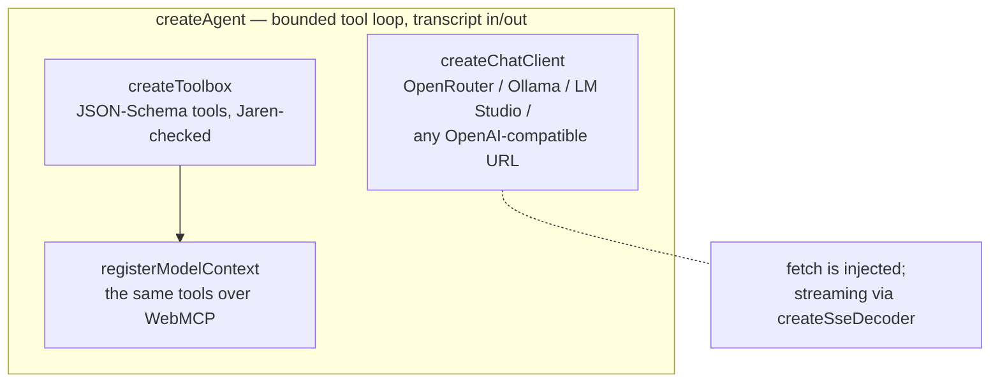

# @jarenjs/ai

Browser-side AI that actually makes sense. No server, no proxy, no SDK tower: the user
brings their own key (OpenRouter) or their own local runtime URL (Ollama, LM Studio), and
one small client speaks the OpenAI-compatible `/chat/completions` wire format all three
share. Tools are declared with JSON Schema and validated by Jaren itself before they run —
the suite guarding its own tools — and a bounded agent loop keeps even weak local models
on the rails.



## Why browser-side?

Most "AI in the app" designs put a server between the page and the model, because the
server owns the API key. When the key is the *user's own* — a personal OpenRouter key, or
`http://localhost:11434` where their Ollama runs — the server adds nothing but latency and
a place for the key to leak. The key stays in the page, requests go straight to the
provider, and a static site can ship a full assistant.

## The client

```js
import { createChatClient } from '@jarenjs/ai';

const client = createChatClient({
  provider: 'openrouter',            // 'openrouter' | 'ollama' | 'lmstudio' | 'custom'
  apiKey: userKey,                   // omit for local runtimes
  model: 'qwen/qwen3-4b',
});

const { message } = await client.complete({
  messages: [{ role: 'user', content: 'Say hi.' }],
  onDelta: (text) => process.stdout.write(text),   // streamed by default
});
```

Base URLs are forgiving: `http://localhost:11434` becomes `http://localhost:11434/v1`, a
pasted `…/chat/completions` suffix is stripped (in any case), and a query string or
fragment is refused with `AI0001` rather than spliced into the middle of every endpoint.
The resolved base is `endpoint.base`; `/chat/completions` and `/models` are both composed
from it, never re-derived from one another. `fetch` is injectable
(`createChatClient({ fetch: myFetch })`) so the client runs identically in the browser, in
Node, and in tests against a scripted stub. Failures carry stable codes: `AI0001` (caller
error), `AI0002` (HTTP error status), `AI0003` (malformed payload).

**Retries are built in.** Transient failures — network errors, 408, 429, 5xx — back off
exponentially with full jitter and try again (`retry: { attempts, baseMs, maxMs }`,
default 3 total tries; `attempts: 1` disables). A provider `Retry-After` header (seconds
or HTTP-date) overrides the computed delay, capped at `maxMs`. Two hard rules: a request
never retries once the caller has observed a streamed delta, and an abort cancels the
backoff immediately. The final `AI0002` reports what happened: `status`, `attempts`,
`retryAfterMs`.

**Reasoning models are first-class.** Thinking streamed as `delta.reasoning` (or
`reasoning_details`) reaches the caller through `onReasoning`, and the final message
carries a `reasoning` member — so a reasoning-only turn (empty `content`, non-empty
`reasoning`) is distinguishable from an empty one instead of rendering as a blank bubble.
The agent attaches `reasoning` to the **returned** message only: the transcript it
accumulates never carries it, so a host that persists `messages` and sends them back next
turn keeps a clean wire history.

**Thinking can be turned off** — `reasoning` is forwarded verbatim, as a client-level
default or per request: `createChatClient({ …, reasoning: { effort: 'none' } })`, and
`{ enabled: false }` does the same. (`{ exclude: true }` only HIDES the thinking; the
model still thinks and you still pay for it.) On a short, non-agentic call this is a large
win — measured on a hybrid Qwen model, a one-line answer went from 140 completion tokens
and 28.8s to 2 tokens and 0.5s. **Do not reach for it in an agent loop.** The same models,
asked to author a document through tools with thinking off, roughly doubled their tool
calls and stopped converging (2/3 then 0/3 runs reaching a green result, several hitting
the round limit): they plan the document in the reasoning channel, so removing it removes
the planning. Turn it off for classification, extraction and rewriting; leave it on for
tool use.

**Probe before the first turn.** `probeProvider({ provider, baseUrl, apiKey })` GETs the
provider's `/models` listing with exactly the auth a chat call would use and never throws:
`{ ok: true, models }` or `{ ok: false, status?, error }` — the contract a settings UI
wants for a "Test connection" button and a model picker.

## Embeddings

The same providers serve the OpenAI-compatible `/embeddings` wire beside `/chat/completions`
— OpenRouter at `/api/v1/embeddings`, Ollama and LM Studio at `/v1/embeddings` — and
`createEmbeddingClient` speaks it from the same resolved base, with the same key, headers,
`fetch` injection and retry policy as the chat client:

```js
import { createEmbeddingClient, probeEmbeddings } from '@jarenjs/ai';
import { cosineSimilarity } from '@jarenjs/core/vector';

const embedder = createEmbeddingClient({
  provider: 'ollama',                // the chat client's providers, keys and base URLs
  model: 'nomic-embed-text',         // required — it is half of every vector's identity
});

const [a, b] = await embedder.embed(['a cat on a mat', 'quarterly revenue']);
cosineSimilarity(a, b);              // Float32Arrays in; higher is better
embedder.dims;                       // the width, settled by the first reply (or pass `dims`)
```

**The reply is verified, not trusted.** An `/embeddings` reply carries
`data: [{ index, embedding }]`, and providers do answer a batch out of order. The client
reassembles the items by `index` into input order and refuses the reply — `AI0003`, naming
the input — unless exactly one non-empty vector of finite numbers, of the expected width,
arrived per input. An embedding attached to the wrong text is worse than an error, and this
is the one place in the suite that rule is enforced.

**A vector never travels without its identity.** Vectors from two models are pairwise
meaningless and compare into plausible garbage, so the client carries `model` and `dims`:
`dims` is either configured up front or fixed by the first reply, and every later reply is
held to it — a model that changed width under the same name is refused, never mixed.

**Retries and timeouts follow `complete()`.** Transient failures (network, 408, 429, 5xx, a
malformed 200) back off with the same `retry` option and the same `Retry-After` cap; an abort
ends everything at once. There is no default timeout, as `complete()` has none — a batch of
long texts on a local runtime legitimately takes a while; `timeoutMs` bounds each attempt when
you want one, and a timed-out attempt retries like a network failure.

**Probe before relying on it.** `probeEmbeddings({ provider, baseUrl, apiKey, model })` embeds
one word in one attempt (5 000 ms, as `probeProvider`) and never throws:
`{ ok: true, model, dims }` or `{ ok: false, status?, error }` — the contract for a settings
UI, and the live proof that a provider really serves `/embeddings`.

**The seam.** Everything in this package that consumes embeddings is written against three
members — `{ embed(texts, { signal }) → Promise<Float32Array[]>, model, dims }` — and anything
that implements them plugs in: the wire client above, a local transformer runtime, a native
embedding library. The contract a host implementation keeps: `embed` returns a Promise and
**rejects, never throws** (a synchronous throw escapes `.catch` and `Promise.all` alike — the
consumers here call it inside their own `try` so a host that slips is still caught, but the
contract is the rejection); one vector per input, in input order, all of one finite width;
`model` a non-empty string; `dims` the width, or `undefined` until a first reply settles it.
The ledger's `recall({ near })` and `embedMissing()` (§Compaction that moves) are the
consumers. This package ships no model weights, no tokenizer and no download, and publishes
no opinion on which embedding model is good; embedding *quality* belongs to the provider and
the host.

**The reference embedder is demo-grade, and says so.** `createHashEmbedder({ dims = 64 })`
implements the seam with hashed character trigrams (FNV-1a into `dims` buckets, l2-normalized)
— deterministic, dependency-free, network-free, identity `hash-trigram-<dims>`. It is
**lexical, not semantic**: two texts score high when they share letters, not when they mean the
same thing. It exists so that tests and offline demos exercise retrieval *mechanics* without a
network; it is not a substitute for a model.

The arithmetic — dot, cosine and Euclidean similarity (higher-is-better, a malformed pair
scores 0 and never throws), l2 normalization, the packed little-endian Float32 form and the
`isVector` shape guard — lives in [`@jarenjs/core/vector`](../core/README.md#vectors), the
suite's one home for it.

## Structured output

```js
import { createStructuredOutput } from '@jarenjs/ai';
import schema from '@jarenjs/json/schemas/jaren-query.llm-profile.schema.json' with { type: 'json' };

const out = createStructuredOutput({ client, schema, name: 'jaren_query' });
const result = await out.generate([{ role: 'user', content: 'books over €10' }]);
if ('value' in result) compileJsonQuery(result.value);   // validated, ready to compile
else console.log(result.errors);                          // instancePath'd, model-readable
```

One call, every provider tier: where the provider speaks
`response_format: json_schema` the schema constrains decoding; where it only has JSON
mode, or nothing, the schema travels in a system instruction. Either way the reply is
parsed (accidental code fences stripped) and **validated locally** by `@jarenjs/validate`
— the provider is an accelerator, never the authority — and a failed round goes back to
the model with the instancePath'd errors for a bounded number of repairs (`maxRepairs`,
default 1). The query/JSLT grammars ship LLM-profile twins built for exactly this
(see `@jarenjs/json`'s README).

## Authoring engine documents — validate *and* compile

The Jaren engines are program languages published as JSON Schema — a query, a JSLT
stylesheet, an app, a flow machine. A model can author one under the schema, but "it
validates" is not "it compiles": a jaren-fsm can be structurally perfect and still name a
transition to an undeclared state, which only the *compiler* catches. So the gate for a
generated program is the schema (the **shape**) plus a compile check (the **semantics**),
and `createStructuredOutput` composes them for you with `refs` and `gate`:

```javascript
import { createStructuredOutput } from '@jarenjs/ai';
import { compileFsm } from '@jarenjs/flow';

// the two-line compile gate: success → true, a compile error → an
// outcome carrying the engine's own code + docPath
const compiles = (doc) => {
  try { compileFsm(doc); return true; }
  catch (e) { return { valid: false, errors: [{ code: e.code, docPath: e.docPath, message: e.message }] }; }
};

const out = createStructuredOutput({
  client, schema: fsmSchema, name: 'jaren_fsm',
  refs: [querySchema],   // every engine grammar $refs the query grammar — register it
  gate: compiles,        // shape (schema, constrained-decoded) + semantics (compile)
});
```

- **`refs`** are the schemas your `schema` references by `$id`. Every Jaren engine-document
  grammar composes the published query/JSLT grammars by `$ref`, so without `refs` the
  internal validator throws "Can not resolve schema". Pass the referenced grammars once.
- **`gate`** is one or more checks run *after* schema validation (the schema still drives
  constrained decoding). The first invalid check wins and its errors go back to the model.

What makes this *repairable* rather than merely "failed": every Jaren compile error carries
a stable `code` (`JQ0002`, `JT0007`, `JF0006`, …) and a `docPath` — a JSON Pointer into the
exact offending member — kept through the repair prompt. The model is told not "something
failed" but *where* and *what* — the difference between a loop that converges and one that
flails.

Nothing here is engine-specific: the same `refs` + `gate` shape authors a query, a JSLT
stylesheet, an `@jarenjs/app` document or an `@jarenjs/flow` machine. `@jarenjs/flow`'s
[README](../flow/README.md#authoring-with-a-model) shows the flow worked example end to end.

### What holds up on a cheap model (field notes)

Measured driving `qwen3.6-35b-a3b` (orchestration) and `qwen3.6-27b` (coding) through
OpenRouter on a real, complex task — designing a Kubernetes self-management state machine
and its remediation scripts. The pattern that *reliably* gets a valid, useful program out
of a small model:

- **Author with constrained structured output, not a free-form agent tool.** With
  `response_format: json_schema` the schema constrains generation and a rich, valid
  document comes back in one shot. Handing the model an *unconstrained* tool argument
  (`{ doc: object }`) and hoping it emits the right shape is far weaker — a small model
  degrades to a trivially-valid-but-empty document just to satisfy the gate, or stalls.
- **Compile errors repair; quality asks do not.** A precise `JF0006 at /transitions/0/to`
  is a fix the model lands. A terse "needs ≥6 events" invites narrow patching and burns
  rounds — enforce *breadth* in the prompt and, if a whole document is inadequate,
  **re-generate with a sharper prompt** rather than repair-patching it.
- **A few-shot example fixes *shape*.** Told in prose to make an event-driven machine, a
  small model tends to build an action *pipeline* chained by one generic event. One tiny
  worked example in the prompt flips it to the intended shape (events → transitions).
- **Pin caller-known fields.** If you ask for the script implementing action `X`, set the
  result's `action` to `X` yourself — don't trust the model's free-form label.
- **Match the adequacy metric to the shape.** An event-driven loop is *few states, many
  events*; measuring "≥5 states" pushes the model toward the wrong (pipeline) design.

The reliable *composition* of all this is a jaren-dag: one task node authors the machine
(orchestrator model, `refs` + `gate`), a query node extracts its actions, a task node
writes a validated script per action (coder model), and a query node assembles the system
— every AI output schema-validated and compiled before the next stage, no `eval`.

### When the grammar is too big to decode (measured)

The pattern above has a size limit, and the published JSLT grammar is past it. Asked for a
stylesheet with `jaren-jslt.schema.json` (18,736 characters) as the `response_format`,
`qwen3.6-35b-a3b` returns **an empty reply — three times out of three, in 14 seconds each**.
Not a bad document: no document. The LLM-profile twin does not help, because a relaxation
*restates* every constraint it removes and therefore **grows** the schema (19,158
characters). That is the failure this section exists to fix, and `@jarenjs/ai/stylesheet`
is the fix:

```javascript
import { createStructuredOutput, createStylesheetAuthor } from '@jarenjs/ai';
import { compileJsltStylesheet } from '@jarenjs/json/jslt';
import authoring from '@jarenjs/json/schemas/jaren-jslt.authoring.schema.json' with { type: 'json' };
import canonical from '@jarenjs/json/schemas/jaren-jslt.schema.json' with { type: 'json' };
import grammar from '@jarenjs/json/schemas/jaren-query.schema.json' with { type: 'json' };

const author = createStylesheetAuthor({
  client, createStructuredOutput,
  compile: compileJsltStylesheet,   // the engine, INJECTED — never imported here
  schema: authoring,                // 3,491 chars: the document shape, body open
  canonical,                        // the full grammar, as a local check after decoding
  grammar,                          // the operator vocabulary, for the prompt
  models: ['qwen/qwen3.6-27b', 'qwen/qwen3.6-35b-a3b'],   // dense first — measured below
});

const { value, model } = await author.author(
  'Use jsonpath to make a stylesheet that gets the nearest probability to a random upperclass list',
  { sample },                       // the document it will run on
);
```

Four changes, each one answering something that was measured rather than suspected.

**1. Narrow the response format; move the vocabulary to the prompt.**
[`jaren-jslt.authoring.schema.json`](../json/schemas/jaren-jslt.authoring.schema.json) is
the canonical grammar cut at the one `$ref` that pulls in the whole expression language —
**18,736 → 3,491 characters**, the document shape intact and the body open. It is
mechanically derived and the artifact test asserts the committed file *is* the derivation.
It is deliberately weaker than the canonical schema, which is why `canonical` is validated
locally afterwards and the compiler still gates everything: the same validate-then-compile
pipeline, with a smaller thing driving the decoder. What the cut removes goes into the
system message instead, as **1,089 characters of operator names grouped by arity** —
`operatorCrib(querySchema)`, read off the injected artifact so it cannot rot. Arity is in
there because leaving it out was measured too: on the small schema alone the model reached
the right algorithm and wrote `{"$if": {"$gt": …, "then": …, "else": …}}` — named members
for an operator whose operands are an array.

**2. Ground the question in the data, as paths.** A real user's prompt names no field that
exists: *propability* is a typo and *upperclass* is a value, not a member. `describePaths`
turns a sample into the addresses that reach it —

```
$.target                    number  e.g. 0.5
$.records[*].class          string  e.g. "upper", "middle"
$.records[*].probability    number  e.g. 0.61, 0.54
```

— which binds both without being told. Arrays collapse to one `[*]` entry, so four hundred
records describe the same shape as three and the request does not grow with the data.

**3. Two gates the schema and the compiler both miss.** Both of these documents validate,
compile, and are wrong:

| the document | why every existing check passes it | what catches it |
| --- | --- | --- |
| `{"match": "$", "body": "if (.class == \"upper\") …"}` | a body string that does not start with `$` is a legal string **literal** — the transform returns its own source | `literalBodyGate` → `AI0220` |
| `{"$sub": ["$i.probability", "$$.target"]}` | `$$` is the escape for a literal `$`, so this is the *text* `"$.target"` — legal everywhere except arithmetic | `runGate` → the engine's own `JQ2001` at `/…/$sub/1` |

The second is the sharper lesson: **compiling is not running**. That document was produced
by a live model on the first attempt, filtering the right class and ranking by absolute
distance — correct in every respect except one operand, and unfindable until a value flowed
through it. The sample the digest already needs is exactly what makes it findable, so the
run gate costs nothing extra and converts a silent wrong answer into a repair round
carrying the engine's pointer. Neither gate judges the *answer*: a transform that runs and
returns the wrong record passes, because a quality gate repairs badly on weak models — a
field note this package earned once already.

**4. Bound the request.** Of 2,642 completion tokens on one of these calls, **2,167 were
reasoning**: 82% of the output budget spent thinking, and a repair round (a longer prompt
carrying the failed attempt) escalated it to 5,131 and blew its deadline. The author sends
`reasoning: { effort: 'low' }` and a `maxTokens` ceiling by default. The ceiling is not
only thrift: left unset a provider substitutes the model's whole context window, which a
credit-metered aggregator must be able to afford up front — OpenRouter answers **HTTP 402**
naming the number it wanted rather than billing for it. `createChatClient` now takes
`maxTokens` for this reason.

**5. Name the member the model has to change.** A closed vocabulary is the one thing
JSON Schema reports badly. Both tiers reach for `$abs` for "nearest" — a reasonable
spelling, and one that lives in `mathPack` rather than the core grammar — and validating
that document against the canonical schema produces **280 errors, of which the first to
contain the string `$abs` is number 67**. A repair round carries eight. What the model
gets back is `must be a array`, `must have required property '$query'`, `must NOT have
additional property '$head'` — the anyOf branches failing one by one, describing
everything except what to fix. It repaired to the identical document twice.
`unknownOperatorGate` walks the bodies, checks every `$`-member against the grammar's own
closed vocabulary, and says *`'$abs' is not an operator in this grammar`* with a pointer.
It runs **before** the canonical schema, because the first invalid check is the one whose
errors travel. A host that mounts a registry passes `operators: registry.names()` and both
the crib and the gate widen together — a gate stricter than the prompt would refuse what
the instructions offered.

#### What it does, end to end

The question is the user's, typo and all — *"Use jsonpath to make a stylesheet that gets
the nearest propability to a random upperclass list"* — over fourteen records with a
`class` and a `probability` and a `target` to be near. A run counts as **correct** only if
the authored stylesheet compiles, runs, and returns the record the arithmetic says it
should: the nearest probability *among the upper class*, which is not the nearest overall.

| response format | model | trials | authored | correct | calls | wall clock | reasoning tokens/attempt |
| --- | --- | ---: | ---: | ---: | ---: | --- | --- |
| canonical grammar (18,736 chars) | `qwen3.6-35b-a3b` | 3 | 0 | 0 | 3 | 14 s per empty reply | n/a — the reply was empty |
| authoring profile (3,491 chars) | `qwen3.6-27b` | 5 | 5 | **5** | 1 each | **3.3–5.5 s** | **0** |
| authoring profile (3,491 chars) | `qwen3.6-35b-a3b` | 3 | 3 | 2 | 1 each | 40–141 s | 3,000–5,600 |
| authoring profile (3,491 chars) | 27b → 35b escalation | 2 | 2 | **2** | 1 each | 4.0–61 s | 0 (27b answered both) |

Read the last two rows before picking a tier. The **dense** 27b model — the one this
package's older field notes call "the coding model" — answers correctly every time, in one
call, in seconds, emitting **no reasoning tokens at all**. The sparse-MoE `a3b` model gets
there two times in three and spends a minute or two thinking to do it. That is the
opposite of the intuition that a bigger orchestration model should author better, and it
is the most useful thing measured here: **route document authoring to the dense model.**
Across every configuration that put 27b first the answer was right **7 times out of 7**.
Three trials on the 35b rows is a small sample and the error bars are wide — the 5-of-5
and the 40-to-141-second spread are the numbers, not a claim about model families in
general.

`models` is a list because the *call* can fail — a timeout, a transport error, a candidate
that never passes the gates — and the next model is then tried with the same messages.
It escalates on a failed call and never on a bad answer: a second opinion on a document
that authored cleanly is not what a fallback is for.

The failing 35b run is worth naming too, because it is the honest limit: it authored a
stylesheet that compiled and ran and ranked over every record instead of over one class.
No gate here refuses that, deliberately, and the arithmetic in the harness is what caught
it. A gate that judged answers would have to be right about the question, and it isn't.

**The worked example carries a `$where`, and that is load-bearing.** Without it the example
is `$for`/`$orderby`/`$return`, and asked for the nearest probability *in one class* the
model returned the nearest probability *overall* — a stylesheet that compiled, ran, and
answered a question nobody asked. It copied the shape it was shown, filter and all, and the
shape it was shown had no filter. Adding the clause to the example fixed it on the next
run. This is the "a few-shot example fixes *shape*" note above, in its sharpest form: an
example that omits a clause teaches the model to omit it.

## A model as a dataflow node

An `@jarenjs/flow` dag runs a graph whose nodes are the suite's engines — and a *model*
is just another node. A `task` handler is three lines, and the run's shared `AbortSignal`
reaches the client for free:

```javascript
const dag = compileDag(doc, {
  tasks: {
    llm: ({ with: w, input }, signal) =>
      client.complete({ stream: false, messages: [{ role: 'user', content: prompt(w, input) }], signal })
        .then((r) => JSON.parse(r.message.content)),
  },
});
await dag.run(rows);        // the model's output flows to the next node; aborting the run aborts the request
```

That is the whole integration — no wrapper, no adapter. Guarding the model's *output*
with a downstream `query`/`jslt` node, or with `createStructuredOutput` inside the
handler, composes the same way. `@jarenjs/ai` and `@jarenjs/flow` never import each
other; the graph is the only thing that knows about both.

## The toolbox

```js
import { createToolbox, registerModelContext } from '@jarenjs/ai';

const toolbox = createToolbox();
toolbox.add({
  name: 'lookup_order',
  description: 'Look up one order by id.',
  inputSchema: {
    type: 'object',
    properties: { id: { type: 'string', minLength: 1 } },
    required: ['id'],
  },
  execute: ({ id }) => orders.get(id) ?? { error: `no order '${id}'` },
});

// the same tools, published to a browser-hosted agent (WebMCP):
registerModelContext(toolbox);
```

Every call is validated against the tool's schema by `@jarenjs/validate` before the tool
runs. `execute` never throws for content-level problems — unknown tool, invalid input, or
a throwing tool all come back as `{ error }` results the model can read and correct.

Weak models routinely JSON-*encode* a nested argument. Where the schema wants an object or
an array and a parseable JSON string arrived, the toolbox parses it and validates the
parsed value, so the tool sees what the model meant instead of a type error. A rejected
call answers `{ error, errors, inputSchema }` — up to eight validation errors as
`{ instancePath, keyword, message }`, plus the tool's own schema to re-read — and adds a
named `hint` when a property that wanted structure arrived as JSON text that does not
parse, naming the offending properties.

## What the three paths actually buy

One table, derived from the benchmark rather than asserted, on the realistic payload shape
(the fact behind the padding) at the budget where compaction's defect is clearest:

<!--bm:horizon.campaign-->
| configuration | needle | pairwise | what it cost the request |
| --- | --- | --- | --- |
| compaction alone (budget 6000) | 17.5% | 0.0% | 5781 chars |
| + a ledger (same budget) | 100.0% via recall | 0.0% | 5739 chars |
| + the environment and a program | 100.0% | 100.0% | 937 chars, against a 17719-char corpus |
<!--/bm-->

Read the last column, not just the first two: the environment answers a *harder* question in
**fewer** characters than compaction spends failing the easy one, because the corpus never
enters the request at all. And read the pairwise column as the campaign's own scoreboard —
it was 0% at every compacting budget before this work, which is the number all of it was
aimed at.

## Which path do I reach for?

There are three, and picking wrong is expensive in both directions — a tool loop cannot
finish a job larger than its context, and a recursive run is a silly way to answer a
question about the last message.

| you have | reach for | what it costs |
|---|---|---|
| a **conversation** — a user, turns, follow-ups | `createAgent({ client, toolbox })` | one model call per turn, plus one per tool round |
| work that must **survive a tab** — a goal, things learned, a session resumed tomorrow | the same, `+ ledger` | the same, plus a storage round-trip per turn and one `recall` per fact fetched back |
| a **job** — a corpus, a question over all of it, nobody waiting | `createLongHorizonAgent` | one authoring call, then one call per piece; recursion multiplies that per level |

**`historyBudget` is not the long-horizon answer**, and this package measures rather than
asserts it. It still works, it is still deterministic to the character, and with a `ledger`
nothing it cuts is destroyed. But a question that needs *every* fact at once scores <!--bm:horizon.pairwise-->0% at every budget that compacts anything except ledger/front at 20000<!--/bm-->
under it, at every budget, with a ledger or without — because the information required to
answer is spread across rounds that no longer fit. Compaction is the right tool for a long
*conversation*; an environment and a program are the right tools for a long *job*. Reach for
the third row when the corpus is the problem, not the transcript.

## The agent loop

```js
import { createAgent } from '@jarenjs/ai';

const agent = createAgent({ client, toolbox, system: 'You are…', maxToolRounds: 5 });
const { message, messages, steps } = await agent.send(history, {
  onDelta: (text) => ui.stream(text),
  onToolCall: ({ name }) => ui.activity(name),
});
```

The loop is bounded (`maxToolRounds`, default 5) and stops with a readable message instead
of spinning; oversized tool results are truncated (`maxToolResultChars`, default 8000) so
a local model's context is respected. `send` never mutates the history it receives — it
returns the complete new transcript, ready to persist and send back next turn.

**Long sessions fit a small context — for questions about one thing at a time.** That
qualification is load-bearing and the numbers below are why: compaction keeps a session
runnable and answerable one fact at a time, and a question that needs *every* fact at once
stops being answerable the moment anything is cut. `historyBudget` (characters — deterministic where
tokens are provider-private) compacts each request when the history outgrows it: the
system prompt, the first user message and the largest tail that fits always survive, and
the dropped middle becomes one synopsis message naming every dropped tool round. Cuts
happen only at tool-round boundaries, so `tool_calls`/`tool` pairing stays wire-legal —
always. The built-in synopsis is pure string work (no second model call; a single local
model runs unassisted); `compaction: (droppedRounds, addresses) => string` swaps in your
own writer. The returned transcript is always the full, uncompacted history.

On its own that is lossy, and worth being precise about, because the loss has a shape.
Each dropped tool call leaves one line whose result excerpt is capped at 60 characters, so
the synopsis remembers **that** `fetch_record` was called and returned a `REC0007` and
loses **what the record said**. Measured on <!--bm:horizon.measured-->2026-08-13, Node v22.22.2, 40 tool rounds<!--/bm--> of ~440-character results at a
6 000-character budget, with the fact behind the padding, the request keeps <!--bm:horizon.synopsisGap-->15 of 40 record ids and 7 of their 40 values<!--/bm--> (`npm run benchmark:long-horizon`). A model can see the label and answer confidently from
a record it no longer has. **Compaction alone is not the answer to a long session.**

### Compaction that moves instead of destroying

Give the agent a ledger and nothing leaves the request without a copy that can be named:

```js
import { createAgent, createLedger } from '@jarenjs/ai';

const ledger = createLedger({ storage });        // storage is yours to inject
const agent = createAgent({ client, toolbox, historyBudget: 6000, ledger });
```

`createLedger()` takes no arguments and works in memory, so a static page degrades cleanly;
durability is a storage adapter the host injects — four async methods and nothing else:

```js
const storage = {
  get: async (key) => …,              // a JSON value, or undefined
  set: async (key, value) => …,       // value is a JSON value
  delete: async (key) => …,           // an absent key is not an error
  keys: async (prefix) => […],        // every key starting with prefix, sorted
};
```

Back it with `@jarenjs/db` over OPFS, with one `localStorage` slot, with a file, with a
server — or with nothing. The package gains no dependency either way, which is the whole
posture: it loads in a static page with two dependencies and degrades to in-memory and
schema-only. This site's assistant backs it with a single JSON slot
([`ledgerStore.js`](../website/src/lib/ledgerStore.js)), which is all a browser session
needs. The ledger serializes its own writes, so a `Promise.all` of adds is safe; two
processes — two tabs, a worker and a page — writing one adapter at once are outside the
contract, because the adapter is four methods, not a transaction.

The ledger holds four kinds, and they differ in every dimension that matters — lifetime,
retrieval and who may write them:

| kind | what it is | how it is retrieved | written by |
|---|---|---|---|
| `goal` | the one active objective and its append-only progress | always in the prompt | the host (`setGoal`), a refinement (progress only) |
| `memory` | an evidenced fact worth carrying past this context | `recall({ tags, where, near, limit })` | the host, or a gated refinement |
| `skill` | a reusable recipe: when it applies, what to do | `recallSkills(…)` — the same query | the host, or a gated refinement |
| `slot` | addressable content too big to carry; metadata is separate from the bytes | by name (`recall` the tool) | the harness — never proposed by a model |

Retrieval is tag match plus recency by default. Inject `compileQuery`
(`compileJsonQuery` from `@jarenjs/json/query`) and a `where` predicate becomes a real
query document — the same document `@jarenjs/db` could push down to SQL. Without that seam
a `where` is **refused**, not ignored: a filter silently dropped answers the wrong question
with a straight face.

**Recall by meaning is the same shape of seam.** A memory or skill may carry an `embedding`
(plain `number[]` — never a typed array, because the storage boundary is JSON) together with
its identity, `embeddedBy: { model, dims }`; the two travel as a pair, the vector must be
exactly `dims` finite numbers, and an un-embedded record is exactly as valid as before.
Inject an embedder (§Embeddings) and `recall({ near })` ranks by cosine similarity through it:

```js
import { createLedger, createEmbeddingClient } from '@jarenjs/ai';

const embedder = createEmbeddingClient({ provider: 'ollama', model: 'nomic-embed-text' });
const ledger = createLedger({ storage, embedder });      // embedOnWrite stays off

await ledger.addMemory({ text: 'The export uses CRLF line endings.', evidence: 'head export.csv' });
await ledger.embedMissing();                            // → { embedded: 1, remaining: 0 }
const { memories, scores, skipped } = await ledger.recall({
  near: 'line endings in the export', tags: ['csv'], limit: 5, minScore: 0.3,
});
```

- **Refused without the seam.** `recall({ near })` on a ledger with no embedder answers
  `{ error: 'recall: near needs the embedder seam — …' }`, exactly as a `where` refuses without
  `compileQuery`. An absent capability refuses; it never degrades to a different answer.
- **Refused across identities.** Every candidate's `embeddedBy` is compared with the query
  embedder's `{ model, dims }` before any arithmetic. Two models in the ledger, or a ledger
  embedded by one model and queried through another, answer `{ error }` naming every identity
  found — never the matching subset, because a silent subset is a silent wrong answer.
- **Skipped, reported.** The candidates are the records that pass `tags`/`where` AND carry a
  vector; the ones that pass and carry none are counted in `skipped`, never scored (a fabricated
  score poisons a ranking) and never hidden (a silent drop poisons trust). The result is
  `{ memories, scores, skipped }` — `scores[i]` is `memories[i]`'s cosine, descending; equal
  scores fall back to recency, then id, so the order is deterministic; `minScore` filters the
  ranked list and `limit` caps what survives. `recallSkills({ near })` answers `{ skills, scores,
  skipped }` the same way, a skill's meaning being its name, when and instructions together.
- **`embedMissing({ limit?, batch? })` is the explicit sweep** — every un-embedded memory and
  skill, through `embed(texts[])` in batches, written inside the ledger's write chain, answering
  `{ embedded, remaining }`. A second run embeds zero and makes no seam call. A failing batch
  ends the run with the error surfaced once: what was embedded before it is written, the rest
  stays un-embedded and is counted in `remaining` — never a throw that loses the batch. A ledger
  that already holds vectors under another identity is refused up front rather than turned into
  the mixture `recall` would then refuse.
- **`embedOnWrite` is off by default**, because a write must not silently acquire a network
  dependency. `createLedger({ embedder, embedOnWrite: true })` embeds a record that arrives
  without a vector inside its own write; a seam failure then stores the record **un-embedded**
  and reports it on the returned record as `embedError` (not part of the stored record) — one
  bad network call never loses a memory, and `embedMissing()` closes the gap later.
- **No arithmetic lives here.** The cosine is `@jarenjs/core/vector`'s; the ledger calls it and
  computes nothing. Ranked recall is an exact sweep — one adapter scan plus one cosine per
  embedded record — which is the right tool for a ledger of thousands and the wrong one for
  millions; the instrument below says what it costs.
- **Measured, whichever way it fell.** `benchmark/retrieval.js` scores the ranked path beside the
  default over the same seeded corpus, through the deterministic reference embedder
  (§Embeddings — lexical, so a mechanism score, not a model-quality claim): <!--bm:retrieval.ranked-->1.9% of questions at 10,000 memories through the hash-trigram-64 reference embedder (10.0% at 1,000), ahead of tag match and recency's 1.3%<!--/bm-->.
  A real model's number is the host's to measure through the same instrument's `--live` tier.

Each dropped round is archived to a slot **before** the synopsis is written, and every
synopsis line carries its address:

```
[Earlier context was compacted. 33 round(s) are ARCHIVED, not lost: recall("rx-…") lists
 every address; recall(name) returns one in full. What happened:]
- called fetch_record({"index":7}) → {"id":"REC0007","notes":"xxxx… [recall("r-8kq2p-442") · 442B]
```

The excerpt is now a *preview*, not a summary. A `recall` tool is registered alongside your
own (only when there is a ledger, and never over a `recall` you registered yourself), so
the model fetches a round back when it needs one — a normal tool call that shows up in
`steps` like any other, rather than an automatic re-expansion guessing which round mattered.

- **Addresses are content-derived**, so compacting the same history twice writes the same
  slots rather than a second copy.
- **The allowance grows with the number of archived rounds** instead of being flat, and is
  capped at a quarter of the budget so the addresses cannot crowd out the recent tail. The
  budget still holds to the character.
- **The header survives truncation.** If the synopsis itself has to be cut, the per-round
  addresses go but the index address does not — and the index lists every one of them.
- **A store that refuses a write throws** (`AiError` `AI0001`). The alternative is dropping
  a round while claiming an address for it, which is the failure this exists to remove.

The contract, asserted over every budget the benchmark sweeps in both payload shapes
(`test/ai/compaction-recovery.test.js`): **every fact the full transcript held is either
still in the request verbatim or reachable through an address the request names** — <!--bm:horizon.ledgerRecovered-->40 of 40<!--/bm--> record values at the same budget, where the same runs without a ledger keep <!--bm:horizon.synopsisBand-->1 to 28<!--/bm--> of them. What that
costs is a few characters of verbatim retention at the tightest budgets, published beside
the win.

That is the model-free half. Here is a real model on the same contexts — the realistic
payload shape, one needle question per trial, scored by whether the answer is right:

<!--bm:horizon.liveNeedle-->
| history budget | without a ledger | with a ledger | recall calls |
| --- | --- | --- | --- |
| 20000 | 66.7% | 66.7% | 0 |
| 10000 | 50.0% | 66.7% | 1 |
| 6000 | 0.0% | 50.0% | 3 |
| 4000 | 33.3% | 100.0% | 3 |
| 2000 | 0.0% | 100.0% | 5 |
<!--/bm-->

The last column is the point: those answers were fetched, not remembered. A ledger row
that scored well with **zero** recalls would have scored on what was still in front of it,
and the number is printed either way so that cannot be read as a win. Three trials per row
is a small sample with a wide error bar — the ceilings above are the structural claim, this
is the check that a model can actually use them.

**And here is what it does not fix.** A question that needs *every* fact at once (which two
of forty records are closest?) is unanswerable the instant one round is cut, and a ledger
does not change that: forty rounds fetched one at a time do not fit the budget they were
cut to fit. The benchmark scores that question too and publishes it beside the needle: <!--bm:horizon.pairwise-->0% at every budget that compacts anything except ledger/front at 20000<!--/bm-->.
Recall is the wrong shape of answer for it: the fact is not missing, the *relation* is, and
no number of one-at-a-time fetches reconstructs it inside the budget. Moving that number
needs the corpus held *outside* the context and worked on programmatically, which is what
[the environment](#the-environment--a-corpus-you-work-on-not-one-you-read) and
[the action language](#the-action-language--a-program-the-model-writes-and-the-compiler-checks)
below are for — the same question, asked of an environment, is answered by a program that
visits every record by address while the root carries a plan and a step report. The live
tier of the numbers above ran on <!--bm:horizon.live-->qwen/qwen3.6-35b-a3b, 3 trial(s) per row, 146 model calls<!--/bm-->.

Without a `ledger`, all of this is inert and compaction behaves exactly as it always did.

## A goal that outlives the tab

```js
const ledger = createLedger({ storage });                    // durable storage is yours
await ledger.setGoal({ objective: 'Reconcile July against the bank export.' });

const agent = createAgent({
  client, toolbox, ledger,
  budget: { turns: 40, tokens: 250_000, ms: 15 * 60_000 },   // hard stops, not warnings
  retrieval: { memories: { tags: ['reconcile'], limit: 5 }, skills: {} },
});
await agent.resume();                                        // no new instruction needed
```

The active objective and everything recorded against it are composed into the **system
prompt of every request** — unconditionally, because it is the thing being worked on.
Memories and skills are *retrieved* (`retrieval`, using the ledger's own query shape) and
are absent unless you ask for them. Progress is appended and never rewritten
(`{ at, note, evidence }`), which is what stops a resumed session redoing finished work: a
new agent built over the same storage reads what has already been tried rather than being
told.

Composition happens **in the request, never in the transcript**. `send` still returns the
full, uncomposed history, so the transcript you persist and hand back next turn carries the
immutable base prompt and the conversation — not yesterday's rendering of the goal. A goal
ends by being completed, paused or cleared (`setGoalStatus`); it never ends by being
forgotten, and there is no timeout that silently drops it.

**Budgets are refusals.** `turns` (one turn = one model call), `tokens` and `ms` each stop
the run with a named `stopReason` — `budget-turns`, `budget-tokens`, `budget-ms` — and a
message naming what remains, the same posture as `maxToolRounds`. They bound the *run*, not
the turn: the counters live on the agent, `spend()` reads them back and `budget.spent` seeds
them, so a budget survives a reload. Token accounting uses the provider's reported `usage`
and falls back to deterministic character accounting (4 chars ≈ 1 token) when a provider
reports none — stated here because a budget that silently did not apply on the runtimes
that report no usage would be worse than no budget.

### Refinement — the only way durable state changes

```js
import { createRefiner } from '@jarenjs/ai';
import { applyJSONPatch } from '@jarenjs/json';

const refiner = createRefiner({
  client, ledger,
  applyPatch: (doc, patch) => applyJSONPatch(doc, patch),   // injected, never imported
});
const result = await agent.send(history);
await refiner.refine(result);        // proposes, gates, commits — or declines
```

The model is asked what it learned, and answers with an **RFC 6902 JSON Patch** over the
supplemental state, generated through `createStructuredOutput`. Four stages, in order:
the constrained schema (three verbs, a `path` *pattern*, a cap on operations); application
to a **copy** through the injected patch engine; validation of every resulting record
against the ledger's own schemas; then a snapshot and the commit. A failure at any stage
returns coded, pointered errors for one bounded repair and then declines — nothing is
half-applied, and `rollback(result.snapshot)` restores byte-identical state after one that
succeeded.

Two properties are asserted rather than documented:

- **The base system prompt is not a patch target.** It is not in the document a patch
  applies to, and no path that could reach it matches the schema's pattern. There is no
  operation a model can write that edits its own instructions.
- **Every stored memory carries `evidence`**, because the ledger rejects one that does not.
  That is the mechanism by which "evidence-backed" is enforced rather than hoped for, and
  it is why a refinement cannot launder a hallucination into durable state.

A revised memory is stored as a new record, not an edit: a different claim, with different
evidence, at a different time. The empty patch is a legal answer, and the schema does not
demand an operation — asking a model that learned nothing to produce something is exactly
how an invented memory gets in.

### What the cheap tier does with it (measured)

Refinement is open-ended authoring, which the field notes above say weak models do badly —
so it was measured on the qwen tier rather than assumed, on a four-step incident-diagnosis
run with facts planted in the tool results (`REC0007`, `pg-bouncer`, `v4.19.2`), so that
grounding and invention are both checkable without a judge.

These figures are **dated, not regenerated** — measured 2026-08-12 by a live probe that
needs a key and fifteen model calls, so it is not part of the committed benchmark suite and
not driven by the figure gate the numbers above it are. Read them as a record of one run on
one day, and re-run the probe rather than trusting the table if it matters.

| model | trials | accepted | first attempt | records | grounded | fabricated ids | median |
|---|---|---|---|---|---|---|---|
| `qwen/qwen3.6-35b-a3b` (non-streamed, the shipped path) | 5 | 5 | 5 | 16 | 16/16 | 0 | 69 s |
| `qwen/qwen3.6-35b-a3b` (streamed) | 5 | 5 | 5 | 16 | 16/16 | 0 | 56 s |
| `qwen/qwen3.6-27b` (streamed) | 5 | 5 | 5 | 15 | 15/15 | 0 | 10 s |

**Refinement does not need a stronger model** — with one caveat that is the whole finding.
Before the prompt carried a per-path shape table and one worked example, *every* trial
failed its first attempt and needed the repair round, always the same way: a progress entry
written in a memory's shape (`text` where the goal wants `note`). The schema cannot rule
that out — one `value` union serves three paths — so it is the prompt's job. Six of six
first attempts failed without it; twenty-four of twenty-four passed with it. That is this
package's own field note ("a few-shot example fixes *shape*") applied to its own harness,
and it is the difference between refinement costing one call and costing two.

Nothing else needed a stronger model: 47 of 47 records across every tier cited something
that was actually in the run, and no trial invented an identifier. The scoring is
deliberately narrow — it checks that a claim quotes the run and that no `REC…`/`v…`/region
token appears that the run never contained — so read it as "does not fabricate the things
we can check", not as a quality score.

One incidental result, recorded because the long-horizon benchmark found the opposite:
`createStructuredOutput` sends `stream: false`, and non-streaming did **not** hang here on
the same provider. It was slower on the thinking model (69 s against 56 s median) and
identical in outcome. The smaller `27b` answered in a tenth of that, from a fifth of the
completion tokens — a thinking model spends most of a refinement thinking.

## The environment — a corpus you work on, not one you read

Everything above makes a long context *fit*. The environment asks the other question:
why is the corpus in the request at all?

```js
import { createEnvironment } from '@jarenjs/ai';
import { compileJsonQuery } from '@jarenjs/json/query';

const environment = createEnvironment({ ledger, compileQuery: compileJsonQuery });
await environment.put('report', await file.text());          // 10 MB is fine
await environment.chunk('report', { strategy: 'line', size: 4000 });

const agent = createAgent({ client, toolbox, environment });  // env_* tools registered
```

Content lives in named slots. The model sees a **digest** — name, kind, size, count, one
line of excerpt — and works by naming slots in operations:

| operation | answers with | never |
|---|---|---|
| `digest()` | every slot's metadata, capped, plus how many it did not list | content |
| `peek(name)` | metadata and the first characters | the slot |
| `chunk(name, …)` | addresses of the pieces, capped, plus how many more | the pieces |
| `grep(pattern, …)` | which slot matched, a window **around the hit**, and its offset | the slot |
| `select(name, query)` | the address of a new slot holding the result | the rows |
| `stat(name)` | counts, sizes, kinds — for one slot or a whole family | anything read |
| `read(name, { chars })` | exactly that many characters | more than asked |

**No operation returns bulk content.** Every result is capped by construction, so it is the
same size whether the slot holds 10 kB or 10 MB — that is asserted, not intended. `read` is
the single exception and it makes the caller state a budget, because a design where reading
is as easy as peeking is a design that ends up back in the transcript.

**The root view does not grow with the corpus.** Sweeping a corpus across three orders of
magnitude (10 kB → 10 MB, `test/ai/environment-scale.test.js`), the root request stays
inside a 3 000-character band and moves by *tens* of characters between decades — the extra
digits in a chunk's index, and nothing else. The digest lists at most twelve slots and
reports how many it did not list; a cap that hid the difference would let a model conclude
a four-hundred-slot corpus is twelve slots long. The same sweep runs against an
asynchronous, out-of-process stub adapter, because a property that only held for the
in-memory default would be a property of the test.

Addresses are derived, never stored: a chunk is `parent#strategy:size/index`, so chunking
the same slot twice writes the same slots instead of a second copy. `select` needs the
`compileQuery` seam and declines with a stated reason without it — naming `grep` as the way
around it — while every other operation is unaffected.

### The transcript is just another slot

```js
const agent = createAgent({ client, toolbox, environment, transcript: { window: 2 } });
```

The growing conversation is a long prompt too. With `transcript`, it is written whole to a
slot before every call and the request keeps a window of it plus the address of the rest —
so the request stops growing with the conversation, and an earlier round is reached the way
anything else is: `env_grep` for it, `env_read` at the offset it reports. Over forty
gathering rounds the request stays under 3 000 characters, and a value that a
6 000-character `historyBudget` run no longer carries comes back from a 600-character read
(`test/ai/transcript-slot.test.js`).

This is the alternative to `historyBudget` rather than a tuning of it: there is no budget to
exceed when the history is addressed instead of resent. `historyBudget` keeps working
exactly as it did — an agent with no `environment` is byte-identical to one built before
this existed — and which to reach for is the choice, not a migration.

## The action language — a program the model writes and the compiler checks

The environment lets a model *address* a corpus. A program lets it *work* one: a small
document whose steps name slots and operations, generated under a schema, compiled before
anything runs, and executed by the harness.

```js
import { createProgramRunner, createProgramAuthor, createStructuredOutput } from '@jarenjs/ai';
import { compileJsonQuery } from '@jarenjs/json/query';
import querySchema from '@jarenjs/json/schemas/jaren-query.llm-profile.schema.json' with { type: 'json' };

const runner = createProgramRunner({ environment, client, compileQuery: compileJsonQuery });
const author = createProgramAuthor({
  client, environment, compileQuery: compileJsonQuery, createStructuredOutput, querySchema,
});

const { value: program } = await author.author('Which two records have the closest values?');
const result = await runner.run(program);        // result.answer.text
```

A program is a list of steps, each reading `from` a slot or an earlier step and writing `as`
a name the next step can read:

| step | does | calls a model |
|---|---|---|
| `chunk` | splits a slot into addressable pieces | no |
| `grep` | records which pieces matched a pattern | no |
| `select` | runs a query over a JSON slot | no |
| `stat` / `peek` | shape, sizes, a head excerpt | no |
| `map` | asks one question of **every piece** | **yes** |
| `reduce` | combines a map's results with a query | no |
| `answer` | reads the slot the answer is in | no |

Three properties, each asserted rather than intended:

- **A program that does not compile never runs.** `run()` puts the document through the
  schema and then the compiler, and returns the errors having written nothing and spent no
  model call. The compiler resolves names against what the environment actually holds, so a
  step reading something no earlier step produced is `AI0201` *with a pointer* — the class of
  error small models repair well, and one a schema cannot catch. A query that will not
  compile keeps the **query engine's own** code (`JQ0003`, …) with its pointer rebased onto
  the step it came from.
- **No step can carry content.** Every member of every step is an operation name, a binding,
  a slot reference, a bounded instruction or a query document — `test/ai/program.test.js`
  walks the grammar and fails if a string member is ever declared without a cap. So the
  program is the same size for a 10 kB corpus and a 10 MB one, which is what keeps the root
  request flat while a program runs.
- **`map` is the only step that calls a model**, so it is the only thing to bound:
  `maxSubcalls` caps how many are made (and a capped map *says* how many pieces it did not
  visit), `maxConcurrentSubcalls` caps how many are in flight, and the run's `AbortSignal`
  reaches every one of them. A sub-call that fails is a **result** — `{ error }` in its own
  slot — and the map completes, because forty pieces of which one was unreadable is a
  finished map with one recorded failure, not a crashed program.

### Fan-out is concurrent, and that is the point

The RLM paper this design follows states its own limitation plainly: its sub-calls are
sequential, and "RLMs without asynchronous LM calls are slow". Running the fan-out in a
harness rather than inside an evaluator is what makes concurrency available at all — the
same program and the same sub-calls, run one at a time and then four at a time, is worth <!--bm:horizon.programFanout-->3.9x (814ms sequential vs 209ms at concurrency 4, 40 sub-calls of 20ms each)<!--/bm-->.
The per-call latency there is synthetic and deliberately so: a benchmark that made eighty
real calls to time its own scheduler would be measuring the provider's queue.

**What it answers, and what the root pays for it.** The pairwise question that compaction
scores 0% on at every budget is answered at a ceiling of <!--bm:horizon.program-->100%, with 40 of 40 records reaching the reduce over 40 sub-calls, while the root request carried 937 characters against a corpus of 17719<!--/bm-->.
By contrast a needle question over the same environment costs **one** sub-call, because
`grep` narrows to the piece that mentions the record before anything is spent on it.

**On the cheap tier** (D8 — the campaign targets the weak model deliberately, and publishes
the result whichever way it falls), the measurement is <!--bm:horizon.programLive-->2 of 3 authored programs compiled — but 1 of those attempts never came back at all (the 300 s deadline), so of the 2 that answered, 2 compiled. Answering 40 sub-calls itself it reached 40 of 40 records (0 sub-call(s) failed) and named the CORRECT pair<!--/bm-->.
Read that second half as the campaign's own result and the first half as a caveat about the
transport, not the tier: the sub-calls are where the model does the work, and it did it.

### Why there is no `$llm` operator

The obvious-looking alternative is to register an async `$llm` operator into the JSLT/query
registry so a stylesheet could call a model inline. **Deliberately not done.**
`@jarenjs/core`'s operators are pure synchronous functions and both evaluators are
synchronous by construction; making them async for this one caller would change an engine
that `@jarenjs/db` pushes down into, `@jarenjs/md` renders directives with and
`@jarenjs/app` derives state from — every one of them would inherit a promise, to save this
package a `map` step.

So the division is fixed, and it is worth stating because it is the first thing a reader
will want to reopen: **the program selects (pure, synchronous, compiled) and the harness
awaits (async, bounded, cancellable).** `map` is the seam between the two halves and it is
the only one. The pairwise question is answered under that rule — the closest pair of forty
records is a `$fold` over `$orderby`-sorted tuples, which is arithmetic the query engine
already does once the model has read each record once.

## Recursion — a job, not a conversation

`createAgent` is a bounded tool loop: you talk to it. `createLongHorizonAgent` is the
other shape — a corpus, a question over all of it, and nobody waiting to answer a
follow-up. It authors a program, runs it, and may let any sub-call be **another agent over
its own slice**.

```js
import { createLongHorizonAgent } from '@jarenjs/ai';

const agent = createLongHorizonAgent({
  client, environment, compileQuery: compileJsonQuery,
  createStructuredOutput, createProgramAuthor, createProgramRunner, createEnvironment,
  depth: 1,                                   // default 1, hard cap 3
  budget: { turns: 40, tokens: 200_000 },     // shared by the WHOLE tree
});

const { answer, trajectory, stopReason, spent } = await agent.run('Which two are closest?');
```

**Depth defaults to 1 and caps at 3.** The research this follows runs depths 0–3 and finds
most of its gain at depth 1, with depth 3 helping only on information-dense tasks — so
deeper is not the default, because it multiplies cost on every task where it does not help.
Ask for more and you get the cap *and are told*: `depthClamped` is true and the trajectory
records it. The benchmark publishes the trade rather than asserting it, as **median and p95**
call cost per depth — never the mean, which is the one summary that would hide the outlier
trajectories a caller has to provision for.

**Budgets are shared by the tree.** Depth × fan-out is multiplicative — depth 3 fanning
twenty ways is eight thousand leaf calls — so one account is threaded through every level,
and a turn is *reserved before* a call rather than charged after it, which is what keeps the
bound exact when four sub-calls launch together. Tokens cannot be known in advance, so a
token budget may overshoot by at most `maxConcurrentSubcalls - 1` calls' worth; that bound
is asserted, not hoped for. When a budget runs out the tree stops with a named `stopReason`
and **leaves its partial work in slots**, which is what makes a stopped run resumable rather
than merely failed.

**A child is isolated, and the isolation is invisible to it.** Each child gets the same
store seen through its own prefix: names go in prefixed and come out stripped, so a child's
corpus is `corpus` and it authors exactly the program it would author at the root. A child
naming a sibling's real address resolves *beneath itself*, so the sibling is unreachable
rather than merely discouraged — no check has to remember to run.

**A child's failure is a value.** A child whose program will not compile returns
`{ error, depth, address }` into its parent's map result slot, and the parent's map
completes. One bad branch is a recorded failure with somewhere to look, not a silent empty
answer — the propagation failure the research names.

### The one rule a program must follow to survive its own recursion

A map element is `{ slot, value }` whether that value came from a leaf model call or from a
whole child agent — but what is *inside* it is whatever answered. So **a reduce must emit
the shape its map's elements carry**:

```js
// composes at every depth: output shape === input element shape
{ value: { $max: { $for: { r: '$[*].value' }, $return: '$r.value' } } }

// right at depth 0, empty at depth 1: the child's answer is a list where
// the leaf's was an object, so the path finds nothing
{ $for: { r: '$[*].value' }, $return: '$r.value' }
```

Both are asserted in `test/ai/recursive.test.js`. This is the research's "distinguishing
between final answer and thought is brittle" in its concrete form here — and note where it
lives: it is a property of the **program**, fixable in the program, not something the
harness can paper over.

### What the cheap tier actually managed

Published because it is the campaign's own bet (D8) and because half of it lost. On the
qwen tier, the **program** path works: it authored plans that compile, answered all forty
sub-calls itself, and named the right pair — the number is in §"The action language" above.

The **recursive** path did not. Measured at depths 1 and 2, it managed <!--bm:horizon.depthLive-->0 of 4 tasks at depths 1 and 2 — every one of them died on the 300-second deadline during its first authoring call, so what this measured is that the recursive path does not currently RUN on this tier, not that it runs badly<!--/bm-->.

Read that precisely, because the distinction matters: this is not "recursion answers badly
on a small model". It is "recursion did not get far enough to be scored". The authoring call
at each level carries the digest, the question, a worked example and the program schema, and
on this tier that request exceeds a 300-second deadline — **even streamed**, which rules out
the non-streaming hang this repo measured elsewhere. Every level needs one such call, so the
chance of at least one timeout compounds with depth, which is exactly the shape observed:
the single-level program path lost 1 attempt in 3, the recursive path lost 4 in 4.

The model-free depth numbers in the benchmark are therefore the honest ones for now — they
say what recursion *costs* (1.5× and 2.0× the calls for the same answer on these tasks) and
say nothing about what it is worth on a task where depth should pay. Both gaps are open
entries in `docs/ROADMAP.md` rather than quiet omissions.

### What is not guarded

Guardrails for recursive LM systems are under-explored, and this package does not pretend
otherwise. **Three bounds exist and they are the only three:** the depth cap, the shared
budget, and the abort signal. There is no detection of a child that answers confidently and
wrongly, no loop detection beyond depth, and no per-branch quality gate. A thinking model
needs output room for the authoring call, and the finding in §"Thinking can be turned off"
above is *sharper* here, not exempt: recursion is the extreme case of a tool loop, so
turning thinking off wrecks it.

### Heartbeats are the host's

There is no scheduler here, deliberately. Re-entering a session on a timer is a *host*
concern — a browser page, a service worker, a cron — and this package injects its
environment rather than owning it. The ledger plus `agent.resume()` is the primitive: the
goal, the progress and the memories reload from storage and the run continues. What decides
*when* that happens is yours, and keeping it out is what lets the same agent run in a static
page with no store at all.

## Boundaries — what this package does not do, and why

Every one of these is a decision with a reason, not an omission waiting to be fixed. They
are collected here so nobody has to rediscover them the hard way.

- **No `eval`, and therefore no arbitrary computation.** The model authors a compile-gated
  document, not code. What it can express is the operation set plus a jaren-query — that is
  the ceiling, deliberately, and it is a safety decision with a real cost: a computation
  outside the query language cannot be asked for at all. What buys it is that a generated
  program is checkable *before* it runs, on a tier where free-form code is not.
- **Guardrails for recursive agents are under-explored** — the research says so plainly, and
  this package inherits that. Three bounds exist: the depth cap, the shared budget, the
  abort signal. There is no detection of a child that is confidently wrong.
- **Heartbeats and scheduling are the host's.** Re-entering a session on a timer is a
  browser, worker or cron concern; the ledger plus `agent.resume()` is the primitive, and
  keeping the scheduler out is what lets the same agent run in a static page.
- **Retrieval is tag-and-recency by default; ranking is seam-gated opt-in.** The ledger
  ranks by meaning only through an embedder the host injects, and `recall({ near })` refuses
  without one — the same refusal culture as a `where` without `compileQuery`. No embedding
  model, no tokenizer and no download ship here, so no default can rank, and this package
  publishes no opinion on which model should. What it does publish is the instrument:
  `benchmark/retrieval.js` scores the default and the ranked path over one seeded corpus,
  through the deterministic reference embedder, whichever way it falls — <!--bm:retrieval.ranked-->1.9% of questions at 10,000 memories through the hash-trigram-64 reference embedder (10.0% at 1,000), ahead of tag match and recency's 1.3%<!--/bm-->.
  That is a mechanism score (the reference embedder is lexical); a real model's number is the
  host's to measure through the same instrument's `--live` tier, never this package's to claim.
- **On the cheap tier, the transport is the fragile part, not the reasoning.** In the
  campaign's own live run the qwen tier answered every sub-call it was given and named the
  right pair; what failed was authoring calls dying on a 300-second deadline. The full
  number is in §"The action language" above, and it is published whichever way it falls.

## House rules

Like every jarenjs package: ESM, zero runtime dependencies outside `@jarenjs/*`, no
`eval`/`new Function` (CSP-safe), environment injected at the edges. The jarenjs website's
assistant and its WebMCP tools run on exactly this package — the playground engines are
the toolbox, and Jaren validates the model's own tool calls.
