# @jarenjs/core Architecture

> **The foundational utility layer of the Jaren JSON Schema Validator ecosystem**

***IMPORTANT*** Update this doc ONLY AND WHEN you introduce architectural changes! ONLY if there are more architects like you, make sure you have a democratic vote majority on the changes you are making!

---

## Table of Contents

1. [Overview](#overview)
2. [Design Philosophy](#design-philosophy)
3. [Module Architecture](#module-architecture)
4. [Package Relationships](#package-relationships)
5. [Module Deep Dive](#module-deep-dive)
6. [Performance Considerations](#performance-considerations)
7. [Type Safety](#type-safety)
8. [Contributing Guidelines](#contributing-guidelines)

---

## Overview

`@jarenjs/core` is the foundational utility package that provides the essential building blocks for the entire Jaren ecosystem. It is designed as a **zero-dependency**, vanilla JavaScript library that offers:

- **Type checking and validation utilities** for JavaScript primitives
- **String manipulation and validation** for common formats
- **Date/Time parsing and validation** per RFC 3339 and ISO 8601
- **Mathematical operations** with both integer and floating-point precision
- **Vector mathematics** for 2D/3D computations
- **JSON Pointer operations** for schema traversal
- **Deep equality and object manipulation** utilities

This package is intentionally **decoupled** from JSON Schema concepts, making it reusable for any JavaScript application requiring robust type checking and data validation.

---

## Design Philosophy

### 1. Zero Dependencies
The core package has **zero external dependencies**. This ensures:
- Predictable bundle sizes
- No supply chain attack vectors
- Full control over performance characteristics
- Easy auditing and maintenance

### 2. Vanilla JavaScript with TypeScript Support
While implemented in vanilla JavaScript, the package provides comprehensive TypeScript type definitions (`types.d.ts`). This approach:
- Avoids transpilation overhead
- Provides direct control over JIT optimization hints
- Maintains readability without TypeScript boilerplate
- Leverages JSDoc for inline documentation

### 3. Functional Programming Style
Most utilities are pure functions that:
- Take explicit inputs
- Return predictable outputs
- Have no side effects
- Are easily testable and composable

### 4. Performance-First
The codebase includes explicit performance optimizations:
- `| 0` bitwise operations for integer coercion
- `+` unary operators for float64 hinting
- Inline fast paths for common cases (e.g., ASCII string detection)
- Lazy initialization of expensive objects (e.g., `Intl.Segmenter`)

---

## Module Architecture

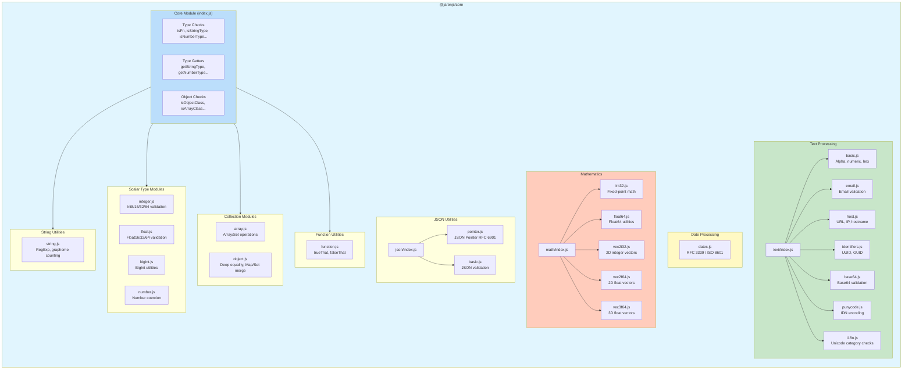

---

## Package Relationships

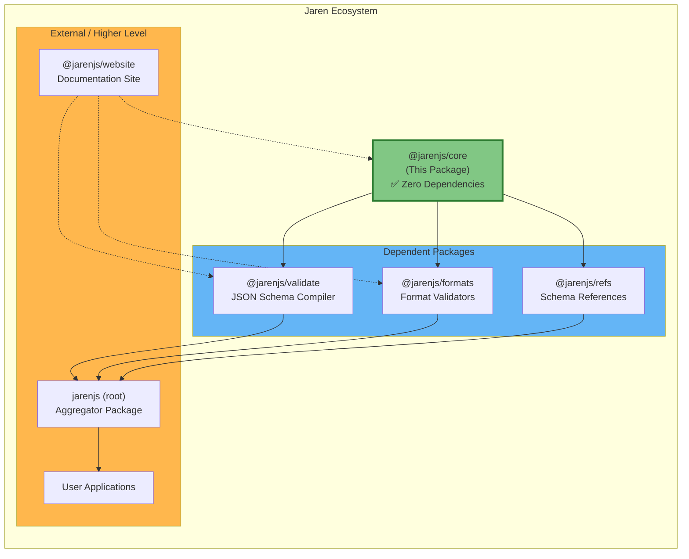

### Dependency Flow

| Package | Depends On | Purpose |
|---------|-----------|---------|
| `@jarenjs/core` | None | Foundational utilities |
| `@jarenjs/validate` | `@jarenjs/core` | JSON Schema compilation |
| `@jarenjs/formats` | `@jarenjs/core` (peer) | Format validators |
| `@jarenjs/refs` | None | Schema reference data |
| `jarenjs` (root) | All packages | Public API aggregation |

> **Note:** For broader Jaren architecture, see the root [`ARCHITECTURE.md`](../../ARCHITECTURE.md). For development guides, see [`HOWTO.md`](../../HOWTO.md).

---

## Module Deep Dive

### 1. Core Type System (`index.js`)

The foundation of the package. Provides runtime type checking that goes beyond JavaScript's `typeof` operator.

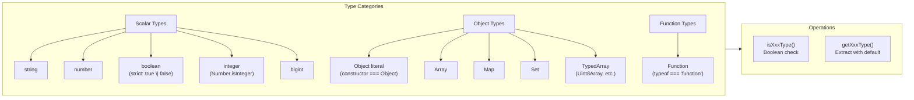

**Key Functions:**

| Function | Purpose | Example |
|----------|---------|---------|
| `isFn(data)` | Check if function | `isFn(() => {}) // true` |
| `isStringType(data)` | Strict string check | `isStringType('') // true` |
| `isBooleanType(data)` | Strict boolean check | `isBooleanType(true) // true` (excludes truthy values) |
| `isNumberType(data)` | Number check (includes NaN) | `isNumberType(42) // true` |
| `isIntegerType(data)` | Integer check | `isIntegerType(42.0) // true` |
| `isObjectClass(data)` | Plain object check | `isObjectClass({}) // true` |
| `isArrayClass(data)` | Array check | `isArrayClass([]) // true` |

**Design Pattern: Getter with Default**

```javascript
// Instead of:
const value = isStringType(data) ? data : undefined;

// Use:
const value = getStringType(data); // undefined if not string
const value = getStringType(data, 'default'); // 'default' if not string
```

### 2. Integer Module (`integer.js`)

Provides constants and validation for fixed-width integers.

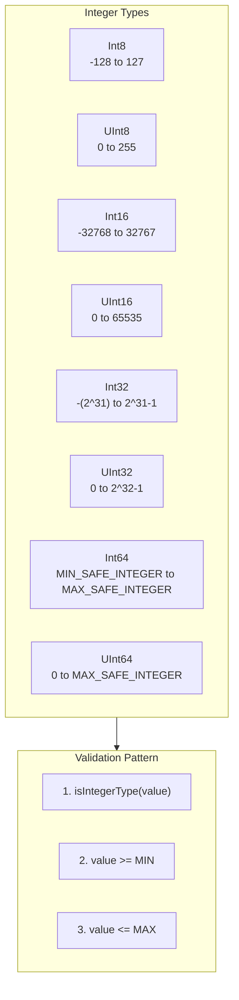

**Usage Example:**

```javascript
import { isValidInt32, INT32_MIN, INT32_MAX } from '@jarenjs/core/integer';

// Validate int32 range
if (isValidInt32(someValue)) {
  // Safe to use as int32
}

// Used by @jarenjs/formats for format validators
// e.g., format: 'int32' in JSON Schema
```

### 3. Float Module (`float.js`)

IEEE 754 floating-point validation with explicit width support.

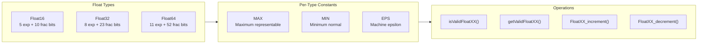

**Special Features:**
- Increment/decrement functions that respect float precision boundaries
- Proper handling of infinity at range boundaries
- Used for JSON Schema `format: 'float32'`, `format: 'float64'`

### 4. String Module (`string.js`)

String utilities with Unicode awareness.

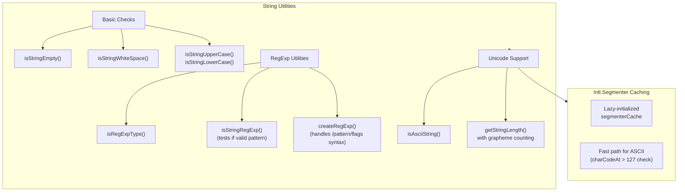

**Grapheme Cluster Support:**

```javascript
import { getStringLength } from '@jarenjs/core/string';

// Emoji "👨‍👩‍👧‍👦" is 1 grapheme but 11 UTF-16 code units
getStringLength("👨‍👩‍👧‍👦", false); // 11 (code units)
getStringLength("👨‍👩‍👧‍👦", true);  // 1 (grapheme cluster)
```

### 5. Date Module (`dates.js`)

RFC 3339 and ISO 8601 compliant date/time parsing.

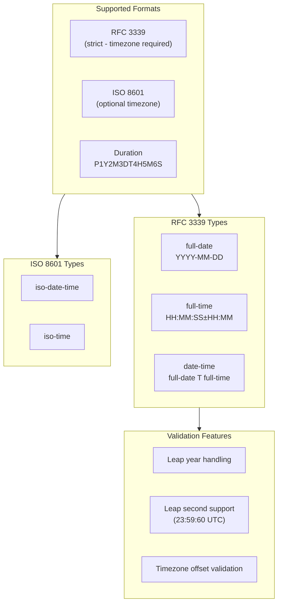

**Constants Provided:**

```javascript
import {
  CONST_TICKS_SECOND,    // 1000
  CONST_TICKS_HOUR,      // 3600000
  CONST_TICKS_DAY,       // 86400000
  CONST_RFC3339_DAYS,    // Days per month array
  CONST_RFC3339_REGEX_ISDATE,  // Date regex
  CONST_RFC3339_REGEX_ISTIME,  // Time regex
} from '@jarenjs/core/dates';
```

### 6. Text Module (`text/`)

Comprehensive string format validation organized by domain.

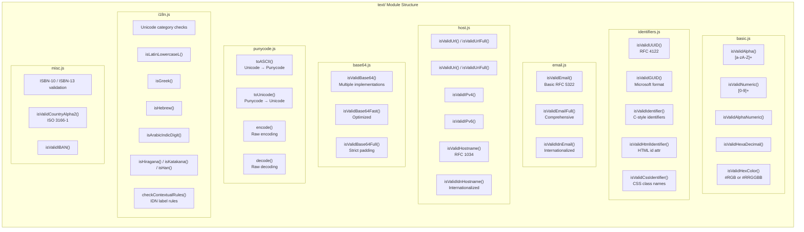

**Usage Pattern:**

```javascript
// Import specific validators
import { isValidUUID, isValidEmail } from '@jarenjs/core/text';

// Or import entire categories
import * as identifiers from '@jarenjs/core/text/identifiers';
```

### 7. Math Module (`math/`)

High-performance mathematical operations with explicit type annotations for JIT optimization.

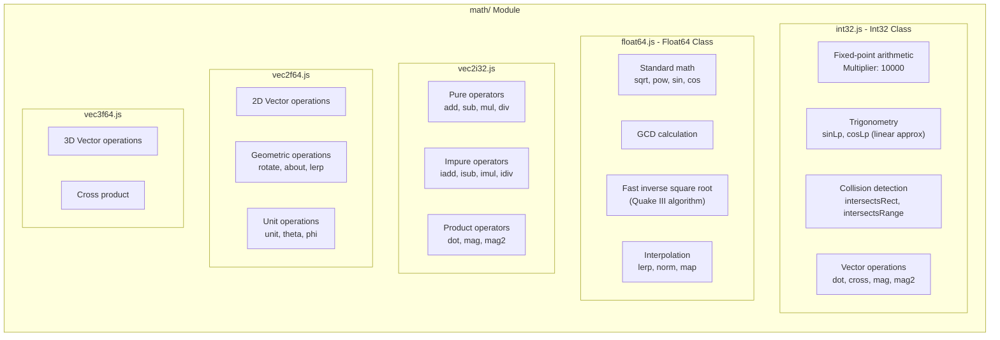

**Optimization Technique: ASM.js-style Type Annotations**

```javascript
// The + prefix hints to JIT that this is float64
// The | 0 suffix hints to JIT that this is int32

// From int32.js
static clamp(value = 0, min = 0, max = 0) {
  value = value | 0;  // Force int32
  min = min | 0;
  max = max | 0;
  return (
    mathi32_min(
      mathi32_max(value, mathi32_min(min, max)),
      mathi32_max(min, max),
    ) | 0  // Return int32
  );
}

// From float64.js
static clamp(value = 0.0, min = 0.0, max = 0.0) {
  return +mathf64_min(+mathf64_max(+value, +mathf64_min(+min, +max)), +mathf64_max(+min, +max));
}
```

**Pure vs Impure Operators:**

| Type | Pattern | Returns | Use Case |
|------|---------|---------|----------|
| Pure | `Vec2f64.add(a, b)` | New Vec2f64 | Functional style, no side effects |
| Impure | `a.iadd(b)` | Modified `this` | Performance-critical loops |

### 8. JSON Module (`json/`)

JSON Pointer implementation per RFC 6901.

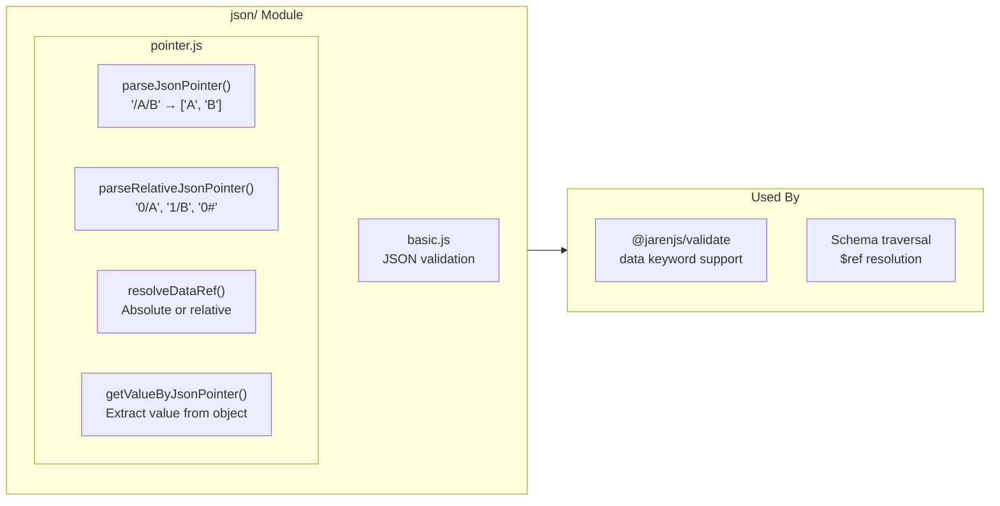

**JSON Pointer Decoding:**

```javascript
import { parseJsonPointer, getValueByJsonPointer } from '@jarenjs/core/json';

// ~1 → /, ~0 → ~
parseJsonPointer('/foo/bar~1baz~0qux');
// ['foo', 'bar/baz~qux']

// Extract value
const data = { foo: { bar: 'value' } };
getValueByJsonPointer(data, '', '/foo/bar');
// { value: 'value', found: true }
```

**Relative JSON Pointer:**

```javascript
// Format: <levels><pointer> or <levels>#
// 0/property - same level
// 1/sibling - parent level
// 0# - property name at current level

parseRelativeJsonPointer('1/parent');
// { levels: 1, pointer: '/parent', hash: false }
```

### 9. Object Module (`object.js`)

Deep equality and collection manipulation.

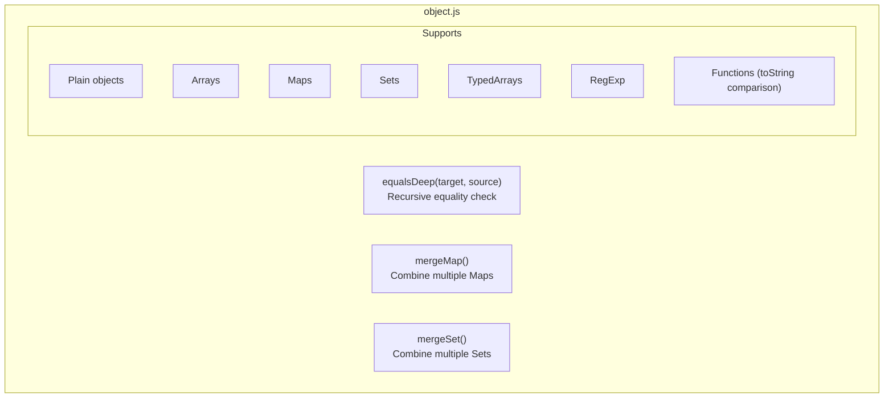

### 10. Array Module (`array.js`)

Array and array-like utilities.

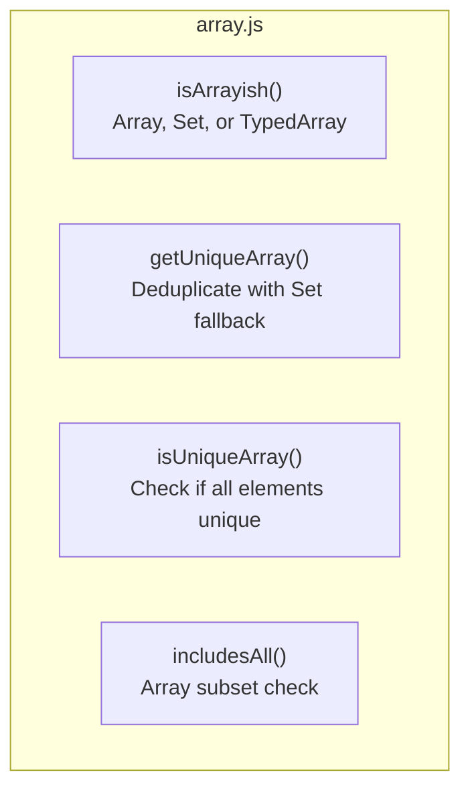

### 11. Function Module (`function.js`)

Utility functions for validator composition.

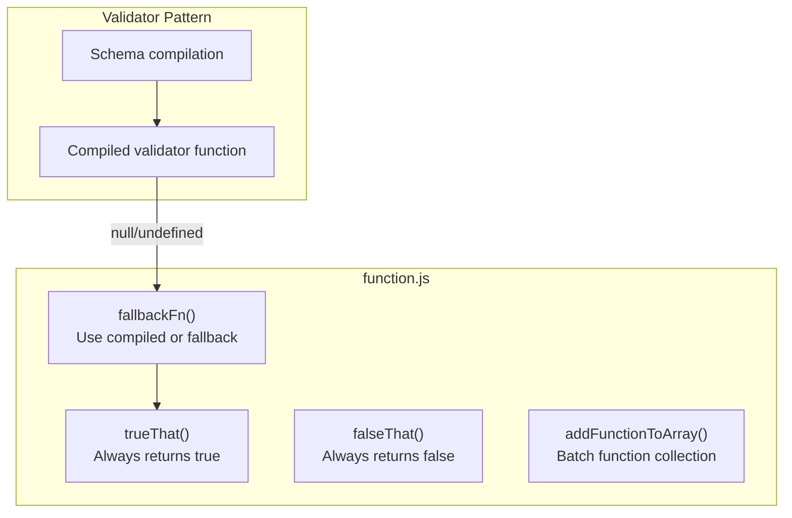

---

## Performance Considerations

### 1. JIT Optimization Hints

The codebase uses ASM.js-inspired type annotations to help JavaScript engines optimize hot paths:

```javascript
// int32 hint: | 0
const int32Value = (someNumber + 1) | 0;

// float64 hint: + prefix
const float64Value = +someNumber;

// Combined
const result = +((+a * +b) + (+c * +d));
```

### 2. Lazy Initialization

Expensive objects are created only when needed:

```javascript
let segmenterCache = null;
export function getSegmenter() {
  if (segmenterCache === null) {
    segmenterCache = new Intl.Segmenter(undefined, { granularity: "grapheme" });
  }
  return segmenterCache;
}
```

### 3. Fast Paths

Common cases are handled inline before falling back to slower algorithms:

```javascript
export function getStringLength(str, useGrapheme = false) {
  if (!useGrapheme) {
    return str.length;  // Fast path: ASCII length
  }

  // Check if ASCII inline to avoid function call overhead
  const len = str.length;
  for (let i = 0; i < len; i++) {
    if (str.charCodeAt(i) > 127) {
      // Non-ASCII found - use grapheme counting
      // ...
    }
  }
  return len;  // Was ASCII after all
}
```

### 4. Regex Caching

Constant regex patterns are defined at module load time:

```javascript
const CONST_REGEXP_UUID = /^(?:urn:uuid:)?[0-9a-f]{8}-(?:[0-9a-f]{4}-){3}[0-9a-f]{12}$/i;
```

---

## Type Safety

### TypeScript Definitions

The `types.d.ts` file provides comprehensive type definitions:

```typescript
// Branded types for type-safe numeric validation
type Int8 = number & { __brand: 'int8' };
type Float32 = number & { __brand: 'float32' };

// Type guards
export function isStringType(data: unknown): data is string;
export function isValidInt8(value: number): value is Int8;

// Vector classes with full type support
export class Vec2F64 {
  constructor(x?: number, y?: number);
  get x(): number;
  set x(value: number);
  add(other: Vec2F64): Vec2F64;
  iadd(other: Vec2F64): Vec2F64;  // impure
}
```

### JSDoc Annotations

All functions include JSDoc for IDE support:

```javascript
/**
 * Checks if the given data is of number type.
 * @param {any} data - The data to check.
 * @returns {boolean} - True if the data is a number, otherwise false.
 */
export function isNumberType(data) {
  return data != null && typeof data === 'number';
}
```

---

## Contributing Guidelines

### Adding New Type Checkers

1. Add the `isXxxType()` function to `index.js`
2. Add the corresponding `getXxxType()` function
3. Export from `types.d.ts` with proper type guard
4. Add tests in `test/core/`

### Adding New Format Validators

1. Identify the appropriate text submodule (or create one)
2. Define the regex/pattern as a `CONST_` at module level
3. Export the `isValidXxx()` function
4. Update `text/index.js` exports
5. Add TypeScript definition in `types.d.ts`

### Adding Math Operations

1. For scalar: Add to `int32.js` or `float64.js`
2. For vector: Add pure static method, then impure instance method
3. Use explicit type annotations (`| 0` for int32, `+` for float64)
4. Document mathematical formula/references in comments

### Code Style

- Use `@ts-check` at the top of every file
- Prefer `===` and `!==` over `==` and `!=`
- Use early returns to reduce nesting
- Cache regex patterns at module level
- Use `// eslint-disable-next-line` sparingly with justification

---

## Summary

`@jarenjs/core` is the **bedrock** of the Jaren ecosystem. It provides:

1. **Reliable type checking** that goes beyond JavaScript's built-in operators
2. **Format validation** for common string patterns (emails, URLs, UUIDs, etc.)
3. **Date/Time parsing** compliant with RFC 3339 and ISO 8601
4. **High-performance math** with explicit type annotations
5. **JSON Pointer operations** for schema traversal
6. **Zero dependencies** for maximum reliability

When contributing, remember: this package is used by `@jarenjs/validate` and `@jarenjs/formats`. Changes here have downstream effects. Maintain backward compatibility, optimize for performance, and keep the API predictable.

For questions about the broader architecture, see the root [`ARCHITECTURE.md`](../../ARCHITECTURE.md). For development workflows, see [`HOWTO.md`](../../HOWTO.md).
