# @jarenjs/core Architecture

> **The foundational utility layer of the Jaren JSON Schema Validator ecosystem**

***IMPORTANT*** Update this doc ONLY AND WHEN you introduce architectural changes! ONLY if there are more architects like you, make sure you have a democratic vote majority on the changes you are making!

---

## Table of Contents

1. [Overview](#overview)
2. [Design Philosophy](#design-philosophy)
3. [Module Architecture](#module-architecture)
4. [Package Relationships](#package-relationships)
5. [Module Deep Dive](#module-deep-dive)
6. [Performance Considerations](#performance-considerations)
7. [Type Safety](#type-safety)
8. [Contributing Guidelines](#contributing-guidelines)

---

## Overview

`@jarenjs/core` is the foundational utility package that provides the essential building blocks for the entire Jaren ecosystem. It is designed as a **zero-dependency**, vanilla JavaScript library that offers:

- **Type checking and validation utilities** for JavaScript primitives
- **String manipulation and validation** for common formats
- **Date/Time parsing and validation** per RFC 3339 and ISO 8601
- **Mathematical operations** with both integer and floating-point precision
- **Vector mathematics** for 2D/3D computations
- **Deep equality and object manipulation** utilities

This package is intentionally **decoupled** from JSON Schema concepts, making it reusable for any JavaScript application requiring robust type checking and data validation.

---

## Design Philosophy

### 1. Zero Dependencies
The core package has **zero external dependencies**. This ensures:
- Predictable bundle sizes
- No supply chain attack vectors
- Full control over performance characteristics
- Easy auditing and maintenance

### 2. Vanilla JavaScript with TypeScript Support
While implemented in vanilla JavaScript, the package generates TypeScript declarations from its JSDoc into `dist/types` during the build. This approach:
- Avoids transpilation overhead
- Provides direct control over JIT optimization hints
- Maintains readability without TypeScript boilerplate
- Leverages JSDoc for inline documentation

### 3. Functional Programming Style
Most utilities are pure functions that:
- Take explicit inputs
- Return predictable outputs
- Have no side effects
- Are easily testable and composable

### 4. Performance-First
The codebase includes explicit performance optimizations:
- `| 0` bitwise operations for integer coercion
- `+` unary operators for float64 hinting
- Inline fast paths for common cases (e.g., ASCII string detection)
- Lazy initialization of expensive objects (e.g., `Intl.Segmenter`)

---

## Module Architecture

```mermaid
flowchart TB
    subgraph CorePackage["@jarenjs/core"]
        direction TB

        subgraph CoreModule["Core Module (index.js)"]
            TypeChecks["Type Checks<br/>isFn, isStringType, isNumberType..."]
            TypeGetters["Type Getters<br/>getStringType, getNumberType..."]
            ObjectChecks["Object Checks<br/>isObjectClass, isArrayClass..."]
        end

        subgraph ScalarModules["Scalar Type Modules"]
            Integer["integer.js<br/>Int8/16/32/64 validation"]
            Float["float.js<br/>Float16/32/64 validation"]
            BigIntModule["bigint.js<br/>BigInt utilities"]
            NumberModule["number.js<br/>Coercion and JSON number grammar"]
        end

        subgraph CollectionModules["Collection Modules"]
            ArrayModule["array.js<br/>Array/Set operations"]
            ObjectModule["object.js<br/>Deep equality, Map/Set merge"]
        end

        subgraph TextModules["Text Processing"]
            TextIndex["text/index.js"]
            Basic["basic.js<br/>Alpha, numeric, hex"]
            Email["email.js<br/>Email validation"]
            Host["host.js<br/>URL, IP, hostname, URI/IRI"]
            Identifiers["identifiers.js<br/>UUID, GUID"]
            Base64["base64.js<br/>Base64 validation"]
            Punycode["punycode.js<br/>Punycode codec + IDNA"]
            I18n["i18n.js<br/>Unicode category checks"]
            IRegexp["iregexp.js<br/>I-Regexp (RFC 9485)"]
            TextMisc["misc.js<br/>Assorted text testers"]
        end

        subgraph DateModule["Date Processing"]
            DatesIndex["dates/index.js"]
            DatesRfc["rfc3339.js<br/>RFC 3339 / ISO 8601"]
            DatesCivil["civil.js<br/>Gregorian day-number math"]
            DatesFormat["format.js<br/>LDML pattern compiler"]
            DatesParse["parse.js<br/>LDML pattern parser"]
            DatesDuration["duration.js<br/>ISO 8601 durations"]
            DatesTicks["ticks.js<br/>Time-axis step ladder"]
        end

        subgraph GeoModule["Spatial"]
            GeoIndex["geo/index.js"]
            GeoPred["predicates.js<br/>Robust orientation"]
            GeoDist["distance.js<br/>Great-circle measurement"]
            GeoRing["ring.js<br/>Closure, winding, area, containment"]
            GeoBbox["bbox.js<br/>Bounding boxes"]
            GeoHash["geohash.js<br/>Base-32 cells"]
            GeoJson["geojson.js<br/>Typed-geometry traversal"]
            GeoValid["valid.js<br/>Structural judgment"]
            GeoWkt["wkt.js<br/>Well-Known Text round trip"]
            GeoTree["index-tree.js<br/>Packed-Hilbert box index"]
            GeoMerc["mercator.js + simplify.js<br/>Projection out, simplification"]
        end

        subgraph VectorModule["Vectors"]
            VectorIndex["vector/index.js<br/>Similarity kernels, normalization, packed form"]
        end

        subgraph SeriesModule["Temporal"]
            SeriesIndex["series/index.js"]
            SeriesSelector["selector.js<br/>Where a member lives in a row"]
            SeriesNormalize["normalize.js<br/>Instants, stable sort, binary bounds"]
            SeriesInterval["interval.js<br/>Half-open set algebra"]
            SeriesTree["interval-index.js<br/>Prefix-max-end interval index"]
        end

        subgraph MathModules["Mathematics"]
            MathIndex["math/index.js"]
            Int32Math["int32.js<br/>Fixed-point math"]
            Float64Math["float64.js<br/>Float64 utilities, remap, clamp01"]
            Vec2I32["vec2i32.js<br/>2D integer vectors"]
            Vec2F64["vec2f64.js<br/>2D float vectors"]
            Vec3F64["vec3f64.js<br/>3D float vectors"]
            Mat4Math["mat4.js<br/>4x4 matrices"]
            ProjectMath["project.js<br/>3D to 2D projection"]
            SolveMath["solve.js<br/>Numeric root finders"]
            WordMath["word.js<br/>BigInt fixed-width words"]
            FormatMath["format.js<br/>Number format/parse"]
        end

        subgraph DomainModules["Domain Kernels"]
            ConvertIndex["convert/index.js<br/>Unit and currency conversion"]
            FinanceIndex["finance/index.js<br/>TVM, bonds, cash flow, returns"]
        end

        subgraph FunctionModule["Function Utilities"]
            FunctionUtil["function.js<br/>trueThat, falseThat"]
            AsyncUtil["async.js<br/>Bounded ordered asynchronous map, awaited sink"]
        end

        subgraph RandomModule["Randomness"]
            RandomUtil["random.js<br/>Seeded generator, integer draw, shuffle, distinct draw"]
        end

        subgraph RuntimeModule["Host runtime"]
            RuntimeRecord["runtime.js<br/>The runtime record: clock, identifiers, randomness, zone provider"]
        end

        subgraph StatsModule["Statistics"]
            StatsUtil["stats.js<br/>Mean, sample variance, median, named quantile"]
        end

        subgraph StringModules["String &amp; Scanning"]
            StringUtil["string.js<br/>RegExp, grapheme counting, fnv1a"]
            ScanUtil["scan.js<br/>Char-code classes for parsers"]
            MessageUtil["message.js<br/>Message template/catalog compiler"]
            ColorUtil["color.js<br/>Mixing, relative luminance"]
        end
    end

    CoreModule --> ScalarModules
    CoreModule --> CollectionModules
    CoreModule --> StringModules
    CoreModule --> FunctionModule

    TextIndex --> Basic
    TextIndex --> Email
    TextIndex --> Host
    TextIndex --> Identifiers
    TextIndex --> Base64
    TextIndex --> Punycode
    TextIndex --> I18n
    TextIndex --> IRegexp
    TextIndex --> TextMisc

    MathIndex --> Int32Math
    MathIndex --> Float64Math
    MathIndex --> Vec2I32
    MathIndex --> Vec2F64
    MathIndex --> Vec3F64
    MathIndex --> Mat4Math
    MathIndex --> ProjectMath
    MathIndex --> SolveMath
    MathIndex --> WordMath
    MathIndex --> FormatMath

    DatesIndex --> DatesRfc
    DatesIndex --> DatesCivil
    DatesIndex --> DatesFormat
    DatesIndex --> DatesDuration
    DatesIndex --> DatesTicks

    GeoIndex --> GeoPred
    GeoIndex --> GeoDist
    GeoIndex --> GeoRing
    GeoIndex --> GeoBbox
    GeoIndex --> GeoHash
    GeoIndex --> GeoJson
    GeoIndex --> GeoValid
    GeoIndex --> GeoWkt
    GeoIndex --> GeoTree
    GeoIndex --> GeoMerc

    style CorePackage fill:#e1f5fe
    style CoreModule fill:#bbdefb
    style TextModules fill:#c8e6c9
    style MathModules fill:#ffccbc
    style DateModule fill:#fff9c4
    style GeoModule fill:#b2dfdb
    style VectorModule fill:#b2dfdb
```

---

## Package Relationships

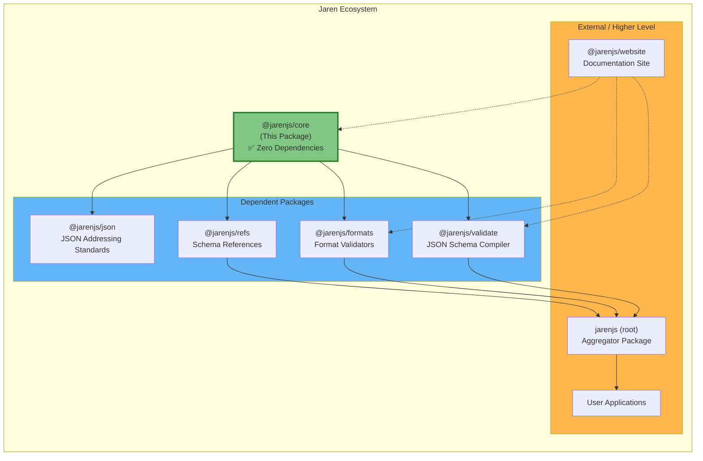

### Dependency Flow

| Package | Depends On | Purpose |
|---------|-----------|---------|
| `@jarenjs/core` | None | Foundational utilities |
| `@jarenjs/json` | `@jarenjs/core` (peer) | JSON addressing standards |
| `@jarenjs/validate` | `@jarenjs/core` | JSON Schema compilation |
| `@jarenjs/formats` | `@jarenjs/core` (peer) | Format validators |
| `@jarenjs/refs` | None | Schema reference data |
| `jarenjs` (root) | All packages | Public API aggregation |

> **Note:** For broader Jaren architecture, see the root [`ARCHITECTURE.md`](../../docs/ARCHITECTURE.md). For development guides, see [`HOWTO.md`](../../docs/HOWTO.md).

---

## Module Deep Dive

### 1. Core Type System (`index.js`)

The foundation of the package. Provides runtime type checking that goes beyond JavaScript's `typeof` operator.

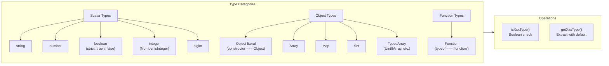

**Key Functions:**

| Function | Purpose | Example |
|----------|---------|---------|
| `isFn(data)` | Check if function | `isFn(() => {}) // true` |
| `isStringType(data)` | Strict string check | `isStringType('') // true` |
| `isBooleanType(data)` | Strict boolean check | `isBooleanType(true) // true` (excludes truthy values) |
| `isNumberType(data)` | Number check (includes NaN) | `isNumberType(42) // true` |
| `isIntegerType(data)` | Integer check | `isIntegerType(42.0) // true` |
| `isObjectClass(data)` | Plain object check | `isObjectClass({}) // true` |
| `isArrayClass(data)` | Array check | `isArrayClass([]) // true` |

**Design Pattern: Getter with Default**

```javascript
// Instead of:
const value = isStringType(data) ? data : undefined;

// Use:
const value = getStringType(data); // undefined if not string
const value = getStringType(data, 'default'); // 'default' if not string
```

### 2. Integer Module (`integer.js`)

Provides constants and validation for fixed-width integers.

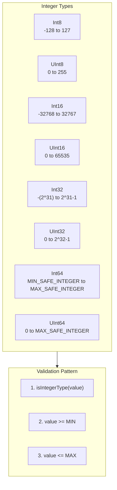

**Usage Example:**

```javascript
import { isValidInt32, INT32_MIN, INT32_MAX } from '@jarenjs/core/integer';

// Validate int32 range
if (isValidInt32(someValue)) {
  // Safe to use as int32
}

// Used by @jarenjs/formats for format validators
// e.g., format: 'int32' in JSON Schema
```

### 3. Float Module (`float.js`)

IEEE 754 floating-point validation with explicit width support.

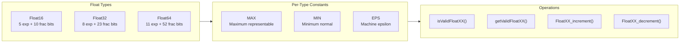

**Special Features:**
- Increment/decrement functions that respect float precision boundaries
- Proper handling of infinity at range boundaries
- Used for JSON Schema `format: 'float32'`, `format: 'float64'`

### 4. String Module (`string.js`)

String utilities with Unicode awareness.

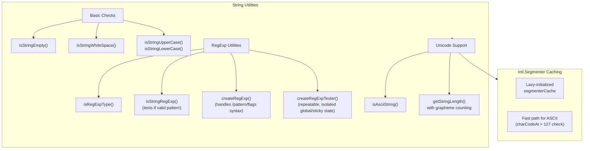

**Grapheme Cluster Support:**

```javascript
import { getStringLength } from '@jarenjs/core/string';

// Emoji "👨‍👩‍👧‍👦" is 1 grapheme but 11 UTF-16 code units
getStringLength("👨‍👩‍👧‍👦", false); // 11 (code units)
getStringLength("👨‍👩‍👧‍👦", true);  // 1 (grapheme cluster)
```

### 5. Date Module (`dates/`)

RFC 3339 and ISO 8601 validation, plus the suite's calendar kernel.

**Dates are not a type here.** They are the two forms JSON already has — an
RFC 3339 **string** (lexical, what documents, schemas, forms and TOML
contain) and **epoch milliseconds** (arithmetic, what a chart plots). A
wrapper object, even an immutable one, could not be a query-engine item, a
JSON Patch target or part of app state; it is why `canonicalizeJson` turns a
`Date` into `{}`. The parts record from `parseRFC3339Parts` is the working
intermediate and is plain data, never an opaque handle.

| Module | Owns |
|---|---|
| `rfc3339.js` | validation, lexical decomposition, epoch conversion |
| `civil.js` | proleptic Gregorian arithmetic over integers |
| `format.js` | LDML pattern → compiled formatter |
| `parse.js` | LDML pattern → compiled strict parser (the formatter's inverse) |
| `duration.js` | ISO 8601 duration decomposition and date arithmetic |
| `ticks.js` | the time-axis step ladder and its calendar boundaries |

Calendar math goes through day numbers (`daysFromCivil`/`civilFromDays`),
never through `Date`: the conversions are ~10 integer operations and allocate
nothing, where an allocate-mutate-read `Date` round trip costs about 165× as
much for the same answer. For the same reason every `getDateTypeOf*` getter
has a `getEpochOf*` twin — the same validity check and the same engine parse,
returning epoch milliseconds instead of a `Date` — so a consumer comparing
against precomputed bounds (the `formatMinimum`/`formatMaximum` validators)
allocates nothing per value. Formatting is the two-stage compiler again — a
pattern is scanned once into a chain of appenders, which measured ~4.5×
against re-scanning it per call.

Parsing is the same compiler run backwards. `compileDateParser` scans a
pattern once into a chain of readers and returns a function from text to the
same parts record `parseRFC3339Parts` produces, so every calendar function
takes its output unchanged. It is strict in three ways that a permissive
reader is not: trailing input fails, an impossible civil date (31 February,
hour 24) fails rather than rolling forward into the next month, and a
fixed-width token reads exactly its width. Failure is `null` — malformed
*text* is data — while a malformed *pattern* throws at compile time. The
tokens that only ever format, because they are derived from a date rather
than fields of one (`EEEE`, `DDD`, `ww`, `Q`), are compile errors with a
message saying which and why, rather than tokens that quietly read nothing.
A consumer whose patterns are not LDML — Mermaid's Gantt `dateFormat` is
moment's grammar and its `axisFormat` is strftime — adapts its own tokens
onto this vocabulary rather than handing its spelling to this compiler:
LDML's `YYYY` is the week-numbering year, so `YYYY-MM-DD` read as LDML
answers 2019 for 2018-12-31.

Locale-dependent presentation (month and weekday names, meridiem, relative
phrasing) is deliberately **not** here, so this package stays zero-dependency
and free of data that drifts per language: `compileDateFormat` takes a names
provider, and a pattern using `MMMM`/`EEEE`/`a` without one is a compile
error rather than a silent English fallback.

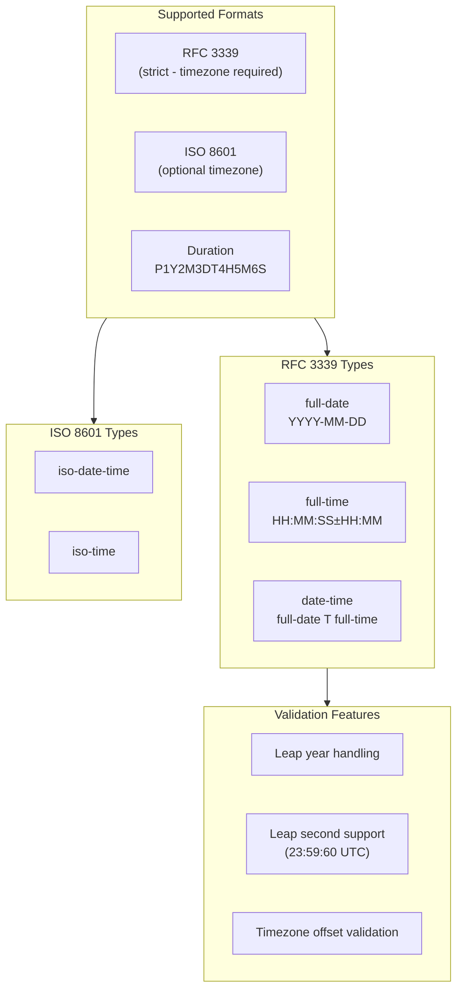

**Constants Provided:**

```javascript
import {
  CONST_TICKS_SECOND,    // 1000
  CONST_TICKS_HOUR,      // 3600000
  CONST_TICKS_DAY,       // 86400000
  CONST_RFC3339_DAYS,    // Days per month array
} from '@jarenjs/core/dates';
```

**Working with the calendar:**

```javascript
import {
  parseRFC3339Parts, addToParts, startOfParts, compileDateFormat,
} from '@jarenjs/core/dates';

const parts = parseRFC3339Parts('2026-01-31');
addToParts(parts, 1, 'month');          // 2026-02-28 — month math clamps
startOfParts(parts, 'week');            // the Monday of that week (ISO 8601)
addToParts(parts, 3, 'hour');           // TypeError — a full-date has no clock

const fmt = compileDateFormat("yyyy-'W'ww");  // compile once…
fmt(parts);                             // …call many: '2026-W05'

const read = compileDateParser('dd-MM-yyyy');
read('06-01-2014');                     // { year: 2014, month: 1, day: 6, … }
read('06-01-2014x');                    // null — trailing input
read('31-02-2014');                     // null — February has no 31st
```

**Ticks a caller chose, or ticks this module chose:**

```javascript
import { axisTicksTime, timeTicksEvery } from '@jarenjs/core/dates';

axisTicksTime(from, to, 4);                  // the ladder picks the step
timeTicksEvery(from, to, 'week', 1, { weekStart: 7 });  // Sundays
```

`axisTicksTime` is the chart axis's planner; `timeTicksEvery` is the same
boundary rule with the step supplied, which is what a document declaring its
own interval (Mermaid's `tickInterval 1week`) needs. One ladder, so a chart
and a timeline cannot disagree about where a tick falls.

### 5b. Geo Module (`geo/`)

The spatial kernel. As with dates, **there is no geometry type**: the
representation is GeoJSON ([RFC 7946](https://datatracker.ietf.org/doc/html/rfc7946)),
whose positions are `[longitude, latitude]` arrays and whose rings are arrays
of those. They are already JSON items, so they stay patchable, schema-checkable
and addressable; a wrapper class would break all three. Every function here
takes plain numbers and plain arrays, so a `Polygon`'s `coordinates` can be
passed straight in without the `type` discriminator being involved.

| Module | Owns |
|---|---|
| `predicates.js` | robust orientation — the sign every spatial test rests on |
| `distance.js` | great-circle measurement on the WGS 84 sphere |
| `ring.js` | ring closure, winding, area and containment |
| `bbox.js` | bounding boxes, the cheap half of every spatial test |
| `geohash.js` | the base-32 cell encoding, and its validity tester |
| `geojson.js` | the one layer that knows the `type` discriminator |
| `valid.js` | `isValidGeoJson` — the one-call structural judgment (rings must close), the boolean twin of the schema artifacts in `@jarenjs/json` |
| `wkt.js` | the Well-Known Text round trip — `wktToGeoJson`, `geoJsonToWkt` and `isValidWkt`, one grammar walk with and without a builder |
| `index-tree.js` | a static packed-Hilbert box index for spatial joins |
| `mercator.js` | Web Mercator, the projection *out* for anything that draws |
| `simplify.js` | Douglas-Peucker — dropping the vertices a drawing cannot show |

The three validity testers back the `geoFormats` group in
[`@jarenjs/formats`](../formats) (`geohash`, `wkt`, `geojson`).

**WKT is one grammar walk with two entry points.** `isValidWkt` is a format
tester — it runs per value in the validator and per keystroke in the form
layer — so it must not allocate a geometry to answer a boolean; and two
hand-maintained grammars for one syntax would drift apart. Both are avoided by
giving every scan function a sink: absent, it validates; present, it appends
the value it just recognized, and `wktToGeoJson` reads the result. A committed
corpus of 181 strings, its malformed half included, asserts
`isValidWkt(s) === (wktToGeoJson(s) !== null)` for every entry — a divergence
is a failing test, not a note. `geoJsonToWkt` writes the string back, and the
parse-write-parse direction is asserted over the corpus; the write-parse-write
direction is *not* claimed, because WKT whitespace, the `M` measure and number
spelling are normalized on the way through.

Against [`wellknown`](https://www.npmjs.com/package/wellknown), the established
WKT↔GeoJSON converter (`npm run benchmark:geo`, Node <!--fact:geo.node-->v24.19.0<!--/fact-->):

<!--fact:geo.wktTable-->
| scenario | Jaren | rival | ratio |
|---|---|---|---|
| wkt parse (POINT) | 431.1 ns | 1.31 µs (wellknown) | **3.1×** |
| wkt parse (2000-vertex polygon) | 843.80 µs | 1.98 ms (wellknown) | **2.3×** |
| wkt stringify (2000-vertex polygon) | 163.40 µs | 229.70 µs (wellknown) | **1.4×** |
| wkt validate (POINT) | 242.7 ns | 1.28 µs (wellknown) | **5.3×** |
| wkt validate (2000-vertex polygon) | 496.00 µs | 1.90 ms (wellknown) | **3.8×** |
<!--/fact-->

The last two rows are the ones the sink exists for: `wellknown` has no
predicate, so validating means parsing and throwing the geometry away. And the
comparison is *not* like-for-like on work done — **wellknown validates less**
and is still slower. Over the corpus it accepts 38 strings this grammar
refuses (no ring closure, no four-point ring or two-point line minimum, no
coordinate count checked against the modifier, no tag list, and text after the
geometry ignored); it refuses 22 this one accepts (`M`/`ZM` geometries, `EMPTY`
for POINT/MULTIPOINT/GEOMETRYCOLLECTION); and on 10 more the two produce
*different geometries*, because wellknown answers an EMPTY geometry for a
POLYGON/MULTILINESTRING/MULTIPOLYGON carrying a modifier and writes a
MULTIPOINT's measure into the altitude slot. Every one of those classes has a
pinned size in the benchmark's equivalence table, so a difference cannot be
quietly absorbed, and the entries behind each are listed under it. The
stringify output is byte-identical on the polygon.

Two decisions carry the module. **Orientation is computed exactly**, through
Shewchuk's adaptive precision arithmetic: a naive floating-point determinant
returns the *wrong sign* on near-collinear input, which makes a containment
test contradict itself and a clipper emit self-intersecting output. The test
suite pins real longitude/latitude fixtures on the San Francisco–Los Angeles
line where the naive form reports "collinear" and the truth is one side or the
other. The cheap filter runs first, so the exact path costs nothing until it is
needed.

**Distance is spherical, and the planar shortcut is refused.** A degree of
longitude spans ~111 km at the equator and ~68 km at 52°N, so a Euclidean norm
on raw degrees is 64% wrong over 1 km at Dutch latitudes. `haversineDistance`
is the answer (<0.5% anywhere); `equirectDistance` is the *screening* form
(0.02% at 430 km, 12.4% intercontinentally — a few multiply-adds against
haversine's transcendentals) for rejecting candidates before the real test —
the same build-then-probe shape the query engine's hash join uses. The
ellipsoid is deliberately not modelled.

RFC 7946 removed coordinate-reference-system support and mandates WGS 84, so
there is no SRID table and no reprojection: conformance removes the need rather
than an omission hiding it.

**Measured against the field** (`npm run benchmark:geo`, Node <!--fact:geo.node-->v24.19.0<!--/fact-->). Every
scenario asserts result equivalence before any timing, and the harness refuses
to print a table if the engines disagree: distance, area, length and bounding
box come out *bit-identical* to Turf, containment agrees on a 400-point sweep,
and the index returns exactly Flatbush's answer on 200 queries. Ratios are the
rival's time over this kernel's, so above 1 means Jaren is faster; the rows
below derive from the committed measurement and are refreshed with it.

<!--fact:geo.table-->
| scenario | Jaren | rival | ratio |
|---|---|---|---|
| distance (two positions) | 28.3 ns | 111.0 ns (turf) | **3.9×** |
| distance (vs geolib, ellipsoidal) | 50.7 ns | 609.1 ns (geolib) | **12.0×** |
| distance (equirectangular screen) | 26.4 ns | — | — |
| point in polygon (12-vertex) | 72.9 ns | 226.4 ns (turf) | **3.1×** |
| point in polygon (2000-vertex) | 8.23 µs | 3.71 µs (turf) | 0.5× |
| polygon area (2000-vertex) | 17.65 µs | 18.45 µs (turf) | **1.0×** |
| line length (500 positions) | 26.65 µs | 63.47 µs (turf) | **2.4×** |
| bounding box (2000-vertex) | 21.08 µs | 18.65 µs (turf) | 0.9× |
| centroid (2000-vertex) | 16.70 µs | 23.18 µs (turf) | **1.4×** |
| index build (100k boxes) | 12.70 ms | 10.62 ms (flatbush) | 0.8× |
| index probe (100k boxes) | 602.3 ns | 668.9 ns (flatbush) | **1.1×** |
| linear scan (100k boxes, no index) | 141.50 µs | — | — |
<!--/fact-->

The losses are kept, and named by the same measurement: on the committed run <!--fact:geo.losses-->three rows lose to a rival: point in polygon (2000-vertex) at 0.5× (turf), bounding box (2000-vertex) at 0.9× (turf), index build (100k boxes) at 0.8× (flatbush)<!--/fact-->.
**Point-in-polygon on a large ring runs at about half Turf's speed**
(<!--fact:geo.pip2000-->0.5×<!--/fact--> at 2000 vertices) because every edge that could
matter goes through the exact orientation predicate, where Turf uses naive
floating-point arithmetic. That is the trade this module exists to make — it
is the difference between a containment test that is right on near-collinear
input and one that is merely fast. Cheap straddle/span tests already skip the
predicate on edges that cannot affect the answer, which took this from 0.2×
to about 0.5×; the rest is the predicate itself, and the campaign that made
geography reachable across the suite never traded it away. The bounding box
of the same ring and the index build against Flatbush sit within a few tenths
of level (<!--fact:geo.bbox2000-->0.9×<!--/fact--> and <!--fact:geo.indexBuild-->0.8×<!--/fact-->) and move
between runs and Node versions; they are published as measured rather than
rounded to a win.

Two former losses were closed by profiling before fixing, and both closures
carry the lesson:

- **Index build** was 2.6× behind Flatbush, and the assumed cause — the leaf
  sort permuting the four-wide bounds rows on every swap — turned out to be
  wrong: fixing it moved nothing. A phase profile put ~60% of the build in
  the *Hilbert distance* computation, a 16-step bisection loop with a float
  division per step. The classical loop is now the bit-parallel transform
  (identical values, verified exhaustively at the corners and over 200k
  pseudo-random points), the sort orders a `Uint32Array` permutation with an
  insertion-sort cutoff, and the bounds are written once, already in leaf
  order. Whether the row is level or a few tenths behind on a given run is
  what the derived table above says.
- **Centroid** walked the same `eachPosition` as `bboxOf` yet lost where
  `bboxOf` won. The difference was the callback body: accumulating doubles
  into *closure variables* writes a boxed heap number per `+=` — two per
  vertex — where `bboxOf`'s comparisons rarely write at all. The accumulators
  are a small `Float64Array` now (raw double stores, no boxing), and the row
  is level with Turf.

```javascript
import { orient2d, haversineDistance, ringWinding, geohashEncode } from '@jarenjs/core/geo';

orient2d(0, 0, 1, 0, 0, 1);                    // > 0 — counter-clockwise, exactly
haversineDistance(4.9041, 52.3676, 2.3522, 48.8566);  // 429_862 m
ringWinding([[0,0],[1,0],[1,1],[0,1],[0,0]]);  // 1 — RFC 7946 exterior ring
geohashEncode(4.9041, 52.3676, 5);             // 'u173z' — a string: a prefix buckets, geohashNeighbours is proximity
```

### 5c. Vector Module (`vector/`)

The suite's one home for n-dimensional vector arithmetic — what an embedding
is compared, normalized and stored with. As with geo, **there is no vector
type**: a vector is a plain array of finite numbers (`number[]` out of JSON, a
`Float32Array` out of a packed column), so it survives every JSON boundary
it travels through. One file, seven functions, three rules every consumer
relies on: similarity is *higher-is-better* in every metric; a malformed
comparison (mismatched lengths, empty, null, non-finite) *scores 0 and never
throws*; and the constructors (`packVector`, `l2Normalize`) *refuse with
null* rather than truncate, pad or zero-fill.

| Function | Owns |
|---|---|
| `isVector(v, dims?)` | the one shape guard — array or float typed array, all finite, optionally an exact width |
| `dotProduct`, `cosineSimilarity`, `euclideanSimilarity` | the similarity kernels; cosine is the one the suite ranks by |
| `l2Normalize` | the unit vector, as a new `Float32Array` — the stored form, so cosine, dot and Euclidean agree in rank |
| `packVector`, `unpackVector` | the little-endian binary32 column form; an aligned unpack is a view, a misaligned one a copy |

The comparison kernels do not re-check components — that is the gate's job,
once, at the boundary — and they keep their loops tight for the sweep that is
their reason to exist; they guarantee a finite answer. The fixed-arity vector
classes in `math/` (`Vec2f64`, `Vec3f64`) are 2D/3D geometry with a
different convention and a different job, and they stay where they are.

### 5d. Series Module (`series/`)

The temporal kernel: one meaning for an instant, one for a sorted series of
readings, one for an interval, and the set algebra over them. As with dates,
**there is no type** — an instant is epoch milliseconds or an RFC 3339 string,
a sample is `{ at, value }`, an interval is `{ start, end }` — and, as with
dates, **there is no `now`**: every bound is data, so every answer here is
reproducible and cacheable.

| File | Owns |
|---|---|
| `selector.js` | where a member lives in a caller's row — a property name or a function, so `on`/`recorded_at`/`from`/`to` are read where they are |
| `normalize.js` | `toEpoch`, `normalizeSeries`, `normalizeIntervals` and the `lowerBoundTime`/`upperBoundTime` cuts a sorted array is read through |
| `interval.js` | `containsInstant`, `overlapsInterval`, `intersectInterval`, `mergeIntervals`, `subtractIntervals`, `gapsWithin`, `coverageOf`, `findSlots` |
| `interval-index.js` | `createIntervalIndex` — build once, query many, by point or by range |

Four decisions carry it. **Half-open `[start, end)`**: an interval holds its
start and not its end, so touching intervals neither overlap nor double-count
and a boundary instant belongs to exactly one of them — while `mergeIntervals`
*joins* touching spans by default, because availability means continuous cover,
with `{ adjacent: false }` as the explicit other answer. **Nothing is dropped**:
a member that names no instant, or an interval that is empty, reversed or
non-finite, is a refusal naming the row rather than a silently shorter result,
and the sort is stable so duplicate instants keep their order and both count.
**No clock**: `gapsWithin` and `coverageOf` derive their window from the input's
own hull when given none, because the only other default would be "now".

And **the index cuts on both ends**. Sorting by start alone is the bug: a span
that began long before a query sits far to the left of the query's own
neighbourhood and still overlaps it, so a binary search around the query loses
it while looking plausible. `createIntervalIndex` therefore carries a prefix
maximum end beside the starts — non-decreasing by construction, hence
binary-searchable — and the first position where it passes the query's start is
the first position where anything can still be live. A query is two binary cuts
and a walk between them, O(log n + k), returning the caller's own rows in a
fresh array. Like the packed-Hilbert box index it is **static**: bounds are
copied into flat typed arrays at build time, so a query reads no source object
and a row mutated afterwards cannot change what the index answers.

Buckets, resampling, rolling windows and as-of joins are the layer above this
one; named zones, recurrence grammars and scheduling solvers are outside it.
`findSlots` enumerates where a fixed-width span fits — choosing among the
answers is a solver's job, deliberately not this kernel's.

```javascript
import { createIntervalIndex, mergeIntervals, findSlots } from '@jarenjs/core/series';

const shifts = [{ start: 0, end: 4 * 3600_000 }, { start: 4 * 3600_000, end: 8 * 3600_000 }];
mergeIntervals(shifts);                         // one span — touching IS continuous cover
mergeIntervals(shifts, { adjacent: false });    // two — a handover is two shifts
findSlots(shifts, { duration: 'PT30M' }).length; // 16
createIntervalIndex(shifts).at(4 * 3600_000);   // the second shift only: [start, end)
```

### 5e. Runtime record (`runtime.js`)

The one record a host hands to every subsystem that needs a host fact:
`createRuntime({ now, uuid, random, zoneProvider })`, frozen, defaulting
member for member to the platform's own (`Date.now`, `crypto.randomUUID`,
`Math.random`, and no zone provider — a named zone stays a refusal). The
store (query deadlines included), the job engine, the migration runner, the
contract bindings and the contract memory ledger take it as `runtime`; a
subsystem's own explicit option wins over the record's member,
which wins over the built-in default, so adopting the record changes nothing
observable and a deterministic run — a fixed clock, a seeded generator, a
counting identifier — is configured once. It is a type plus a freeze: this
module reads no clock and draws no number of its own, and it reaches hosts,
never query compilation, because a compiled query is cached by document
identity and there is no `now` in the kernel for it to feed.

```javascript
import { createRuntime } from '@jarenjs/core/runtime';
import { mulberry32 } from '@jarenjs/core/random';

let n = 0;
const runtime = createRuntime({
  now: () => 1_700_000_000_000,
  uuid: () => `id-${++n}`,
  random: mulberry32(2026),
});
runtime.zoneProvider;                       // null — the one member left at its default
createRuntime({ clock: Date.now });          // TypeError: a runtime record has 'now', 'uuid', 'random', 'zoneProvider', not 'clock'
```

### 6. Text Module (`text/`)

Comprehensive string format validation organized by domain.

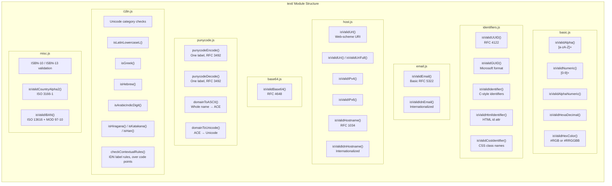

**Usage Pattern:**

```javascript
// Import specific validators
import { isValidUUID, isValidEmail } from '@jarenjs/core/text';

// Or import entire categories
import * as identifiers from '@jarenjs/core/text/identifiers';
```

### 7. Math Module (`math/`)

High-performance mathematical operations with explicit type annotations for JIT optimization.

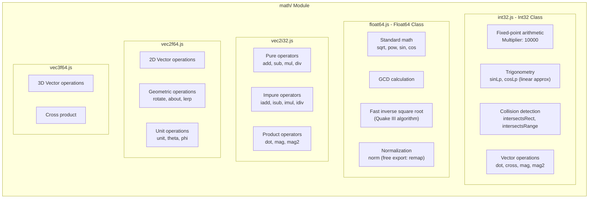

**Optimization Technique: ASM.js-style Type Annotations**

```javascript
// The + prefix hints to JIT that this is float64
// The | 0 suffix hints to JIT that this is int32

// From int32.js
static clamp(value = 0, min = 0, max = 0) {
  value = value | 0;  // Force int32
  min = min | 0;
  max = max | 0;
  return (
    mathi32_min(
      mathi32_max(value, mathi32_min(min, max)),
      mathi32_max(min, max),
    ) | 0  // Return int32
  );
}

// From float64.js
static clamp(value = 0.0, min = 0.0, max = 0.0) {
  return +mathf64_min(+mathf64_max(+value, +mathf64_min(+min, +max)), +mathf64_max(+min, +max));
}
```

**Pure vs Impure Operators:**

| Type | Pattern | Returns | Use Case |
|------|---------|---------|----------|
| Pure | `Vec2f64.add(a, b)` | New Vec2f64 | Functional style, no side effects |
| Impure | `a.iadd(b)` | Modified `this` | Performance-critical loops |

### 8. JSON Module — moved to `@jarenjs/json`

The JSON addressing standards (JSON validation helpers, JSON Pointer per RFC 6901 and the compiling JSONPath engine per RFC 9535) now live in the [`@jarenjs/json`](../json) package; see its README for the module deep dive.

### 9. Object Module (`object.js`)

Deep equality and collection manipulation.

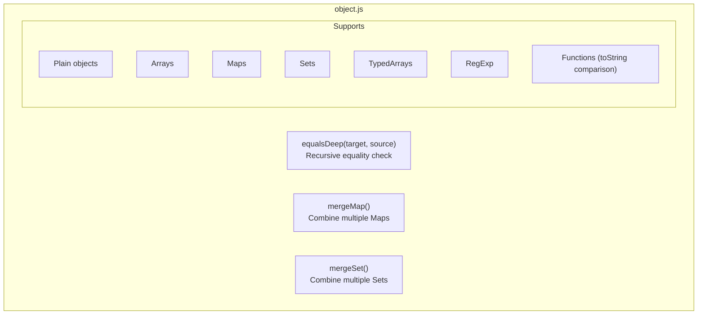

### 10. Array Module (`array.js`)

Array and array-like utilities.

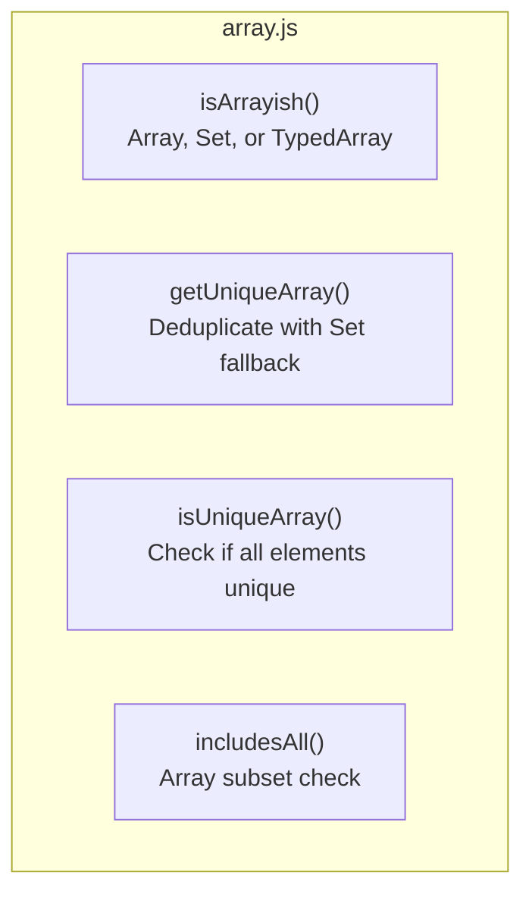

### 11. Function Module (`function.js`)

Utility functions for validator composition.

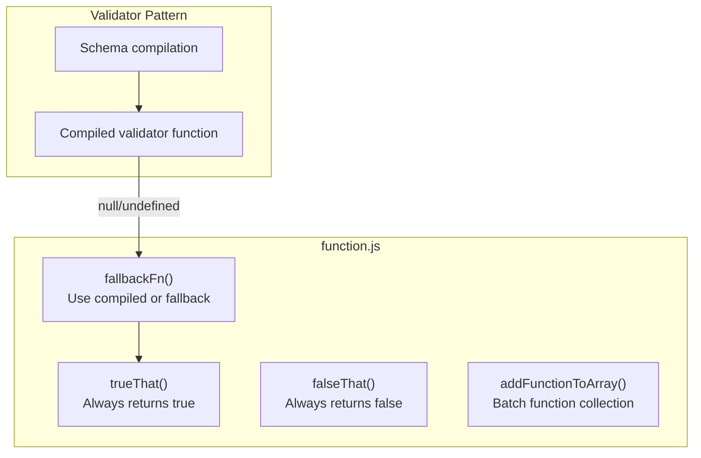

---

## Performance Considerations

### 1. JIT Optimization Hints

The codebase uses ASM.js-inspired type annotations to help JavaScript engines optimize hot paths:

```javascript
// int32 hint: | 0
const int32Value = (someNumber + 1) | 0;

// float64 hint: + prefix
const float64Value = +someNumber;

// Combined
const result = +((+a * +b) + (+c * +d));
```

### 2. Lazy Initialization

Expensive objects are created only when needed:

```javascript
let segmenterCache = null;
export function getSegmenter() {
  if (segmenterCache === null) {
    segmenterCache = new Intl.Segmenter(undefined, { granularity: "grapheme" });
  }
  return segmenterCache;
}
```

### 3. Fast Paths

Common cases are handled inline before falling back to slower algorithms:

```javascript
export function getStringLength(str, useGrapheme = false) {
  if (!useGrapheme) {
    return str.length;  // Fast path: ASCII length
  }

  // Check if ASCII inline to avoid function call overhead
  const len = str.length;
  for (let i = 0; i < len; i++) {
    if (str.charCodeAt(i) > 127) {
      // Non-ASCII found - use grapheme counting
      // ...
    }
  }
  return len;  // Was ASCII after all
}
```

### 4. Regex Caching

Constant regex patterns are defined at module load time:

```javascript
const CONST_REGEXP_UUID = /^(?:urn:uuid:)?[0-9a-f]{8}-(?:[0-9a-f]{4}-){3}[0-9a-f]{12}$/i;
```

---

## Type Safety

### TypeScript Definitions

The build generates declarations for the root entry point and every exported subpath:

```typescript
// Type guards
export function isStringType(data: unknown): data is string;
export function isValidInt8(value: number): boolean;

// Vector classes with full type support
export class Vec2F64 {
  constructor(x?: number, y?: number);
  get x(): number;
  set x(value: number);
  add(other: Vec2F64): Vec2F64;
  iadd(other: Vec2F64): Vec2F64;  // impure
}
```

### JSDoc Annotations

All functions include JSDoc for IDE support:

```javascript
/**
 * Checks if the given data is of number type.
 * @param {any} data - The data to check.
 * @returns {boolean} - True if the data is a number, otherwise false.
 */
export function isNumberType(data) {
  return data != null && typeof data === 'number';
}
```

---

## Contributing Guidelines

### Adding New Type Checkers

1. Add the `isXxxType()` function to `index.js`
2. Add the corresponding `getXxxType()` function
3. Add accurate JSDoc so the generated declaration contains the proper type guard
4. Add tests in `test/core/`

### Adding New Format Validators

1. Identify the appropriate text submodule (or create one)
2. Define the regex/pattern as a `CONST_` at module level
3. Export the `isValidXxx()` function
4. Update `text/index.js` exports
5. Add accurate JSDoc and run `npm run build:types --workspace=@jarenjs/core`

### Adding Math Operations

1. For scalar: Add to `int32.js` or `float64.js`
2. For vector: Add pure static method, then impure instance method
3. Use explicit type annotations (`| 0` for int32, `+` for float64)
4. Document mathematical formula/references in comments

### Code Style

- Use `@ts-check` at the top of every file
- Prefer `===` and `!==` over `==` and `!=`
- Use early returns to reduce nesting
- Cache regex patterns at module level
- Use `// eslint-disable-next-line` sparingly with justification

---

## Summary

`@jarenjs/core` is the **bedrock** of the Jaren ecosystem. It provides:

1. **Reliable type checking** that goes beyond JavaScript's built-in operators
2. **Format validation** for common string patterns (emails, URLs, UUIDs, etc.)
3. **Date/Time parsing** compliant with RFC 3339 and ISO 8601
4. **High-performance math** with explicit type annotations
5. **Zero dependencies** for maximum reliability

When contributing, remember: this package is used by `@jarenjs/validate` and `@jarenjs/formats`. Changes here have downstream effects. Maintain backward compatibility, optimize for performance, and keep the API predictable.

For questions about the broader architecture, see the root [`ARCHITECTURE.md`](../../docs/ARCHITECTURE.md). For development workflows, see [`HOWTO.md`](../../docs/HOWTO.md).

`src/virtual/` owns DOM-free fixed and sparse measured collection geometry. It imports no presentation, app or storage owner; the visible component and injected coordinator live above it.

`src/search/` owns lexical definition compilation, postings, rank statistics and derived snapshots. The [search contract](docs/SEARCH.md) fixes tokenizer, scoring and tie semantics. `src/range/` owns the structural resident array provider; app re-exports it and linq injects it without importing an upper layer.
