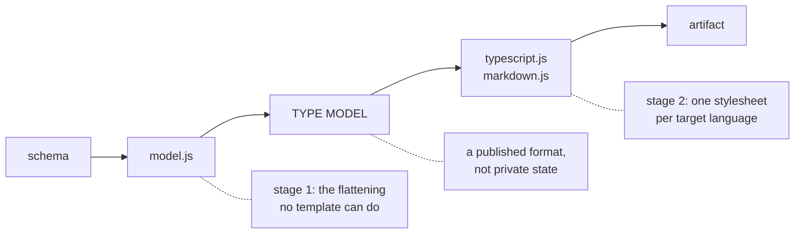

# @jarenjs/emit — architecture

Two stages, one published contract between them.

## Stage 1 — `model.js`

A single recursive descent over the schema, producing a flat declaration list.
The decisions that live here, and nowhere else:

- **Naming.** `$defs` keys and `$ref` pointer tokens are the names a reader
  already uses, so they win. Anything else is derived from the path that
  reached it (`UserAddressStreet`), PascalCased and de-collided by suffix.
- **Cycles.** A node reached while it is still being built is hoisted to a
  declaration and referenced by name. That is what turns a cyclic graph into
  an acyclic list; the frame already building it finishes the declaration.
- **Composition.** `allOf` → intersection, `anyOf`/`oneOf` → union, `const`/
  `enum` → literals. Degenerate unions collapse, `never` drops out, and a
  union containing `unknown` becomes `unknown`. A `$ref`'s 2019-09+ siblings
  intersect with the target; the reference itself resolves through the
  helpers `@jarenjs/validate/normalize` exports (`#`, `#/pointer`, plain
  `#anchor`, embedded-`$id` scope boundary), so a ref means here exactly what
  it means to the runtime normalizer.
- **Honest widening.** Every keyword in `DROPPED_CONSTRAINTS` is recorded on
  the node it came from and flattened into `doc` lines — including
  integer-ness, `not`, active conditionals, dependent/unevaluated keywords
  and `patternProperties` key restrictions. Nothing is discarded. The
  directional half of the rule: the type may be wider than the schema (and
  says where), never narrower. That is why applicators imply no container
  (`properties` without `type` unions the object arm with every other JSON
  kind), why tuples take their required count from `minItems` and stay open
  unless the schema closes them, and why a closed empty object emits
  `Record<string, never>` rather than TypeScript's primitive-swallowing
  empty interface.
- **The plain universe.** When variants are derived, `anyOf`/`oneOf`
  branches compile in a context with normalization inert, because
  `compileNormalizer` does not descend union branches. A referenced type
  that differs under normalization gets a `Plain`-suffixed declaration for
  its as-declared reading, shared by both passes; everything else shares the
  main declaration. `normalizationChangesType` walks exactly the keywords
  `compileNormalizer` walks — the twin analysis answering differently from
  the runtime is the defect class this package exists to rule out.
- **Determinism.** Declaration order is discovery order, member order is
  schema order, and names never depend on a traversal counter. Boolean
  schemas memoize by value — every `true` is the same schema — except that
  the `$defs` loop forces one declaration per def name, so every importable
  name exists. The `reserved` option seeds the taken-name list, which is how
  the CLI's `--bundle` keeps independently compiled models in one name space.

Absent information is **omitted**, not set to `null` — a missing `rest`,
`index` or `default` is simply not there. Stage 2 relies on that: a path that
yields the empty sequence dispatches nothing, which is how a template says
"only when present" without a conditional.

## Stage 2 — the stylesheets

Each emitter is a JTLT document plus a thin `render` function. Three things
about them are worth knowing before editing one:

1. **Rules match by SCHEMA, not by path.** `$apply` on the current node
   dispatches *location-less*, so a path match like `$..[?@.kind == 'union']`
   silently never fires for a re-dispatched node. `isKind()` builds the schema
   match instead, which is location-independent — and shape is what the rules
   mean anyway. This is the single easiest way to break these files.
2. **`$if` is an expression segment.** It interpolates a value; it cannot
   contain a segment list. Conditional *rendering* is done by dispatching a
   path that may be empty, never by `$if`.
3. **Separators without a position variable.** JTLT has no `position()`, so a
   separated list dispatches `$.options[0]` bare and `$.options[1:]` through a
   mode that prints its own separator first. Ordinary RFC 9535 selectors, no
   help needed from the model.

`markdown.js` exists to keep stage 1 honest: it is as unlike TypeScript as a
target gets, and it required no model change. If a future target does require
one, that is the signal the model is shaped around a language rather than
around schemas.

## Verification

`test/emit/agreement.test.js` is the reason to trust any of this — the cyclic
check against `@jarenjs/validate` described in the
[README](./README.md#the-cyclic-verification). It is itself checked by
breaking the generator on purpose and confirming the suite fails.
