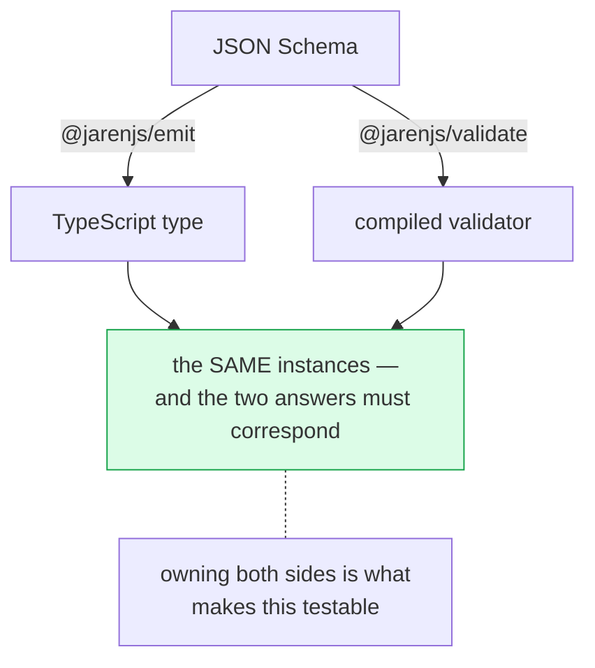

# @jarenjs/emit

Build-time artifacts from JSON documents. Point it at your JSON Schemas, get
TypeScript declarations — or Markdown reference docs, or whatever a stylesheet
emits next.

```bash
npx jaren-emit --schema ./schemas --out ./src/types
```

```javascript
import { emitTypeScript } from '@jarenjs/emit';

emitTypeScript({
  type: 'object',
  description: 'A user',
  properties: {
    id: { type: 'string', format: 'uuid' },
    role: { enum: ['admin', 'user'] },
  },
  required: ['id'],
}, { name: 'User' });
```

```typescript
/**
 * A user
 */
export interface User {
  /**
   * Schema constraints this type cannot express: format="uuid"
   */
  id: string;
  role?: "admin" | "user";
}
```

## Why this exists

A schema-first codebase has a gap where a Zod codebase has `z.infer`: the
schema knows the shape, and TypeScript does not. The usual answers are to
assert the type by hand — which can silently certify something the schema
never said — or to reach for a type-level library.

The observation this package is built on is smaller than either: **a JSON
Schema is JSON, TypeScript is text, and [JTLT](../json/docs/JTLT-FORMAT.md) is
JSON-to-text.** Generating a declaration file is a stylesheet, not a new
engine. That is also why it is called `emit` and not `infer` — swap the
stylesheet and the same machinery emits documentation, DDL, or anything else
a target language needs.

## The cyclic verification

This is the part that matters, and the part a standalone
schema-to-TypeScript tool structurally cannot do.

One schema goes two ways, and the two answers have to correspond:



A generator that is merely *plausible* is worthless. It will emit a type that
says one thing while the validator enforces another, and you find out in
production — data that passed validation and violates its own declared type,
or a type so wide it certifies anything.

Because Jaren owns **both sides**, that can be tested rather than trusted.
The suite in `test/emit/agreement.test.js` takes a corpus of schemas plus
instances, generates the declarations, writes a probe file that assigns every
instance to its generated type, and runs `tsc` over it. Then it runs the
compiled validator over the same instances and requires three relationships to
hold:

| Instance | Validator | Generated type | What a failure would mean |
| --- | --- | --- | --- |
| valid | accepts | **must** type-check | the type is **narrower** than the schema — it rejects data your service accepts |
| structurally invalid | rejects | **must not** type-check | the type is **wider** than the schema — it certifies data your service rejects |
| constraint-invalid | rejects | **does** type-check | the documented widening — see below |

The third row is the honest one. TypeScript cannot express `minLength`,
`pattern` or `format`, so a value can be type-correct and schema-invalid.
Rather than hide that, the corpus asserts it, and the generator writes the
dropped constraint into the generated file:

```typescript
  /**
   * Schema constraints this type cannot express: minLength=3
   */
  id: string;
```

The type says `string`. The comment says the schema also demands a minimum
length that the type does not enforce. A reader learns both. **Widening
silently would be a lie of omission**, and it is the single most common way a
generated type misleads the person reading it.

The rig is checked against itself, too: deliberately breaking the generator so
it emits `unknown` everywhere makes the "not wider than the schema" assertion
fail. A verification suite that passes on a broken generator proves nothing.

## Accepted and normalized types

`@jarenjs/validate/normalize` makes a contract's input and output shapes
differ — a defaulted member is optional for the caller and present afterwards,
and a coerced member arrives in its transport form. Pass the same options to
the generator and it names both sides:

```bash
jaren-emit --schema ./schemas --out ./types --defaults --coerce
```

```typescript
export interface Config {
  host: string;      // present after normalizing
  port: number;
  name: string;
}

/**
 * Accepted input for Config: the shape before normalization, where defaulted
 * members may be absent and coercible values may still be in their transport form.
 */
export interface ConfigInput {
  host?: string | number | boolean;   // optional, and widened to what
  port?: number | string;             // the normalizer will convert FROM
  name: string | number | boolean;
}
```

That pair is exactly what a `Contract<Input, Output>` boundary wants: the
handler signature takes `ConfigInput`, the rest of the program handles
`Config`, and the normalizer is the transition between them.

**A twin appears only where the type actually differs.** The generator works
that out bottom-up, so a schema with one defaulted field does not double every
declaration; everything unaffected keeps a single shared name on both sides.

**Only two normalizations produce a difference.** `useDefaults` moves a member
across the optional boundary and `coerceTypes` widens what the input accepts.
`trimStrings` is string-to-string, and `removeAdditional` removes members no
type ever declared — neither earns a second declaration.

The switch resolution, including per-field predicates, is **imported from the
normalizer rather than reimplemented**. Two copies of that rule would drift,
and a variant that disagrees with the normalizer is worse than no variant: it
is a type certifying an input the normalizer will not take. The agreement
suite checks the pair the same way it checks everything else — a raw input
must satisfy `ConfigInput` and not `Config`, and normalizing it at runtime
must produce something the `Config` side describes.

**The variants stop where the normalizer stops.** `compileNormalizer` does
not descend `anyOf`/`oneOf` — which branch applies is only known after
validating — so inside a union branch no default materializes and no coercion
runs, and the generated pair says the same: branch members keep their
declared optionality and their declared scalar types on *both* sides. When a
branch references a type that does differ elsewhere, the branch points at a
`Plain`-suffixed declaration carrying the schema's as-declared reading.
Literals get the same treatment in the other direction: an integer `enum`
under `--coerce` accepts its transport string on the input side (`1 | 2 |
string`), because the normalizer coerces `"2"` to `2` before the enum check
runs.

## Two stages, and why

```
schema ──▶ compileEmitModel ──▶ TYPE MODEL ──▶ stylesheet ──▶ artifact
```

The templating is the easy half. The hard half is that a schema graph is not
shaped like a declaration file: `$ref`s point sideways and in cycles,
subschemas nest anonymously, `allOf` means intersection while `anyOf` means
union, and half the vocabulary has no type-level meaning. **Stage one** does
that flattening once — resolving refs, breaking cycles by name, deriving
identifiers, widening honestly — into a flat list of named declarations.

**Stage two** is a JTLT stylesheet per target. TypeScript and Markdown ship;
both read the same model, and neither has privileged access to it.

The [type model](./docs/EMIT-FORMAT.md) is a **published format** with its own
[JSON Schema](./schemas/jaren-emit-model.schema.json) — and the test suite
validates every model the package produces against it, so "published format"
stays true rather than becoming decoration. A third-party emitter targeting
the model is exactly as capable as the bundled ones.

Markdown exists mainly as evidence for that claim: it is as unlike TypeScript
as a target gets, and adding it required **no change to stage one**. If the
model had secretly been the TypeScript printer's private state, writing it
would have forced one.

## CLI

```bash
jaren-emit --schema <file|dir> --out <dir> [options]

  --target <name>   typescript (default) or markdown
  --name <Name>     root declaration name for a single schema
  --bundle <file>   one output file instead of one per schema
  --check           write nothing; exit 1 if any output is out of date
```

`--check` is the CI guard: it fails the build when a schema changed and the
generated types did not, which is the failure mode that makes generated code
untrustworthy in the first place.

`--bundle` compiles every schema into **one name space**: a `$defs.Id` that
two schemas both declare comes out as `Id` and `Id2`, deterministically in
sorted-file order, instead of two colliding declarations. The programmatic
equivalent is the `reserved` option of `compileEmitModel`.

## What it maps

| JSON Schema | TypeScript |
| --- | --- |
| `type: 'string' \| 'number' \| 'integer' \| 'boolean' \| 'null'` | the primitive (`integer` → `number`) |
| `const` / `enum` | a literal / a union of literals |
| `properties` + `required` | interface members, optional when not required |
| `additionalProperties` / `patternProperties` | an index signature, widened to cover the declared members |
| *omitted* `additionalProperties` | `[key: string]: unknown` — the object is **open**, see below |
| `additionalProperties: false` | a closed interface, with no index signature; with no members at all, `Record<string, never>` (an empty interface would let a primitive through) |
| `items` | `Array<T>` |
| `prefixItems`, array-form `items` | a tuple: the first `minItems` positions required, the rest optional, and an **open** rest (`...Array<unknown>`) unless `items: false`/`additionalItems: false` closes it — JSON Schema accepts shorter and longer arrays, so the type does too |
| `$ref` (same document, including cycles) | a reference to the named declaration — `#/pointer` and plain `#anchor` forms, resolving exactly as `compileNormalizer` resolves them; a root `$ref` aliases its target, and 2019-09+ siblings intersect with it |
| `allOf` | an intersection |
| `anyOf`, `oneOf` | a union |
| `properties`/`items` with **no `type`** | the container shape as one union arm, plus the other JSON kinds — applicators do not imply a container, and the validator accepts a primitive without reading them |
| `description` | a doc comment |
| `default` (with `--defaults`) | optional on the accepted side — even when `required` lists it, since the normalizer materializes it before validation — and present on the normalized side |

### Objects are open unless the schema closes them

A JSON Schema object accepts members it never declared. That is the default,
and it is easy to forget when reading a schema that lists four properties and
looks like a struct. So an interface generated from one carries an index
signature, and only `additionalProperties: false` removes it.

This costs something real: with an index signature TypeScript stops flagging a
misspelled property, because the misspelling is a legal member. The trade is
deliberate. A type that is **narrower** than its schema rejects a document your
service accepts — the caller is told their payload is wrong by the very
artifact that promised to describe it, and no amount of local convenience is
worth a generated type that lies in that direction. If you want the tighter
type, say so in the schema with `additionalProperties: false` and get it
honestly, or pass `openObjects: 'closed'` and own the divergence.

Both directions are pinned by the agreement corpus: an open schema's extra
member must type-check, and a closed schema's must not.

**Widened, with the constraint recorded**: `minLength`, `maxLength`,
`pattern`, `format`, `minimum`, `maximum`, `exclusiveMinimum`,
`exclusiveMaximum`, `multipleOf`, `minItems`, `maxItems`, `uniqueItems`,
`contains`, `minProperties`, `maxProperties`, `propertyNames`,
`dependentRequired`, `dependentSchemas`/`dependencies`, `not`,
`if`/`then`/`else`, constraining `unevaluatedProperties`/`unevaluatedItems`,
integer-ness (`type: "integer"` emits as `number`), the key restrictions of
`patternProperties`, and the Jaren extension keywords. Nothing on this list
narrows a type, and nothing on it disappears silently: each is written into
the generated file's doc comment.

**Not mapped**: `if`/`then`/`else` and `not` contribute nothing to the type —
they have no sound type-level equivalent, so they are recorded (see above)
rather than guessed at. Cross-document `$ref`s are not followed — a model
compiles the document it was handed — and an unresolvable reference
contributes nothing, leaving the node honestly wider.

## Honest comparison

[`json-schema-to-ts`](https://github.com/ThomasAribart/json-schema-to-ts)
computes types *in the type system* from schema literals. This generates
*source*. Different mechanism, different trade:

- **Theirs** needs no build step and stays exact as you edit a literal.
- **Ours** works on schemas that live in `.json` files, produces declarations
  a human can read and review in a diff, emits non-TypeScript targets, and can
  be checked against the validator that will actually run.

If your schemas are TypeScript literals and you want zero build steps, use
theirs. If your schemas are documents — published, shared with other
languages, or fed to an LLM's structured-output mode — this is the one that
fits.

## Development

Tests live in `test/emit/` at the repository root (`npm run test:emit`).
`agreement.test.js` is the cyclic verification and needs the workspace's
TypeScript. The internals are described in [ARCHITECTURE.md](./ARCHITECTURE.md);
the model contract is in [EMIT-FORMAT.md](./docs/EMIT-FORMAT.md).
