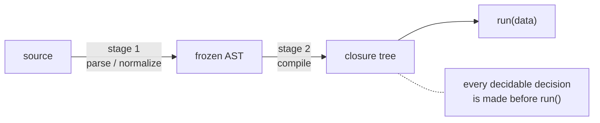

# @jarenjs/json Architecture

This document describes the internals of `@jarenjs/json` for contributors: the JSON Pointer compiler, the RFC 9535 JSONPath compiler, the Jaren JSON Query engine with its XQuery text front-end, the JSLT stylesheet dispatcher layered over the query compiler, and the JTLT text-template front-end that desugars onto JSLT. The user-facing story is in the [README](./README.md); the language contracts are [docs/QUERY-FORMAT.md](./docs/QUERY-FORMAT.md), [docs/JSLT-FORMAT.md](./docs/JSLT-FORMAT.md) and [docs/JTLT-FORMAT.md](./docs/JTLT-FORMAT.md).

Everything here follows the house architecture of the schema validator (see [`packages/validate/ARCHITECTURE.md`](../validate/ARCHITECTURE.md)): **two-stage compilers** — parse and normalize once into an AST, then compile the AST into specialized closures with every decidable decision made at compile time. No `eval`, no `new Function` (CSP-safe), no allocation on hot paths, monomorphic closures wherever the engine can arrange it.

## Module map

| File | Purpose |
|------|---------|
| `src/basic.js` | string validation for JSON, JSON Pointer, JSONPath (`isValidJSON`, `isValidJSONPointer`, `isValidJSONPathStrict`, ...) |
| `src/canonical.js` | Canonical JSON (RFC 8785 / JCS): `canonicalizeJson` deterministic serialization for hashing and signing |
| `src/pointer.js` | the RFC 6901 + Relative JSON Pointer compiler (`compileJSONPointer`, `compileRelativeJSONPointer`, `compileDataRef`) and the reference-token codec (`encodeJSONPointerSegment`, `decodeJSONPointerSegment`, `formatJSONPointer`) |
| `src/cow.js` | package-internal copy-on-write core: owned-set state, spine cloning, step encoding (not exported) |
| `src/patch.js` | JSON Patch (RFC 6902) + JSON Merge Patch (RFC 7396): compiled copy-on-write appliers and the structural diffs |
| `src/write.js` | standalone write operations: set/insert/remove at pointers, normalized paths, or every JSONPath match |
| `src/path.js` | the JSONPath compiler: parser, function-extension registry, nodes-mode compilers (normalized paths), public API, the pointer bridge |
| `src/segments.js` | package-internal runtime segment machinery shared by `path.js` and the query engine — values, nodes and lazy modes (not exported) |
| `src/query/errors.js` | `JsonQueryCompileError` / `JsonQueryRuntimeError` with `code` + `docPath` |
| `src/query/runtime.js` | the tagged sequence representation (`EMPTY` / raw item / `Seq`), EBV, `stableKeyString` |
| `src/query/normalize.js` | query document → frozen AST: all `JQ0xxx` checks, scopes, slots, externals, cardinality |
| `src/query/compile.js` | AST → closures: expressions, FLWOR tuple streams, quantifiers |
| `src/query/operators.js` | the operator registry: all §8 operators as one `name → {params, result, compile}` table |
| `src/query/index.js` | public API: `compileJsonQuery`, `queryJson`, result unwrapping, caches |
| `src/jslt/stylesheet.js` | frozen stylesheet normalization: closed shapes, modes, dispositions, priorities |
| `src/jslt/dispatch.js` | match/body compilation, lazy path pre-passes, ranked dispatch, built-in rules |
| `src/jslt/errors.js` | `JsltCompileError` / `JsltRuntimeError` with `code` + stylesheet `docPath` |
| `src/jslt/index.js` | public API: `compileJsltStylesheet`, `transformJson`, result unwrapping, cache variants |
| `src/jtlt/template.js` | template envelope/rule normalization: closed shapes, the `output` method |
| `src/jtlt/desugar.js` | template → JSLT 0.1 stylesheet: rule bodies become array constructors of tagged segment pairs |
| `src/jtlt/writer.js` | serializes the desugared tagged-segment stream to `text`/`xml`, escaping interpolated data only |
| `src/jtlt/errors.js` | `JtltCompileError` / `JtltRuntimeError` with `code` + template `docPath` |
| `src/jtlt/index.js` | public API: `compileJtltStylesheet`, `renderText`, the exposed `render.stylesheet` |
| `src/xquery/parse.js` | the XQuery text front-end: `parseXQuery(text)` → query document |
| `src/xquery/index.js` | `parseXQuery`, `compileXQuery`, `XQuerySyntaxError` |

Dependency direction: `basic.js` and `canonical.js` stand alone; `pointer.js` shares only the `NOTHING` sentinel and the array-index scanner from `segments.js`; `cow.js` stands alone as the package-internal copy-on-write core; `patch.js` builds on the pointer parser, the segment helpers and `cow.js`; `write.js` builds on `cow.js`, the pointer parser and the JSONPath compiler; `path.js` builds on `segments.js`; the query engine builds on `segments.js` (paths) and `runtime.js`; JSLT consumes the query normalizer/compiler through its package-internal extension point and the nodes-mode segment runner; JTLT is a front-end that desugars templates into ordinary JSLT stylesheets and serializes the dispatched result, depending only on the jslt module (through its public compiler) plus its own writer; the XQuery front-end emits query documents and depends only on the JSON format, never on engine internals. `@jarenjs/core` supplies char-code scanning, `equalsJson`, code-point helpers and I-Regexp compilation. JSON Schema remains an injected predicate hook: `@jarenjs/validate/query` may wire into query/JSLT, but this package never imports the validator.

## The two-stage pipeline

All compilers in this package have the same shape:



Stage 1 owns *all* static errors: the JSONPath parser is a single-pass, character-level recursive-descent parser (the `fail(message, position)` idiom, `JSONPathSyntaxError`), and the query normalizer raises every `JQ0xxx` compile error with a `docPath`. Stage 2 never re-checks structure; it specializes: selector kinds, slice bound arithmetic, comparison operators, literal regexes, operator arities and cardinality fast paths are all resolved before the first document is seen. A compiled query closes over nothing mutable and is reusable across documents and calls.

For the query engine, stage 1's output is a **published contract**, not an internal shape: `analyzeQuery` (the `./query` subpath) returns the frozen normalized tree, `NODE_KINDS` enumerates its twelve node kinds, and `AST_VERSION` versions the shape under the compatibility policy of QUERY-FORMAT.md Appendix C. Stage 2 — the closures — remains unpromised and changes freely. The reasoning: an exhaustive consumer of the normalized form (a translator, a planner) fails loudly when the language grows a construct, where a raw-document walker would silently degrade it; publishing stage 1 freezes the language's *resolved* form, not the implementation. An exhaustiveness gate in `test/json/query/` keeps `NODE_KINDS`, the appendix's table and the operator count in agreement with the code.

### JSON Pointer: segment-count specialization

`pointer.js` follows the pipeline in miniature. The strict parsers (`parseJSONPointer`, `parseRelativeJSONPointer`) are single-pass char-code scanners with a lazy-decode fast path: an escape-free segment is a direct slice, and only segments containing `~` build a decoded string. The compilers pre-decode every member name and pre-parse every array index (one segment, two forms — RFC 6901 lets `"2"` address both a `"2"` member and array element 2), then specialize the getter by segment count (0 = identity, 1 to 4 = unrolled hops, N = a loop over parallel name/index arrays). A relative pointer trims its level count off the runtime location by scanning **backwards** for the N-th `/` — no split, no arrays — and resolution returns the `NOTHING` sentinel shared with `segments.js`, so pointer and JSONPath results compose. Nothing is allocated on any resolution path.

Four deliberate divergences are worth stating, because they are correct-but-surprising and load-bearing for the validator:

- **Own-property reads only.** A `hop` into an object uses `Object.hasOwn`, never a prototype walk, so `/toString` (and any other inherited name) resolves to `NOTHING` rather than the prototype method. RFC 6901 addresses members, and only own members are members.
- **Strict array-index parsing.** The one-token-two-forms array index goes through `scanArrayIndex` (`segments.js`): a leading-zero form (`01`), a non-digit tail (`1abc`), an exponent (`1e0`) and anything above `2³²−2` (`MAX_ARRAY_INDEX = 4294967294`) all reject as an index, falling back to the member-name form. Only a canonical non-negative integer addresses an array element.
- **The `0#` hash form yields the member *name* by default.** The `#` form resolves to the location's last segment **as a string**, a deliberate divergence from Relative JSON Pointer, which yields a *number* for an array position. The string form stays the default because the validator's `$data`/`data` keyword tests rely on it, and because it answers from the location string alone — no document access, tens of nanoseconds. The draft's answer is available per compile as `{ hashIndex: 'number' }`, which pays for a walk to the location's parent to find out whether it is an array (an object member named `"1"` is still the string `"1"` in that mode, since only the container decides); it falls back to the string when the parent is unreachable, and an unknown mode is a compile-time `TypeError`. Two related rules are *not* divergences: the root has no name, so `0#` there yields `NOTHING` rather than `''` (which would collide with the member a document can genuinely name `''`), and the `#` form answers from the location string alone without walking the document — it does not verify the location exists, which is what keeps it a string operation rather than a walk.
- **The relative-resolver `dataPath` contract.** A non-string location is coerced to `''` (the root); a non-empty location not starting with `/` returns `NOTHING`; and the lazy `~` decode (`decodeSegmentRange`) is *lax* — an invalid escape is kept literally rather than raising — because location paths are machine-generated by the validator through raw string concatenation, and the resolver must mirror exactly how they were built.

### JSON Patch: compiled operations over copy-on-write

`patch.js` runs the pipeline over *two* documents: the patch compiles once, the data document is what varies per call. Stage 1 (`compileJSONPatch`) owns all `JP0xxx` errors — operation shapes, unknown ops, pointer syntax (wrapping the `JSONPointerSyntaxError` as `cause`), the move `from`-is-prefix-of-`path` rule — each with a `docPath` into the patch document. Every `path`/`from` is pre-parsed into decoded member names alongside pre-scanned array indexes (the pointer compiler's one-token-two-forms rule), with the last token split off for the mutating operations, and each operation becomes one closure with its error strings pre-bound.

Stage 2 is a copy-on-write interpreter of those closures. An application carries `{root, owned}` where `owned` is the set of nodes this application created: the first write along a path shallow-clones the spine from the root and registers the clones; later writes find the spine in the set and mutate in place. Consequences: the input is never touched (RFC 6902's atomic-application requirement costs nothing — a failing op just abandons the state), untouched subtrees are shared with the result (the JSLT `share` discipline), and k operations through one region cost one spine copy. `copy` deep-clones its source only when the subtree contains owned nodes (otherwise the inserted alias could be mutated through by a later operation); `mutate: true` sets `owned = null` (everything owned, nothing cloned) and then forces per-application deep copies of inserted values, since in-place results must not share structure with the patch document. Object member writes go through the `setMember`/`__proto__` discipline of the query engine, and the object shallow clone relies on spread's `CreateDataProperty` semantics for the same reason.

`test` and `copy`-reads never clone — they run a plain pre-compiled walk against the current root. The merge-patch side (`compileMergePatch`) pre-splits each patch level into remove/set/merge plans and applies them identity-preservingly: a level that changes nothing returns its target by reference, which makes a no-op merge return the input document itself. The structural diffs (`createJSONPatch`, `createMergePatch`) share `equalsJson`; the array diff trims the deep-equal common prefix/suffix and recurses index-wise over the overlap — linear and minimal for in-place edits and head/tail insertions, correct-but-larger for a mid-array insertion, which degrades to a run of per-index replaces. `arrayDiff: 'minimal'` aligns the changed middle instead. The cost model is the patch itself — a kept pair is free, a rewrite, an insert and a delete are one step each — so the alignment is **edit distance with substitutions, not a longest common subsequence**: LCS maximizes kept elements, a different objective that loses on a permutation, where it spends a delete plus an insert on what one rewrite covers. Because pairing every overlapping position is itself a valid alignment, the minimal mode never takes more steps than the default. It stays opt-in because it is O(m·n) in the length of the changed middle against the default's linear pass; elements are interned to integer ids (via `stableStringify`) so the inner loop compares integers and only confirms candidates with `equalsJson`, and a middle above a fixed cell budget falls back to the index-wise diff so the option can never turn a large diff quadratic.

The owned-set machinery itself lives in the package-internal `cow.js` (like `segments.js`, deliberately unexported), because `write.js` shares it. Its step encoding covers both addressing worlds in one pair of parallel arrays: the RFC 6901 form keeps every token in `names[i]` with its pre-scanned index form in `indexes[i]` (one token, two forms), while the JSONPath-derived typed form marks index selectors with `names[i] = null` — which also gives typed steps negative (from-the-end) indexes for free. `patch.js` and `write.js` keep their own ~20-line walk loops over these arrays so each raises its own error type with its own location fields.

### Write operations: reverse document order

`write.js` publishes the standalone set/insert/remove writers. Pointer-addressed targets dispatch once at compile time (`$` → parse as JSONPath and require a singular query — which admits every RFC 9535 normalized path; otherwise the RFC 6901 parser), then compile to a closure over the pre-parsed steps. The query-selected writers (`compileJSONPathSetter` et al.) compile the query once; each application runs it in nodes mode and rewrites the matched normalized paths in **reverse document order** — descendants before ancestors, later siblings before earlier ones — so array-index shifts from inserts/removes never invalidate the remaining locations, nested matches compose, and an ancestor rewrite deterministically wins over rewrites inside it. Normalized paths are engine-generated, so the scanner that turns them back into typed steps (`scanNormalizedSteps`) is total for its input. The path↔pointer bridge (`jsonPointerFromJSONPath`, `jsonPathFromJSONPointer`) lives in `path.js` with the documented digit-token convention for the pointer→path direction.

### JSONPath: parser, segments, two output modes

`path.js` keeps the grammar (strict RFC 9535: leading-zero rules, integer bounds, filter well-typedness) and the public API. The runtime machinery lives in `segments.js` so the query engine can reuse it: `compileSingularGetter` (the zero-allocation property-walk for singular queries), `compileSegmentV`/`descendV` (values-mode segment closures), `compileExists` (existence tests that skip nodelist construction), the filter expression compilers, and the `NOTHING` sentinel (exported publicly as `JSONPATH_NOTHING`).

Values mode is the default and the fast path; nodes mode (normalized paths for `query.nodes()`/`query.paths()`) is compiled **lazily on first use**, so value-only queries never pay for path-string production.

A third mode is pulled rather than pushed: `compileSegmentG`/`runSegmentsG` are the same selectors as values mode written as generators, so a consumer that stops early never visits the rest of the document. `query.iterate(data)` exposes it, and `query.first()`/`query.exists()` are one pull of it — a filter evaluates its predicate only until a node passes, a wildcard reads only the children pulled, a descendant segment abandons the walk mid-subtree. Nothing is buffered, so the laziness is per node rather than per segment. It is also compiled lazily, so a query that only calls `values()` never pays for it. The equivalence that makes this safe: a segment maps each input node to its outputs in order and concatenates, so pulling the chain depth-first yields exactly the sequence values mode builds breadth-first.

Laziness deliberately stops at the top of a query. The existence test inside a *filter* (`compileExists`) and `value()`'s one-node test still build their nodelists, because they run per candidate node where nodelists are a handful of items and generator setup costs more than the pushes it saves — the generator form benched about 9× slower on `$.items[?@.tags[*]]` over 2000 items.

A `$`-rooted comparable inside a filter (`[?@.price < $.config.max]`) is invariant across the candidates of one filter application, so it is memoized: computed at the first candidate, reused for the rest, and reset before each application. The reset hooks travel from the predicate tree to the selector that runs it (`compileFilterPredicate`), because a plain root-keyed memo would be wrong — a caller may mutate the document and re-run the query on the same root identity. A guard on root identity additionally covers a reentrant run against a different document. Hoisting the walk out of the loop measured ~2.9× on a three-segment comparable over 2000 candidates (~1.6× on a one-segment one); a filter with no absolute comparables compiles exactly as before.

Function extensions (RFC 9535 §2.4) are a registry rather than a fixed table. `options.pathFunctions` declares each extension's parameter and result types, so the parser applies the same well-typedness rules (§2.4.3) to a custom function as to a built-in, and rejects a name that would redefine one (§2.4.1). Because the declared types are known before an argument is parsed, argument parsing is type-directed: a `LogicalType` parameter takes the whole `logical-expr` production, which is how `!`, `&&` and comparisons become legal in that position and nowhere else. The registry is resolved once per registry object (memoized in a `WeakMap`) and the resulting table is null-prototype, so an inherited member name (`constructor`) is an unknown function rather than a half-formed descriptor. Threading reaches every entry point that embeds a path: `compileJSONPath`/`queryJSONPath`/`isValidJSONPathStrict`, the JSONPath-addressed writers in `write.js`, the query normalizer's `parsePathString` (both the absolute and the variable-rooted call sites), and the JSLT dispatcher's match paths and rule bodies. `queryJSONPath`'s compiled-query cache is keyed per registry, since one source compiles differently under different extensions.

The `json-path` string format resolves to the built-ins and nothing else, and so does `json-path-segments`: a format is a property of the string itself and must mean the same thing in every schema, independent of which extensions some host installed. A host that wants its own extensions asserted registers a tester bound to them.

## The query engine

### The sequence representation

XQuery evaluates everything to a *sequence*, but JSON arrays are themselves items, so the representation must never confuse "a sequence of three numbers" with "an array of three numbers". The engine uses a tagged representation (`runtime.js`) that also makes the overwhelmingly common singleton case allocation-free:

| Sequence | Representation |
|---|---|
| empty `()` | the exported `EMPTY` symbol |
| singleton | the raw item itself — no wrapper ("singleton ≡ item", spec §2.1) |
| two or more items | a `Seq` instance wrapping a flat items array |

`Seq`s are always flat (never contain `Seq`, `EMPTY`, or fewer than two items); all construction goes through `seqOf`/`appendItem`, which maintain the invariant. The representation **never escapes the module**: `index.js` maps results to plain JSON (`EMPTY` → `undefined`, singleton → the item, `Seq` → its items array).

### Cardinality analysis

At normalize time every AST node gets a static cardinality upper bound: `ZERO`, `ONE` (exactly one item), `OPT` (zero or one), or `MANY`. Literals, constructors, comparisons, logic and `$concat` are `ONE`; singular paths are `OPT`; non-singular paths, `$for`/`$groupby` phrases and `$range` are `MANY`; arithmetic joins its operands (`ONE` only when all operands are `ONE`, because empty propagates). The compiler consumes the bounds everywhere a general code path can collapse into a specialized one — see [Where the fast paths are](#where-the-fast-paths-are).

### Frames and slots

Variables never live in dictionaries. Normalization runs a single slot allocator over every binding site (`$for`, `$let`, `$at`, `$count`, `$groupby` names, quantifier bindings) *and* every external parameter; evaluation allocates **one flat frame array** per call, with slot 0 holding the input document and externals written once up front (`UNBOUND` sentinel for missing ones, checked at reference time → `JQ2006`).

Scoping is entirely compile-time: a linked chain of `{name, slot, card, parent}` records. Shadowing is chain order; a nested phrase extends the chain and owns fresh slots. Compiled variable references address their slot by constant index — no lookup, no closure-captured environments.

### FLWOR: streaming clauses, blocking clauses, liveness

A FLWOR phrase compiles to a chain of nested `(frame, out) → void` closures. **There are no tuple objects**: a tuple *is* the current state of the frame slots. Clauses apply in the spec's fixed semantic order (`$fold → $for → $let → $as → $where → $groupby → $orderby → $count → $return`) regardless of JSON key order.

Streaming clauses never materialize the tuple stream:

- `$for` iterates its source sequence (with the spec's D4 one-level array unpacking), rebinding its slot per tuple; multiple bindings nest left-to-right and may be correlated. The `$at` positional form keeps a per-activation 0-based counter. `$allowing-empty` tests up front whether the source yields any tuple *after* unpacking and, if not, emits one with the slot bound to `EMPTY` (position `-1`); a `$window` binding materializes the unpacked item stream once and slices runs out of it.
- `$let` writes its slot once per surrounding tuple.
- `$where` gates the chain on the effective boolean value.
- `$count` numbers surviving tuples through its own frame slot (reset per phrase evaluation — safe because a phrase cannot re-enter within one frame).

`$groupby` and `$orderby` are **barriers** — they must see the whole stream — but they snapshot only the **live** slots. At normalize time `collectReadSlots` walks the downstream AST ( `$orderby` keys, `$return`) and intersects the phrase's binding slots with what is actually read:

- `$orderby` runs a Schwartzian sort: each surviving tuple appends a `[key₁, ..., keyₙ, snapshot]` row, `Array.prototype.sort` (stable) compares precomputed keys, then the snapshots replay into the frame. Key type errors (`JQ2005`) are raised eagerly at key evaluation; empty keys order per `$empty` (least/greatest as ±∞ before direction).
- `$groupby` accumulates a `Map` from a composite `stableKeyString` key to the group, in first-appearance order; grouping-key variables rebind to the key values, every other live variable rebinds to the *sequence* of its values across the group's tuples.

`$fold` needs no fifth driver pair. It replaces the collecting sink with one that assigns the accumulator slot, then wraps whichever of the four drivers was built: seed the slot, run the tuple stream unchanged, read the slot back. Both barriers, `$count` and `$where` therefore compose with it for free — a fold under `$orderby` reduces over sorted tuples because the replay loop calls the same sink.

### FLWOR: the two compile-time rewrites

Both are pure specializations — they change the closures emitted, never the answer — and both are declined whenever the rewrite would be observable.

**Range iteration.** A `$for` or quantifier binding whose source is *statically* a `$range` compiles to a counting loop instead of materializing the sequence to walk it once. Memory drops from O(n) to O(1), so the `JQ2007` guard stops being the only thing between a query and the heap (a 50-million-item `$for` allocates nothing); a quantifier additionally stops at its witness. The loop is written out at each use site rather than shared through a callback, because an indirect call per iterated number costs more than the duplication saves. A `$range` that is genuinely materialized — bound by `$let`, handed to an aggregate — keeps the guard.

**Hash joins.** `$for a, $for b` with an equality `$where` is O(|a|·|b|) as nested loops. When the inner binding is *uncorrelated* (`collectReadSlots` proves its source reads no outer binding slot), the equality is answered from a `Map` built once over the inner side, making it O(|a| + |b|) — measured at 227 ms → 1.0 ms for 2000×2000, with identical rows.

The planner declines unless the rewrite is provably invisible: no `$as` and no `$let` in the phrase (both run per tuple *between* `$for` and `$where`, so forming fewer tuples would retract an assertion or skip a failure); no `$at`/`$allowing-empty`/`$window` on the probe binding; the equality is the whole `$where` or its **first** `$and` conjunct (so nothing that used to be evaluated first is skipped); both key expressions are paths or variable references, whose only failure is `JQ2006`, so moving *when* they are evaluated cannot move an error; and neither key is statically `MANY`, since `$eq` is existential over sequences. Buckets key on `stableKeyString`, which agrees with the `$eq` relation (`equalsJson`) on every JSON value except `NaN` — dropped on both sides, which is what `$eq` already does. The table is closure state refreshed once per phrase evaluation, which is sound because the language has no recursion: a compiled phrase can never be re-entered while it runs.

**Spatial joins.** The same rewrite for `$within` and `$bbox-intersects`: index the uncorrelated inner side's bounding boxes once (`createBboxIndex`, a static packed-Hilbert R-tree in `@jarenjs/core/geo`) and probe it per outer tuple. Measured 14× on 200 points against 800 regions, and the index itself is 538× faster than a scan at 100k boxes.

It differs from the hash join in one way that makes it simpler to prove correct: it does **not** consume the predicate. Box overlap is a *necessary* condition for both operators — a position inside a surface lies inside that surface's box — so the index can only remove candidates that would have failed anyway, and `$where` still runs unchanged on every survivor. The surviving tuples are decided by the same closure either way.

That leaves exactly one hazard: a tuple the index rejects never reaches the predicate, so an error the scan would have raised could be swallowed. Two guards close it. An inner item whose box cannot be computed goes into an always-check list rather than the tree, so a malformed operand still raises its `JQ2001`; and when the *outer* side has no box the probe falls back to the full scan. The planner also declines unless the predicate is the entire `$where` — an `$and` could throw in a conjunct the index skipped — and unless both operands are paths or variables, whose only failure is `JQ2006`.

`limits.steps` is the third compile-time switch. Instrumentation is opt-in at the `compileNode` dispatch point: with no step limit the compiler emits exactly the closures it always did, and with one it wraps every node in a counter check whose counter lives in its own frame slot. `limits.depth` needs no runtime support at all — with no recursion in the language, evaluation depth *is* the AST's static depth, so it is measured once at normalize time (`JQ0011`).

Quantifier phrases (`$some`/`$every`) compile to early-exit loop nests over the same binding machinery — the first witnessing (or failing) tuple ends evaluation, and later runtime errors are never raised.

### `stableKeyString`

Grouping, `$distinct` and the `$orderby` machinery need a total, deterministic equality that deep-equal JSON values agree on. `stableKeyString(value)` (runtime.js) serializes: strings via `JSON.stringify` (escape discipline guarantees no raw control characters, so `U+0000` safely separates composite keys), numbers bare with `-0` → `'0'` and `NaN`/`Infinity` by name, object keys sorted by code units, arrays and objects in JSON shape. Consequences worth knowing: `NaN` groups with `NaN` (the XQuery grouping rule; `$eq`'s relation — used by `$index-of` — matches nothing for `NaN`), and the two relations differ *only* there. It is deliberately **not** the canonical-JSON serializer: `canonicalizeJson` (canonical.js, RFC 8785) rejects `NaN`/`Infinity` outright, where grouping needs them representable so that `NaN` can group with `NaN`. The package now has three stable serializers with three jobs — this one is a grouping key, `stableStringify` (`@jarenjs/core/object`) is a cache fingerprint that follows `JSON.stringify` leniency, and `canonicalizeJson` is the interchange format that rejects every non-JSON input instead of coercing it, because a canonicalizer that quietly rewrote its input would sign a document nobody sent.

### The operator registry

All 98 §8 operators live in one table in `operators.js` — the query-language analogue of `path.js`'s `FUNCTIONS` table. A test derives the count from the registry and asserts it against QUERY-FORMAT §8 *and* against every committed document that states a number — this file, the README twice, `site.md` and `@jarenjs/linq`'s architecture — so an operator cannot be added without moving all of them in the same change:

```javascript
'$substring': {
  params: { kinds: ['expr', 'expr', 'expr'], min: 2 }, // shapes checked uniformly by normalize.js
  result: (cards) => ...,                              // static cardinality from argument cardinalities
  compile: (gets, args, docPath) => ...,               // the specialized closure
}
```

`normalize.js` validates every arity and value shape from the table (`JQ0003`), so no operator re-checks its own structure; unknown `$`-keys get a Levenshtein "did you mean" suggestion (`JQ0002`, compile-time error path only). `compile` receives the argument getters *and* the frozen argument AST nodes — that is how `$exists`/`$empty` compile to existence-only tests and how literal `$match`/`$search`/`$replace` patterns become precompiled `RegExp`s at query-compile time. The `raw`/`name` parameter kinds are reserved mechanism for the JSON-Schema-as-type-system operators (`$valid`/`$assert`).

The escape hatches `$const` and `$map` stay outside the registry (they are §3.5 encoding rules, not operators). Note the deliberate import cycles (`operators.js ↔ normalize.js/compile.js` for cardinality helpers and `compileExistsTest`): all cross-module bindings are referenced only inside functions, never at module-evaluation time, so any of the three modules works as the ESM entry point.

### Errors: the `docPath` philosophy

Every error — compile (`JQ0xxx`) and runtime (`JQ2xxx`) — carries a stable `code` and a `docPath`: an RFC 6901 JSON Pointer **into the query document**, not into the data. `{"$where": {"$eq": ["$b.isbn", 42]}}` fails *at* `/$where/$eq/1`. The placement rules: operand-typed errors (`JQ2001`) point at the offending operand; operator-condition errors (`JQ2002` division by zero) point at the operator key; `$orderby` key errors point at the key spec. The pointer is machine-usable — an LLM repair loop or an editor can navigate straight to the offending construct. Compile-time closures pre-bind their `docPath` strings, so the error path costs nothing until an error actually throws.

## Where the fast paths are

The performance culture is the same as the JSONPath compiler's — specialization decided at compile time, guided by the cardinality analysis:

- **Singular paths** (`$.a.b[3]`, `$b.title`) compile to a direct property-walk getter — zero allocations, no segment loop.
- **Singleton ≡ item**: the sequence representation adds no wrapper for the 1-item case, which is nearly every expression in a typical query.
- **Degenerate `{$let, $return}` phrases** compile to a direct closure chain with no tuple accumulator (the `let` node keeps its own compiler).
- **Cardinality-specialized constructors**: map members and array elements that are statically `ONE` compile to direct assignment/push; only `MANY`/`OPT` positions pay for `appendItem` flattening.
- **Item vs existential comparisons**: when both sides are statically `ONE`, `$eq`/`$lt`/... compile to a single item comparison — the O(n·m) existential double loop exists only where sequences are possible.
- **Existence tests never materialize**: `$exists`/`$empty` over a path compile to `compileExists` (first hit wins), and `$where` over a bare path tests emptiness without building a nodelist.
- **Early exit at the top of a query**: `query.first()`/`query.exists()`/`query.iterate()` pull the lazy segment chain, so they stop at the first hit instead of materializing the nodelist — O(1) rather than O(document) on a wildcard, filter or descendant segment.
- **Guard-free arithmetic**: `ONE`-card operands skip the empty-propagation branches.
- **Literal regexes** (`$match`/`$search`/`$replace`, and path filters) are compiled to `RegExp` at query-compile time; dynamic patterns get a per-callsite monomorphic cache.
- **Barriers snapshot only live slots** (`collectReadSlots` liveness), so a sort key that `$return` ignores is never copied per tuple.
- **Short-circuiting is universal**: `$and`/`$or`/`$if`/`$coalesce`/quantifiers evaluate nothing after the deciding operand.
- **Compiled-query caches**: `queryJson` keeps a `WeakMap` for object documents (identity) and a FIFO-512 map for string documents — the same pattern as `queryJSONPath`.
- **Flat frames**: variable access is `frame[slot]` with a constant index; no scope objects at runtime.

Known non-fast-path: the `$where` equijoin is a naive nested loop (see the `//#region roadmap: FLWOR optimizer` note in `compile.js` — hash joins and filter hoisting are future work, and the benchmark's join scenario tracks it honestly).

## The JSLT dispatcher

### Stylesheet model and rank tables

`compileJsltStylesheet` first makes an independent deep-frozen copy, then `stylesheet.js` normalizes the two top-level forms into closure-free data. Every rule has its document pointer, mode, body, normalized match record and resolved numeric priority; absent priorities become the three fixed defaults (path+schema `1`, one condition `0`, unconditional `-1`). Rules partition into modes and sort once by `(priority descending, source index descending)`, so later equal-ranked rules win without runtime comparison logic. Envelope and rule vocabularies are closed here, before path/schema/body compilation starts.

`dispatch.js` compiles each source rule once, then builds each runtime mode as parallel ranked arrays: path bit/ordinal, schema predicate, body evaluator and source rule index. Modes with at most 32 path rules use one signed bit mask per location (ordinal 31 is valid); larger modes use `Set` membership. The arrays keep the hot scan monomorphic and avoid allocating match records per dispatched value.

### Lazy per-mode path pre-pass

Path matching is positional, so each mode evaluates its compiled match paths against the immutable input root at most once per transform call, and only if that mode is reached with a located value (location-less dispatch can never match a path rule, so it never pays for a pre-pass). Rules sharing one match-path string share one compiled query, and each distinct query enumerates the input once per transform call however many modes reference it (the TOC/render idiom). The pre-pass is one map from normalized path to a match entry: matched locations hold their rule bits/ordinals directly, and every proper ancestor of a match holds a spine entry carrying both its own match and the set of child keys (decoded member names / element indexes) that continue toward a deeper match. Pre-passes live in the transform context by mode id—never on the compiled stylesheet—so repeated calls observe mutated/replaced input data and cannot leak document state across calls.

That one entry is also the pruning index: a single hash lookup answers "does a rule match here", "can one match below", and "through which children". In `share` mode, a mode containing only path rules returns any located subtree without an entry immediately, and the built-in rebuild at a spine location dispatches only the children in the entry's key set—every other child is copied by reference without even constructing its normalized path string.

### Query frames and `$apply`

Rule bodies use the ordinary query normalizer/compiler with one injected extension entry, `$apply`; the core registry and published query schema remain unchanged. The extension normalizes the selector as an expression, freezes the static target mode, records every referenced mode for table construction, and compiles through the query engine's own cardinality/sequence machinery.

Every compiled body extends the query frame by exactly three numeric slots after `normalized.frameSize`: current normalized location, dispatch depth, and the transform context — keeping every frame access an indexed element load. The three slots are allocated **unconditionally**, even for bodies that never read a location or `$apply`: a conditional variant that grew the frame only when a body used those slots benched about 30% slower, because a single frame shape keeps the body closures monomorphic under V8 — the uniform frame is the faster shape even when some of it goes unused. The transform context carries the root, per-rule external arrays and the lazy mode pre-passes without consuming query-visible slots; the all-unbound external resolution is precomputed at compile time, so calls without user bindings allocate nothing per transformation. Reserved externals `root` and `path` are detected among the normalizer's external records and populated per dispatch; user externals are deduplicated globally, resolved once per transformation, then projected into each rule's frame slots.

When an `$apply` selector is a path rooted at the current item or reserved `root`, its compiled AST exposes that fact. The extension runs the shared nodes-mode segments from the current normalized location, preserving paths into nested dispatch; every other selector evaluates through its ordinary getter and produces location-less items. Result sequences concatenate through `appendItem`/`seqOf`, exactly like every query operator.

### Built-in rules, sharing and error boundaries

The built-in `share`/`fresh` walkers implement query constructor semantics: empty child results omit object members/array elements, multi-item array children splice, and a multi-item object member raises JT2002. `share` tracks whether any child changed and returns the original container when none did; `fresh` always returns the rebuilt container. Empty `share` stylesheets specialize further to `(data) => data`, which is the O(1) identity row in `benchmark/jslt.js`. Rebuilding defines an own `__proto__` member explicitly, avoiding prototype mutation.

Compilation wraps only errors crossing a language boundary: invalid match paths become JT0003 with the JSONPath cause, a missing type-test hook is JT0006 while hook rejection or a non-function result is JT0005, and `JsonQueryCompileError` from a body becomes JT0007 with the inner pointer composed under `/body`. At runtime, a rule body wraps `JsonQueryRuntimeError` once as JT2004; an existing `JsltRuntimeError` from nested `$apply` passes through unchanged. Dispatch depth is checked before each recursive call, and a host `RangeError` from a deep synchronous chain is converted to JT2001 so the public API never leaks an engine stack overflow.

## The JTLT text front-end

`jtlt/` is a **front-end, not a second engine**, the same relationship `xquery/` has to the query engine. `template.js` validates only the envelope and rule shape (the `output` method, the closed rule vocabulary); everything deeper — match details, `$apply` modes, the query vocabulary inside segments — is left to the JSLT layer so the two vocabularies cannot drift. `desugar.js` compiles the template model down to an ordinary JSLT 0.1 stylesheet: each segment-list body becomes an array constructor of tagged segment pairs (`['r…', text]` raw literal, `['e…', …]` escaped interpolation, `['w…', …]` unescaped), and the built-in template rules are appended as matchless rules per mode. `writer.js`, chosen once per compiled template, serializes the dispatched tagged-segment stream to text or XML — escaping interpolated data only, literal template text passing through raw. The compiled JSLT stylesheet is exposed as `render.stylesheet`, and JSLT/query errors are remapped back to template `docPath`s (`errors.js`). Because dispatch, modes, conflict resolution and schema matching are inherited, JTLT adds zero operators to the query vocabulary and zero members to the JSLT vocabulary.

## The XQuery text front-end

`xquery/parse.js` is a char-code recursive-descent parser for a defined subset of XQuery 3.1 *text* syntax that emits query documents — it is a **front-end, not a second engine**. Design rules:

- The output is always a valid query document (every emission validates against the schema); where XQuery and the JSON format disagree, the JSON format's semantics win, and the mapping is documented per-construct in [docs/XQUERY-FRONTEND.md](./docs/XQUERY-FRONTEND.md).
- Constructs outside the subset fail with stable `unsupported ...` messages (`XQuerySyntaxError` with `source`/`position`), which is what lets the QT3 harness (`benchmark/qt3-runner.js`) classify tens of thousands of suite cases mechanically.
- Positional 1-based/0-based mismatches (XQuery vs D6) follow one rule: **positional inputs are adjusted at parse time** (`?N` lookups, `fn:substring` starts), **positional outputs are not** (`$at`, `count`, `fn:index-of` results surface 0-based).

## Testing and benchmarks

Unit tests live in `test/json/` at the repository root (`npm run test:json`): `path.test.js` from the RFC's own examples, `query/` per engine layer (normalize, expressions, FLWOR, operators, API), `query-format.test.js` and `jslt-format.test.js` validating every fixture against **both** schema twins plus asserting both mechanical derivations, `jslt/` for stylesheet/dispatch behavior and the normative examples, `xquery/` for the front-end, and `readme-examples.test.js` executing the README's examples verbatim.

Benchmarks (all in `benchmark/`, competitor libraries are devDependencies of that workspace only): `jsonpath.js` runs the official JSONPath compliance suite (703/703) and per-query profiles vs json-p3; `jsonquery.js` runs the query scenario matrix vs fontoxpath and jsonata; `jslt.js` runs identity/surgical/modes/schema-annotation transforms vs native JS and JSONata; both transformation tools assert result equivalence before timing; `qt3-runner.js` scores the W3C QT3 suite through the XQuery front-end against a committed baseline with zero unattributed failures. House rule: when touching hot code, run the relevant benchmark before and after, and report the numbers.
