# @jarenjs/validate Architecture

**IMPORTANT**: Update this document only when introducing architectural changes. If multiple architects are involved, ensure consensus on significant changes.

## Overview

**@jarenjs/validate** is a high-performance JSON Schema validator for JavaScript/TypeScript. It implements a **compilation-based architecture** that transforms JSON Schemas into optimized validation functions at build time, rather than interpreting schemas during validation. This design choice delivers significant performance advantages over traditional interpretation-based validators.

### Core Design Philosophy

```
Schema → Compile → Optimized Validator Function → Execute against Data
```

The validator embraces these architectural principles:

1. **Compile-Time Optimization**: Schemas are parsed and compiled once, generating specialized validation functions
2. **Fast Path Specialization**: Common schema patterns receive dedicated optimized code paths
3. **Zero-Copy Validation**: Minimal object allocations during validation through careful memory management
4. **Reference Pre-Resolution**: All `$ref` references are resolved and flattened at compile time
5. **Lazy Error Generation**: Error objects are only created when explicitly requested

### Key Files

| File | Purpose |
|------|---------|
| `packages/validate/src/index.js` | Main validator classes (`JarenValidator`, `ValidationRoot`, `ValidationObject`) |
| `packages/validate/src/traverse.js` | Schema traversal and ref resolution (`storeSchemaIdsInMap`, `restoreSchemaRefsInMap`) |
| `packages/validate/src/schema.js` | Schema compilation dispatcher (`compileSchemaObject`) |
| `packages/validate/src/messages.js` | Error conversion, message catalogs, the `errorMessage` keyword specs (`ValidationError`, `messagesEn`, `localizeErrors`) |
| `packages/validate/src/array.js` | Array validation logic |
| `packages/validate/src/object.js` | Object validation logic |
| `packages/validate/src/string.js` | String validation logic |
| `packages/validate/src/number.js` | Number validation logic |

---

## Core Design Principles

### 1. Compile-Time Optimization

The most important architectural insight: **all ref resolution must happen at compile time**. This means:

- `$ref` chains are flattened during schema loading
- Validation functions are pre-compiled before any data is validated
- No URI resolution happens during validation

### 2. Lazy vs Eager Evaluation Trade-offs

Refs are resolved eagerly at compile time, never lazily on first validation. This keeps the first `validate(data)` call as fast as every subsequent one:

```javascript
const validate = compile(schema); // All refs resolved here
validate(data); // Direct function call, no resolution
```

### 3. Function Inlining

To reduce call stack depth, simple schemas compile to inline validation functions rather than delegating to helper functions:

```javascript
// Before: Multiple function calls
function validate(data) {
  return validateType(data) && validateString(data);
}

// After: example, but use @jarenjs/core
function validate(data) {
  if (typeof data !== 'string') return false;
  if (data.length > maxLength) return false;
  return true;
}
```

---

## Four-Phase Architecture

The validator operates in four distinct phases that cleanly separate concerns:

### Phase 1: Schema Registration

**Purpose**: Build a map of all reachable schemas by URI.

**Entry Point**: `JarenValidator.addSchema(schema, key)`

**Flow**:
```
addSchema(schema, key)
  ├── Store schema under key (and alt key with/without #)
  └── #traverseAndStoreIds(baseUri, schema)
        └── storeSchemaIdsInMap(schemasMap, baseUri, schema)
              ├── Store root schema under baseUri
              └── BFS traverse schema structure:
                    ├── On $id: Store subschema, update baseUri
                    ├── On $anchor: Store anchor
                    ├── On $ref: Store null placeholder (mark as ref)
                    └── On schema objects/arrays: Continue traversal
```

**Key Data Structure**: `#schemas Map<string, schema|null>`

- Keys are normalized URIs (e.g., `http://example.com/schema#`, `#/$defs/foo`)
- Values are either the schema object or `null` (for refs that point elsewhere)
- Stored at `JarenValidator` instance level (survives multiple `compile()` calls)

**Important**: At this phase, refs are stored as `null` placeholders. The actual resolution happens later.

### Phase 2: Schema Traversal

**Purpose**: Create a schemas map for a specific compilation, merging instance schemas with passed schemas.

**Entry Point**: `JarenValidator.compile(schema, schemas)`

**Flow**:
```
compile(schema, schemas)
  └── #traverseSchema(schema, schemas, instanceSchemas)
        ├── Create new schemaMap from instanceSchemas
        ├── storeSchemaIdsInMap(schemaMap, origin, schema)
        ├── (Optional) storeSchemaIdsInMap for additional schemas
        └── restoreSchemaRefsInMap(schemaMap)
              └── For each null entry:
                    ├── Try resolveRefSchemaDeep (flatten chains)
                    └── On failure: resolveRefSchemaShallow (single hop)
```

**Key Data Structure**: `schemaMap Map<string, schema>` (local to this compilation)

- Merges instance-level schemas (`this.#schemas`) with compile-time schemas
- After `restoreSchemaRefsInMap`, all ref values are resolved schemas (not null)
- **Ref chains are flattened**: `A → B → C` becomes `A → C`

**The Critical Optimization**: `restoreSchemaRefsInMap` now uses `resolveRefSchemaDeep` instead of `resolveRefSchemaShallow`. This follows the entire ref chain at load time and stores the final schema directly.

### Phase 3: Compilation

**Purpose**: Create compiled validator functions from schemas.

**Entry Point**: `JarenValidator.#compileSchemaWithRoot(...)`

**Flow**:
```
compile()
  ├── Create ValidationRoot(origin, schemaMap, formats, options)
  ├── #precompileRefs(root, schemaMap, origin)
  │     └── For each ref in schemaMap:
  │           ├── Skip if already compiled
  │           └── root.createObject(id, schema, origin)
  │                 └── ValidationObject(root, id, schema, baseUri)
  │                       └── compileValidator() → returns validator function
  └── Return jarenValidateSchema(data) function
```

**Key Classes**:

#### ValidationRoot
- Manages the `Map<string, ValidationObject>` called `#objects`
- Entry point: `validate(data)` clears errors and calls `#firstSchema.validate(data, data)`
- Creates objects via `createObject()` and caches them in `#objects`
- **Pre-compilation**: Now creates ValidationObjects for ALL refs before returning

#### ValidationObject
- Represents a single schema location (identified by URI)
- **Constructor**: Immediately compiles validator via `compileValidator()`
- **Key property**: `#validator` - the compiled function that validates data
- For refs: `#validator` is the target validator function (direct reference)

**The Critical Optimization**: `#precompileRefs()` iterates through `schemaMap` and creates `ValidationObject` instances for every ref. This moves object creation from validation-time to compile-time.

### Phase 4: Validation

**Purpose**: Validate data against compiled schema.

**Entry Point**: `jarenValidateSchema(data)`

**Flow**:
```
jarenValidateSchema(data)
  └── root.validate(data)
        └── #firstSchema.validate(data, dataRoot)
              └── this.#validator(data, dataRoot)
                    └── Either:
                          ├── compileSchemaObject() result (for non-ref schemas)
                          └── Target validator function (for refs, pre-compiled)
```

**Key Insight**: For refs, `this.#validator` is **already** the target validator function (set during Phase 3 pre-compilation). No resolution happens at validation time.

---

## High-Level Architecture

```mermaid
flowchart TB
    subgraph "Public API Layer"
        A[JarenValidator]
        B[ValidationOptions]
        C[ValidatorOptions]
    end

    subgraph "Compilation Layer"
        D[ValidationRoot]
        E[ValidationObject]
        F[Schema Compilation]
    end

    subgraph "Schema Processing"
        G[Schema Traversal]
        H[Reference Resolution]
        I[JSON Pointer Handling]
    end

    subgraph "Keyword Compilers"
        J[Type Validators]
        K[String Keywords]
        L[Number Keywords]
        M[Array Keywords]
        N[Object Keywords]
        O[Combine Keywords]
        P[Conditional Keywords]
    end

    subgraph "Runtime Dependencies"
        Q[@jarenjs/core]
    end

    A --> D
    D --> E
    E --> F
    F --> J & K & L & M & N & O & P
    G --> H
    H --> I
    D --> G
    J & K & L & M & N & O & P --> Q
```

---

## Module Organization

```mermaid
flowchart LR
    subgraph "Entry Point"
        INDEX[index.js]
    end

    subgraph "Core Classes"
        INDEX --> VR[ValidationRoot]
        INDEX --> VO[ValidationObject]
        INDEX --> JV[JarenValidator]
    end

    subgraph "Schema Compilation"
        VO --> SCHEMA[schema.js]
        SCHEMA --> TYPE[type validation]
        SCHEMA --> COMPILE[compileSchemaObject]
    end

    subgraph "Keyword Modules"
        SCHEMA --> STRING[string.js]
        SCHEMA --> NUMBER[number.js]
        SCHEMA --> BIGINT[bigint.js]
        SCHEMA --> ARRAY[array.js]
        SCHEMA --> OBJECT[object.js]
        SCHEMA --> COMBINE[combine.js]
        SCHEMA --> CONDITION[condition.js]
        SCHEMA --> ENUM[enum.js]
        SCHEMA --> FORMAT[format.js]
        SCHEMA --> CONTENT[content.js]
        SCHEMA --> DATA[data.js]
        SCHEMA --> DDLR[dollar-data.js]
        SCHEMA --> UNEVAL[unevaluated.js]
    end

    subgraph "Infrastructure"
        INDEX --> TRAVERSE[traverse.js]
        INDEX --> TOOLS[tools.js]
        INDEX --> DYNREF[dynamic-ref.js]
    end

    subgraph "External Dependencies"
        TOOLS --> CORE[@jarenjs/core]
    end
```

---

## Core Classes

### JarenValidator

The primary entry point for consumers. Manages schema registration, format registration, and orchestrates the compilation process.

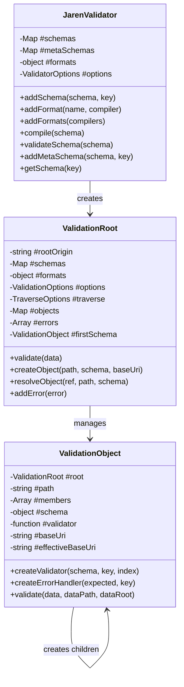

### ValidationRoot

The compilation context that:
- Maintains the schema registry (URI → Schema mapping)
- Manages format validators
- Houses all compiled ValidationObjects
- Collects validation errors
- Provides `$ref` resolution services

### ValidationObject

Represents a single schema location with its compiled validator:
- **Identity**: URI path identifying this schema object
- **State**: The schema definition and compiled validator function
- **Relationships**: Parent root reference, child members
- **Behavior**: Creates child validators, handles error generation

---

## Compilation Pipeline

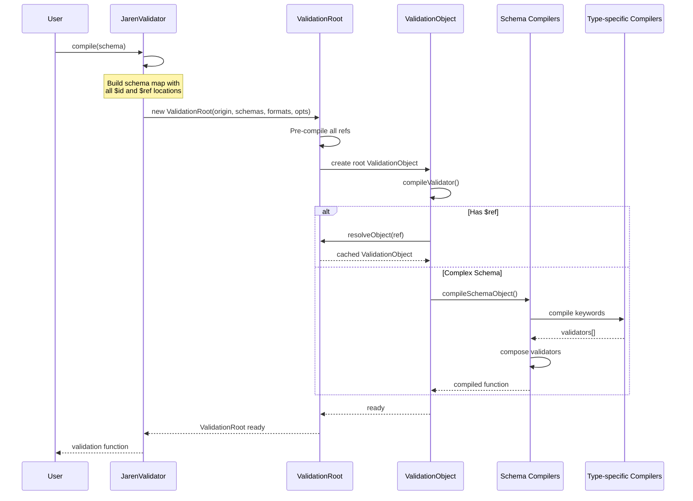

---

## Schema Compilation Flow

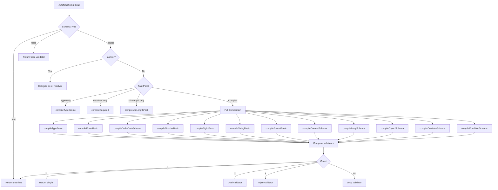

---

## Keyword Compiler Architecture

Each keyword module follows a consistent pattern:

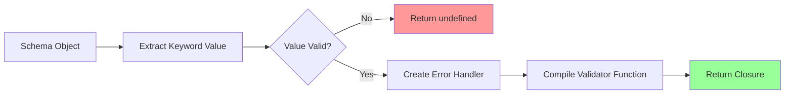

### Example: String Keyword Compilation

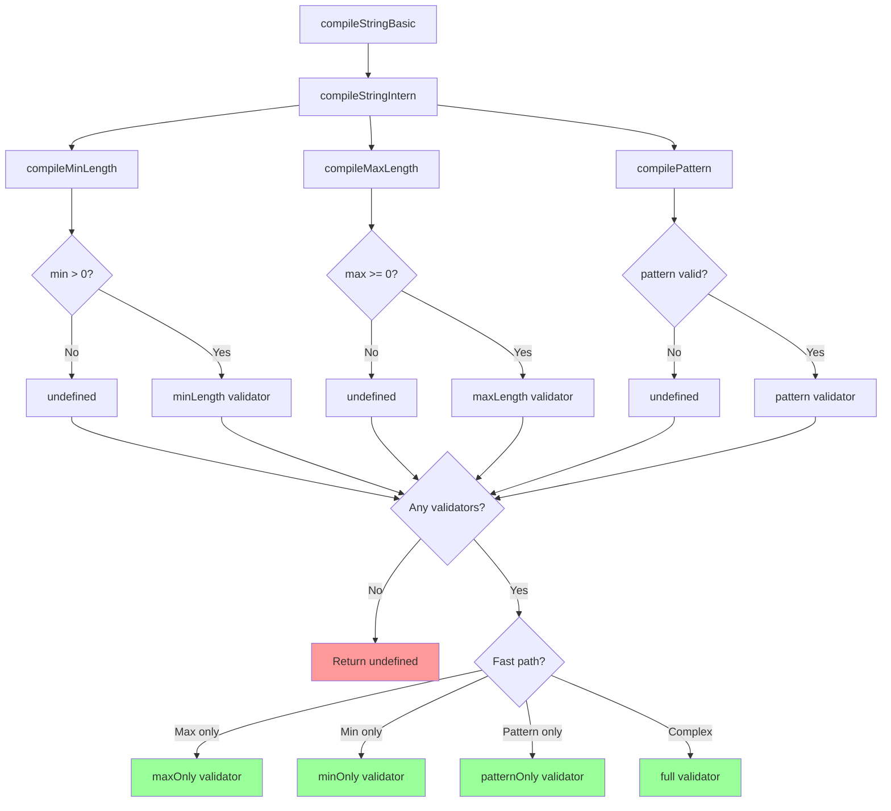

---

## Reference Resolution System

The `$ref` resolution is one of the most critical performance optimizations. Rather than resolving references at validation time, all references are pre-compiled:

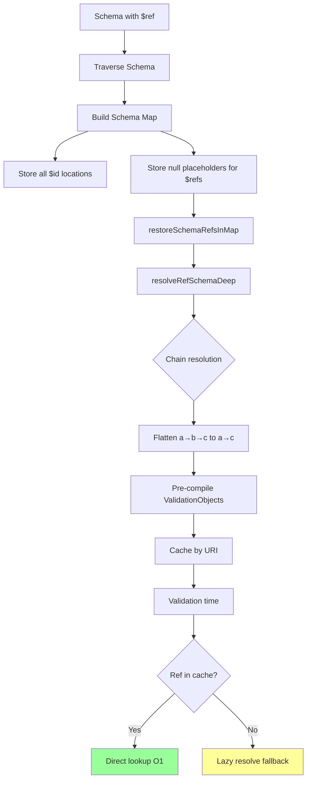

### JSON Pointer Handling

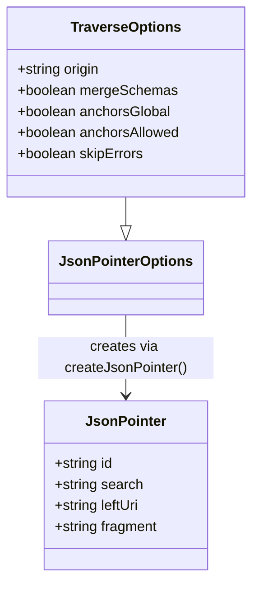

---

## Data Reference Systems

The validator implements two complementary data reference mechanisms:

```mermaid
flowchart TB
    subgraph "$data Keyword Ajv-style"
        A1[Relative JSON Pointer] --> A2[resolveRelativePointer]
        A2 --> A3[Access parent/ancestor data]
        A3 --> A4[Dynamic constraint values]
        A4 --> A5[Example: maximum: {$data: '1/larger'}]
    end

    subgraph "data Keyword json-everything-style"
        B1[JSON Pointer Path] --> B2[resolveDataRef]
        B2 --> B3[Access from data root]
        B3 --> B4[Cross-property validation]
        B4 --> B5[Example: data: {minimum: '/A'}]
    end

    A5 --> C[Runtime value resolution]
    B5 --> C
```

---

## Error Handling Architecture

```mermaid
flowchart LR
    A[Validation Failure] --> B{skipErrors?}

    B -->|true| C[Return false only]
    B -->|false| D[Create InternalValidationError]

    D --> E[Store in ValidationRoot.errors]
    E --> F[Continue validation]

    F --> G[All validators complete]
    G --> H{collectErrors?}

    H -->|true| I[convertInternalErrors - messages.js]
    H -->|false| J[Return boolean only]

    I --> K[Extract params, resolve msgid,<br/>match errorMessage registry,<br/>render through catalog]
    K --> L[Return {valid, errors}]

    style C fill:#9f9
    style J fill:#9f9
    style L fill:#9f9
```

### Report-Time Messages (messages.js)

Conversion is structured-first, render-late (the normative spec is
[docs/ERROR-MESSAGES.md](./docs/ERROR-MESSAGES.md)):

- Every public `ValidationError` carries a stable `msgid` (the matched
  `errorMessage` spec's `$msgid`, else the `$query` runtime code, else the
  keyword) plus raw `params`; `instancePath` is a straight read of the
  first meta argument every handler call site passes (the
  handler-contract invariant), behind a charCode guard that yields `''`
  rather than ever a wrong path.
- The `errorMessage` keyword compiles at schema compile time into a
  registry on `ValidationRoot` (`registerErrorMessage`) — no validator
  closure is emitted and the single-keyword fast paths stay eligible (the
  key count excludes it). Matching happens only over the failed set:
  nearest registered ancestor by segment-aware prefix; map-form entries
  and `_` apply at the node itself, the string form covers the subtree.
- Human text renders through catalogs — plain objects of closures /
  template strings (`messagesEn` built in; packs in `@jarenjs/locales`).
  `localizeErrors(errors, catalog)` re-renders post hoc from
  `msgid` + `params`; the `messages: false` option skips rendering
  entirely (`message: ''`).

### Error Handler Creation

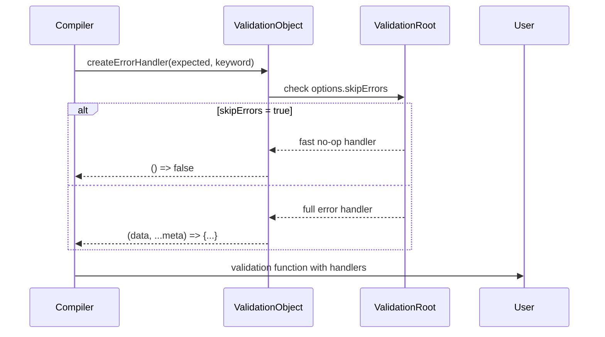

---

## Performance Optimizations

### 1. Fast Path Specialization

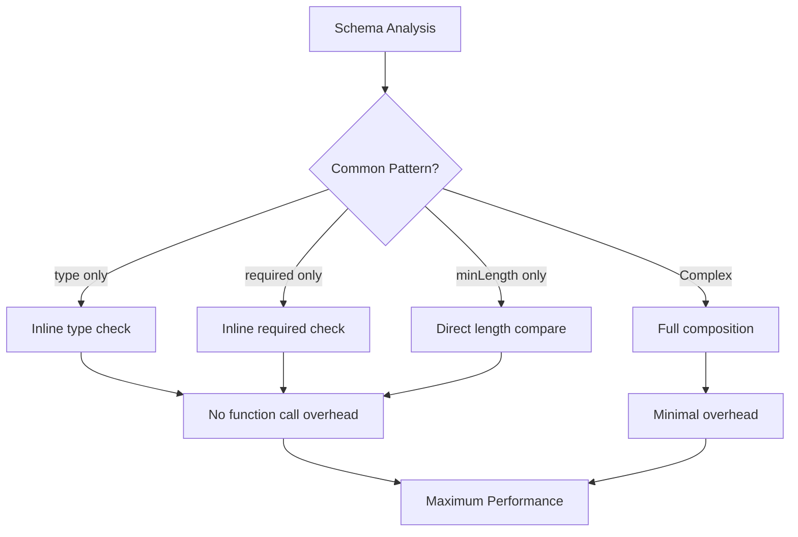

### 2. Validator Composition Strategies

Based on the number of validators, different composition strategies are used:

| Validator Count | Strategy | Implementation |
|-----------------|----------|----------------|
| 0 | No-op | `trueThat` |
| 1 | Direct | Return validator directly |
| 2 | Unrolled | `return v1(data) && v2(data)` |
| 3 | Unrolled | `return v1(data) && v2(data) && v3(data)` |
| 4+ | Loop | `for (let i = 0; i < n; i++)` |

### 3. String Length Optimization

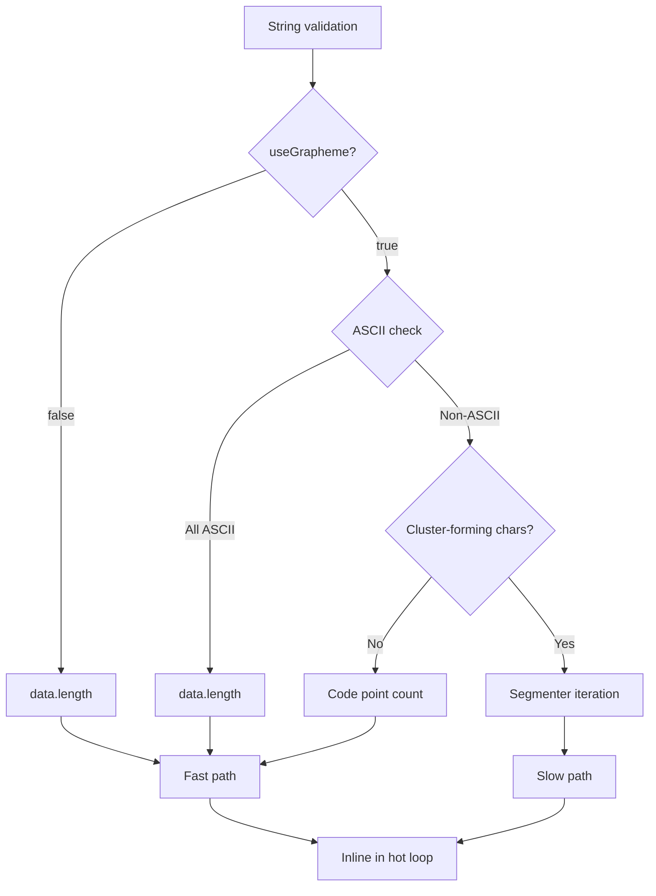

---

## Module Dependencies

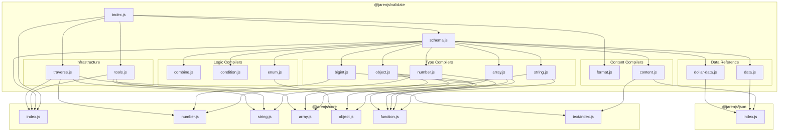

---

## Extension Points

### Format Registration

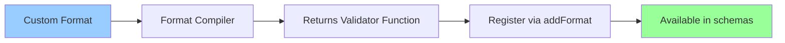

### Custom Keywords

To add custom keywords, you would extend the compilation pipeline in `schema.js`:

```javascript
// In compileSchemaObject or a new module
function compileCustomKeyword(schemaObj, jsonSchema) {
  if (jsonSchema.myKeyword === undefined) return undefined;

  const addError = schemaObj.createErrorHandler(value, 'myKeyword');

  return function validateMyKeyword(data, dataPath) {
    // Custom validation logic
    return isValid(data) || addError(data, dataPath);
  };
}
```

---

## Testing Strategy

The architecture supports comprehensive testing at multiple levels:

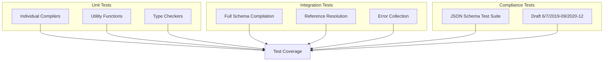

---

## Data Structures

### schemasMap Structure

```typescript
Map<string, schema | null> {
  // Root schemas
  "http://example.com/schema#" → { type: "object", properties: {...} }

  // Internal refs (after Phase 2, these point to final schemas)
  "#/$defs/foo" → { type: "string" }  // Flattened: was A→B→C, now A→C
  "#/$defs/bar" → { $ref: "#/$defs/foo" }  // If not yet resolved

  // Anchors
  "http://example.com/schema#myAnchor" → { type: "number" }
  "#myAnchor" → { type: "number" }  // Global anchor
}
```

### ValidationRoot.#objects Structure

```typescript
Map<string, ValidationObject> {
  "http://example.com/schema#" → ValidationObject {
    #path: "http://example.com/schema#",
    #validator: function validateObject(data, root) {...},
    #schema: { type: "object", ... },
    #root: ValidationRoot
  },

  "#/$defs/foo" → ValidationObject {
    #path: "#/$defs/foo",
    #validator: function validateString(data, root) {...},  // Direct reference
    #schema: { type: "string" },
    #root: ValidationRoot
  }
}
```

---

## Key Functions Reference

| Function | File | Purpose |
|----------|------|---------|
| `storeSchemaIdsInMap` | traverse.js | BFS traversal storing all schema IDs and refs |
| `resolveRefSchemaShallow` | traverse.js | Resolve single ref hop (baseUri + fragment) |
| `resolveRefSchemaDeep` | traverse.js | Follow ref chain to final schema |
| `restoreSchemaRefsInMap` | traverse.js | Flatten all ref chains at load time |
| `createJsonPointer` | traverse.js | Parse URI into components (id, leftUri, fragment) |
| `JarenValidator.compile` | index.js | Main entry point for schema compilation, draft/vocabulary selection |
| `JarenValidator.#precompileRefs` | index.js | Pre-create ValidationObjects for all refs |
| `ValidationObject.compileValidator` | index.js | Compile validator, ref combination, dynamic-anchor registration |
| `ValidationRoot.resolveObject` | index.js | Resolve ref to ValidationObject (fallback only) |
| `wrapUnevaluated` | unevaluated.js | Final-stage unevaluatedProperties/unevaluatedItems check |
| `EvalLog` | tools.js | Annotation log with mark/rollback for unevaluated* |
| `collectDynamicAnchorsDeep` | dynamic-ref.js | Gather a resource's $dynamicAnchors for scope entry |

---

## Implementation Notes

### How $ref Works

1. **Draft 7 and earlier - $ref ignores siblings**: when a schema has `$ref`, all other keywords are ignored, the referenced schema completely replaces the current schema, and a sibling `$id` does not affect `$ref` resolution
2. **Draft 2019-09 and later - $ref has siblings**: `$ref` is just another keyword; sibling keywords apply together with the referenced schema, and a sibling `$id` DOES establish the base URI the `$ref` resolves against
3. **Location-independent identifiers**: Anchors like `#foo` should be resolvable within their document
4. **Ref chain resolution happens at compile time**: pre-resolved via `restoreSchemaRefsInMap` and `#precompileRefs`

### Base URI Resolution

When schemas have `$id` that changes the base URI:

```json
{
  "$id": "http://example.com/schema",
  "$defs": {
    "nested": {
      "$id": "nested/",
      "$defs": {
        "deep": {
          "$ref": "folder/file.json"  // Resolves against http://example.com/nested/
        }
      }
    }
  }
}
```

**Resolution Rules**:
1. `$id` changes the base URI for itself and all children
2. `$ref` is resolved against the current base URI
3. Relative `$id` values resolve against the parent's base URI
4. Trailing `#` is stripped for URL resolution

### ECMAScript Regex in JSON Schema

1. **Unicode flag required**: All regex patterns use the `u` flag for proper Unicode support
2. **Unicode property escapes**: Patterns using `\p{...}` require the `u` flag
3. **Surrogate pairs**: Non-BMP characters (like emojis) are represented as surrogate pairs in JavaScript

---

## Debugging Guide

### "Can not resolve schema for 'X'"

**Cause**: The ref `X` is not in schemasMap

**Check**:
- Was the schema containing `X` added via `addSchema()`?
- Is the ref path correct in the schema?
- After `restoreSchemaRefsInMap`, all refs should have non-null values

### Performance Degradation on First Validation

**Cause**: Refs being resolved at validation time instead of compile time

**Check**:
- Is `#precompileRefs` being called in `compile()`?
- Are ValidationObjects being created for all refs?
- Verify: `compileValidator` should find targets immediately without fallback

### Test Interference (tests pass individually but fail together)

**Cause**: Global shared state between validators

**Check**:
- Are you using a global cache? (Don't)
- Solution: All state should be per-ValidationRoot or per-JarenValidator

### Debugging Ref Resolution

Enable debug logging in traverse.js:

```javascript
// In packages/validate/src/traverse.js
console.log('Resolving ref:', ref, 'against baseUri:', baseUri);
```

---

## Related Documentation

For broader context on how this package fits into the JarenJS ecosystem:

- **Project-wide Architecture**: See `/ARCHITECTURE.md` at the project root
- **Developer Guide**: See `/HOWTO.md` at the project root
- **Core Package**: Depends on `@jarenjs/core` for fundamental utilities and `@jarenjs/json` for the JSON addressing standards

---

## Key Files Reference

| File | Purpose | Key Exports |
|------|---------|-------------|
| `index.js` | Public API | `JarenValidator`, `ValidationOptions`, `ValidatorOptions` |
| `messages.js` | Error conversion & i18n | `ValidationError`, `convertInternalErrors`, `messagesEn`, `compileMessageTemplate`, `compileMessageCatalog`, `renderErrorMessage`, `localizeErrors`, `compileErrorMessageSpec` |
| `schema.js` | Schema compilation | `compileSchemaObject` |
| `traverse.js` | Schema traversal | `TraverseOptions`, `storeSchemaIdsInMap`, `resolveRefSchemaDeep` |
| `tools.js` | Shared utilities | `isBoolOrObjectClass`, `hasSchemaRef`, `createIsSchemaTypeHandler` |
| `string.js` | String keywords | `compileStringBasic` |
| `number.js` | Number keywords | `compileNumberBasic` |
| `bigint.js` | BigInt keywords | `compileBigIntBasic` |
| `array.js` | Array keywords | `compileArraySchema` |
| `object.js` | Object keywords | `compileObjectSchema` |
| `combine.js` | Logic keywords | `compileCombineSchema` |
| `condition.js` | If/then/else | `compileConditionSchema` |
| `enum.js` | Enum/const | `compileEnumBasic` |
| `format.js` | Format registry | `registerFormatCompiler`, `compileFormatBasic` |
| `content.js` | Content encoding | `compileContentSchema` |
| `data.js` | Data keyword | `compileDataSchema` |
| `dollar-data.js` | $data keyword | `compileDollarDataSchema` |
| `unevaluated.js` | unevaluated* keywords | `wrapUnevaluated` |
| `dynamic-ref.js` | Dynamic scope helpers | `collectDynamicAnchorsDeep`, `hasRecursiveAnchor`, `getDynamicAnchorName` |
| `query-keyword.js` | `$query` extension keyword | `compileQuerySchema` |

---

## Architectural Decisions

### 1. Compilation over Interpretation

**Decision**: Compile schemas to functions rather than interpret them at runtime.

**Rationale**:
- Eliminates schema traversal during validation
- Enables V8 optimization of hot paths
- Allows fast-path specialization

**Trade-off**: Higher memory usage for storing compiled functions.

### 2. Pre-compiled References

**Decision**: Resolve all `$ref` at compile time, not validation time.

**Rationale**:
- Eliminates recursive lookup overhead during validation
- Flattens reference chains (a→b→c becomes a→c)
- Enables circular reference detection at compile time

### 3. Lazy Error Generation

**Decision**: Only create error objects when `skipErrors` is false, and
only produce human-readable text at report time (`convertInternalErrors`
in messages.js), over the already-failed set, from a `msgid` + `params`
pair through a message catalog.

**Rationale**:
- Most production use cases only need boolean results
- Error object creation is expensive
- Reduces GC pressure during high-throughput validation
- Structured-first errors make locale a report-time choice: switching
  language (`localizeErrors`, `@jarenjs/locales`) never recompiles a
  validator, and the `errorMessage` keyword resolves against a registry
  with zero validation-time cost (see docs/ERROR-MESSAGES.md)

### 4. Dual Data Reference Systems

**Decision**: Support both `$data` (Ajv-style) and `data` (json-everything-style) keywords.

**Rationale**:
- Maximizes compatibility with existing schema ecosystems
- Different use cases favor different reference styles
- Minimal overhead when not used

### 5. Annotation Tracking via a Shared Log

**Decision**: Implement `unevaluatedProperties`/`unevaluatedItems` with a per-root `EvalLog` of `(instance, key)` pairs and mark/rollback semantics, compiled in only when the schema set uses these keywords.

**Rationale**:
- Instance-identity keying makes annotations flow correctly through `$ref` chains and recursion without threading context through every validator signature
- mark/rollback gives failed applicator branches (anyOf/oneOf/not/if) exact annotation-discarding semantics
- The compile-time feature scan keeps schemas without unevaluated* keywords completely free of tracking overhead

### 6. Dynamic Scope as Per-Anchor Stacks

**Decision**: Track the dynamic scope for `$recursiveRef`/`$dynamicRef` as per-anchor-name validator stacks, pushed on resource entry (root validation and `$ref` crossings) and popped on exit.

**Rationale**:
- Entering a resource registers ALL of its `$dynamicAnchor`s (collected once at compile time), matching the specification's resource-based dynamic scope
- Outermost-first resolution is a bottom-of-stack read
- Balanced push/pop via try/finally keeps the scope correct across validation failures

---

*This document was generated for contributors to understand the architecture of @jarenjs/validate. For implementation details, refer to the source code and inline JSDoc comments.*
