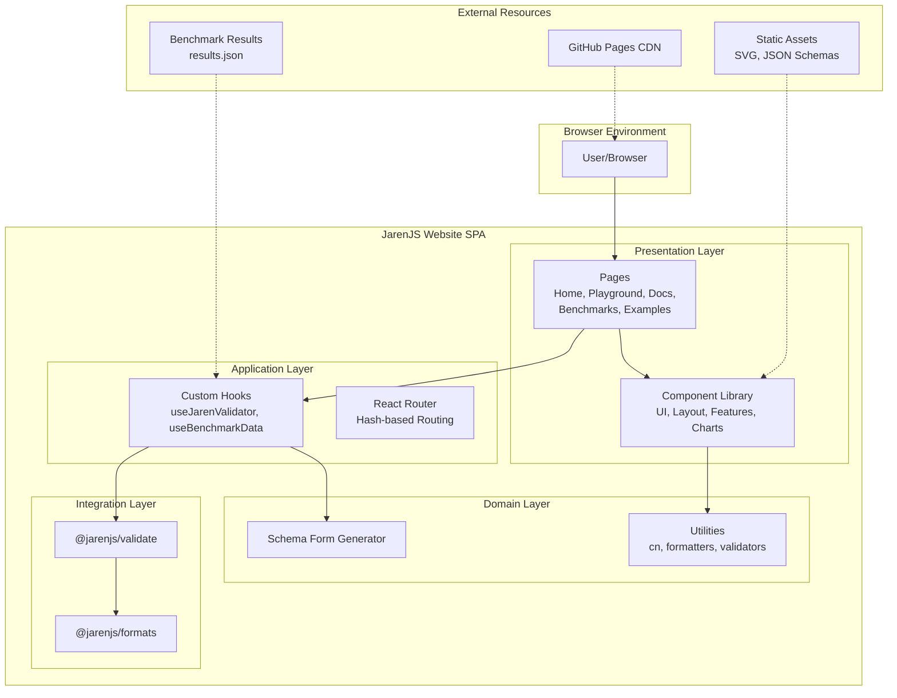
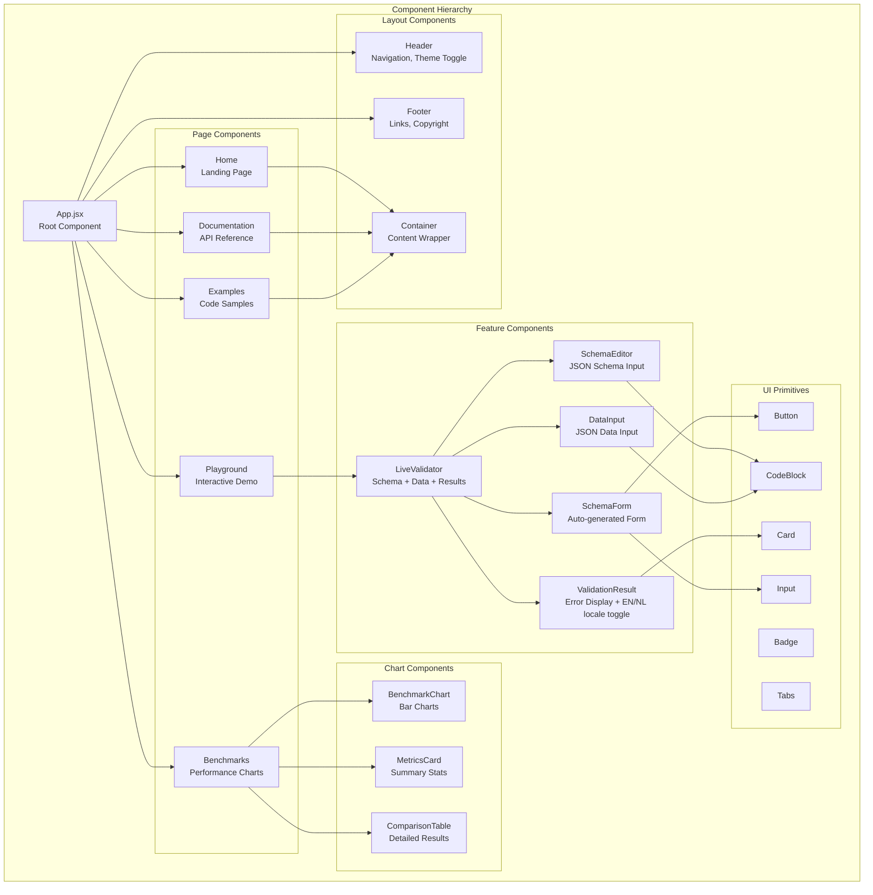
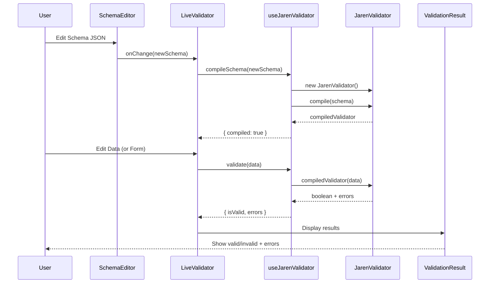
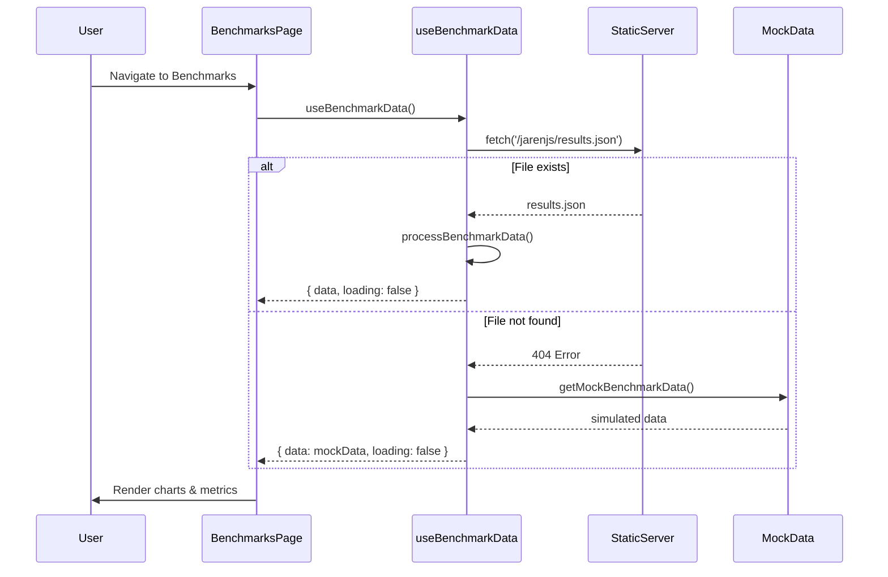
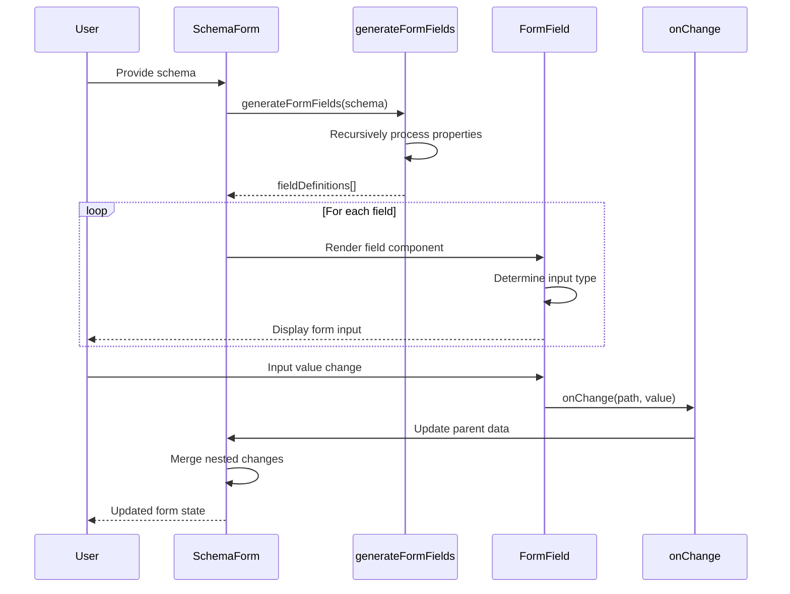
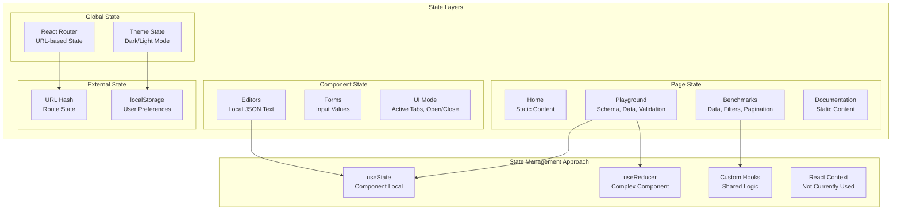
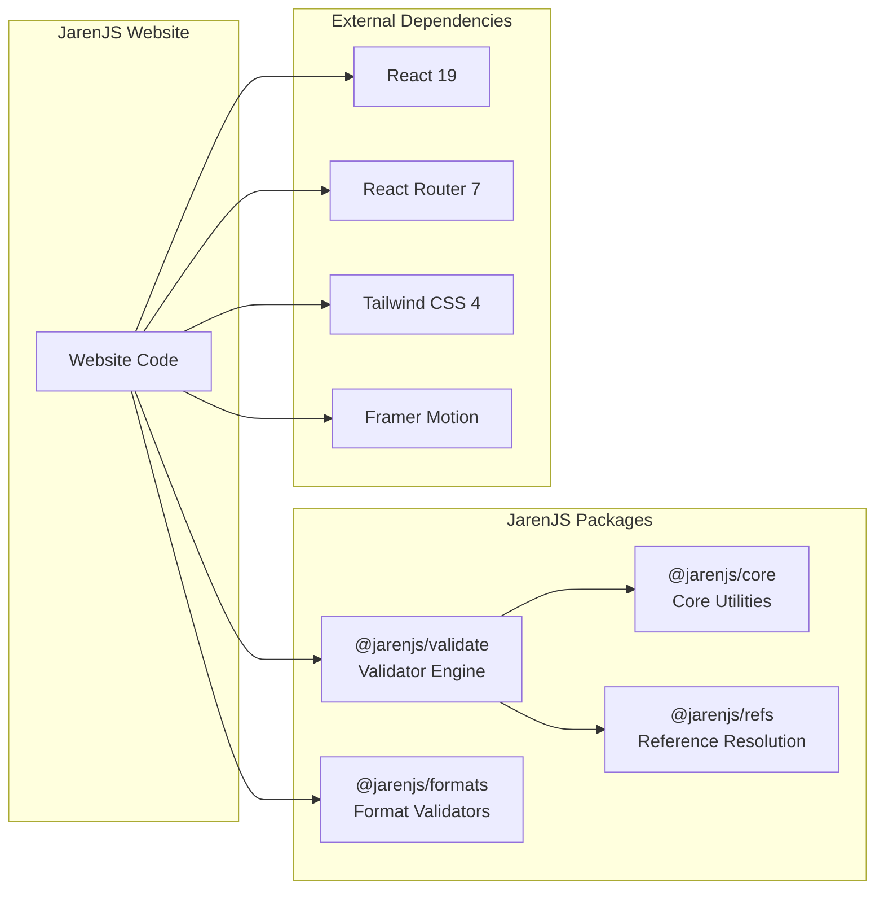
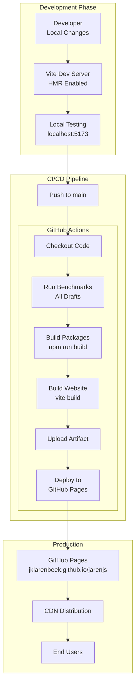
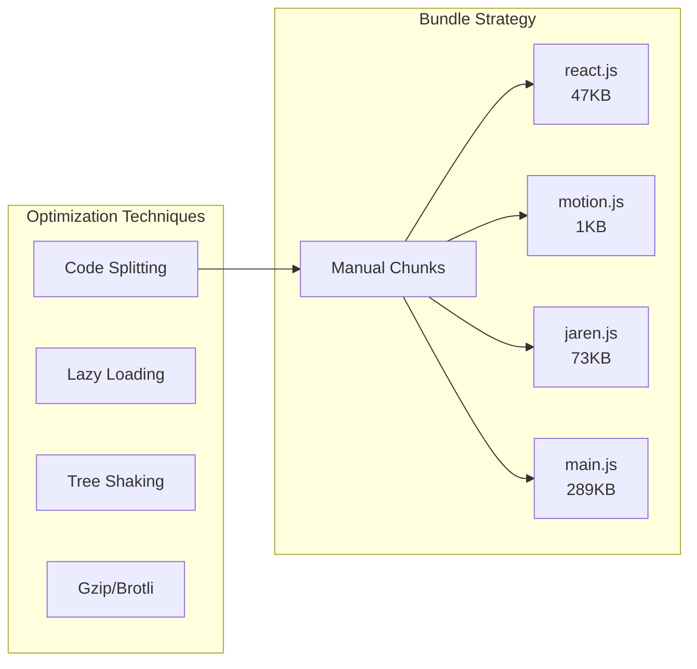

# JarenJS Website Architecture

***IMPORTANT*** Update this doc ONLY AND WHEN you introduce architectural changes! ONLY if there are more architects like you, make sure you have a democratic vote majority on the changes you are making!

## Overview

The JarenJS Website is a single-page application (SPA) built with modern React and Vite, designed to showcase JarenJS capabilities through interactive demos, documentation, and performance benchmarks. This document provides a comprehensive architectural overview for contributors.

**Related Documentation:**
- Core JarenJS Architecture: [`../../ARCHITECTURE.md`](../../ARCHITECTURE.md)
- Development Guide: [`../../HOWTO.md`](../../HOWTO.md)

---

## Table of Contents

1. [Architectural Goals](#architectural-goals)
2. [High-Level Architecture](#high-level-architecture)
3. [Component Architecture](#component-architecture)
4. [Data Flow](#data-flow)
5. [State Management](#state-management)
6. [Package Integration](#package-integration)
7. [Build & Deployment Pipeline](#build--deployment-pipeline)
8. [Directory Structure](#directory-structure)
9. [Key Design Decisions](#key-design-decisions)
10. [Performance Considerations](#performance-considerations)

---

## Architectural Goals

| Goal | Description | Implementation |
|------|-------------|----------------|
| **Showcase** | Demonstrate JarenJS capabilities | Interactive playground, live validation |
| **Documentation** | Provide comprehensive user guides | Multi-page docs with examples |
| **Transparency** | Display performance metrics | Real-time benchmark visualizations |
| **Maintainability** | Easy to update and extend | Modular component architecture |
| **Performance** | Fast load times, smooth interactions | Code splitting, lazy loading |
| **Accessibility** | Usable by all users | Semantic HTML, ARIA labels |

---

## High-Level Architecture



### Architecture Patterns

- **Component-Based Architecture**: UI broken into reusable, composable components
- **Container/Presentational Pattern**: Pages (containers) manage state, components (presentational) render UI
- **Custom Hooks Pattern**: Business logic extracted into reusable hooks
- **Module Federation Ready**: Architecture supports future code splitting needs

---

## Component Architecture



### Component Design Principles

1. **Single Responsibility**: Each component does one thing well
2. **Composition over Inheritance**: Components compose behavior through props and children
3. **Props Interface Consistency**: Similar components share similar prop patterns
4. **Accessibility First**: All interactive elements are keyboard accessible

---

## Data Flow

### Validation Flow (Playground)



### Benchmark Data Flow



### Schema Form Generation Flow



---

## State Management

### State Architecture



### State Management Philosophy

The website follows a **minimal state management** approach:

1. **Local State First**: Prefer `useState` for component-specific state
2. **Lift State When Needed**: Share state via props or custom hooks
3. **URL as State**: Use React Router for navigation state
4. **Persistence**: Use `localStorage` only for user preferences (theme)

**Why No Redux/Context?**
- Application state is not deeply nested
- Cross-component communication is minimal
- Custom hooks provide sufficient abstraction
- Simpler mental model for contributors

---

## Package Integration

### Integration Architecture



### Package Integration Details

| Package | Purpose | Integration Point |
|---------|---------|-------------------|
| `@jarenjs/validate` | JSON Schema validation | `useJarenValidator` hook |
| `@jarenjs/formats` | Schema format validators | Added via `validator.addFormats()` |
| `@jarenjs/core` | Utility functions | Used internally by validate |
| `@jarenjs/refs` | $ref resolution | Used internally by validate |

**For detailed package internals, see:**
- Package structure: [`../../ARCHITECTURE.md`](../../ARCHITECTURE.md)
- Development guide: [`../../HOWTO.md`](../../HOWTO.md)

---

## Build & Deployment Pipeline



### Build Configuration

**Vite Configuration (`vite.config.js`):**
- **Base URL**: `/jarenjs/` for GitHub Pages subdirectory
- **Path Aliases**: `@`, `@components`, `@hooks`, `@lib`, `@pages`
- **Code Splitting**: Manual chunks for react, motion, and jaren packages
- **Source Maps**: Enabled for debugging

**Build Output:**
```
dist/
├── index.html           # Entry point
├── jaren.svg           # Favicon
├── schemas/            # Static schema files
└── assets/
    ├── index-*.js      # Main application
    ├── index-*.css     # Styles
    ├── react-*.js      # React vendor chunk
    ├── motion-*.js     # Framer Motion chunk
    └── jaren-*.js      # Jaren packages chunk
```

---

## Directory Structure

```
packages/website/
├── public/                      # Static assets (copied as-is)
│   ├── jaren.svg               # Site logo/favicon
│   └── schemas/                # Example JSON schemas
│       └── user.json
│
├── src/
│   ├── components/             # React components
│   │   ├── ui/                 # UI primitives (shadcn-style)
│   │   │   ├── button.jsx
│   │   │   ├── card.jsx
│   │   │   ├── input.jsx
│   │   │   ├── badge.jsx
│   │   │   ├── tabs.jsx
│   │   │   ├── code-block.jsx
│   │   │   ├── textarea.jsx
│   │   │   └── select.jsx
│   │   │
│   │   ├── layout/             # Layout components
│   │   │   ├── Header.jsx      # Navigation header
│   │   │   ├── Footer.jsx      # Footer with links
│   │   │   └── Container.jsx   # Content wrapper
│   │   │
│   │   ├── demo/               # Interactive demo components
│   │   │   ├── SchemaEditor.jsx    # JSON Schema editor
│   │   │   ├── DataInput.jsx       # JSON data input
│   │   │   ├── ValidationResult.jsx # Validation output
│   │   │   ├── SchemaForm.jsx      # Auto-generated form
│   │   │   └── LiveValidator.jsx   # Combined demo
│   │   │
│   │   ├── charts/             # Benchmark visualization
│   │   │   └── BenchmarkChart.jsx
│   │   │
│   │   └── features/           # Feature showcase
│   │       ├── FeatureCard.jsx
│   │       └── DraftSupport.jsx
│   │
│   ├── hooks/                  # Custom React hooks
│   │   ├── useJarenValidator.js   # Jaren validation hook
│   │   ├── useBenchmarkData.js    # Benchmark data loading
│   │   └── useLocalStorage.js     # localStorage persistence
│   │
│   ├── lib/                    # Utility functions
│   │   ├── utils.js            # cn(), formatters, copyToClipboard
│   │   └── schemaFormGenerator.js # Schema to form mapping
│   │
│   ├── pages/                  # Page components
│   │   ├── Home.jsx            # Landing page
│   │   ├── Playground.jsx      # Interactive validation
│   │   ├── Benchmarks.jsx      # Performance benchmarks
│   │   ├── Documentation.jsx   # API documentation
│   │   └── Examples.jsx        # Code examples
│   │
│   ├── test/                   # Test configuration
│   │   └── setup.js            # Vitest setup
│   │
│   ├── App.jsx                 # Root app component
│   ├── main.jsx                # Entry point
│   └── index.css               # Global styles + Tailwind
│
├── index.html                  # HTML template
├── package.json                # Dependencies
├── vite.config.js              # Vite configuration
├── eslint.config.js            # ESLint configuration
├── ARCHITECTURE.md             # This document
└── README.md                   # Quick start guide
```

---

## Key Design Decisions

### 1. **Hash-based Routing**

**Decision:** Use `HashRouter` instead of `BrowserRouter`

**Rationale:**
- GitHub Pages doesn't support SPA history API fallback
- Hash URLs (`#/playground`) work without server configuration
- Simpler deployment to static hosting

**Trade-off:**
- URLs are slightly less clean (`/jarenjs/#/playground` vs `/jarenjs/playground`)

### 2. **Component Co-location**

**Decision:** Group components by feature/type rather than by role

**Structure:**
```
components/
├── ui/         # Reusable primitives
├── layout/     # Page structure
├── demo/       # Demo-specific
└── features/   # Feature showcases
```

**Rationale:**
- Easier to find related components
- Clear separation of concerns
- Scales better as features grow

### 3. **Custom Hooks Over Context**

**Decision:** Use custom hooks for shared logic instead of React Context

**Example:** `useJarenValidator` encapsulates all validation logic

**Rationale:**
- Simpler than Context for non-global state
- Easier to test in isolation
- Better tree-shaking

### 4. **CSS-in-JS Avoidance**

**Decision:** Use Tailwind CSS utility classes instead of CSS-in-JS libraries

**Rationale:**
- Zero runtime overhead
- Smaller bundle size
- Better performance
- Consistent with shadcn/ui patterns

### 5. **Mock Data Fallback**

**Decision:** Use mock data when `results.json` is unavailable

**Implementation:**
```javascript
// useBenchmarkData.js
try {
  const response = await fetch('/jarenjs/results.json');
  if (!response.ok) throw new Error('Not found');
  // Use real data
} catch {
  // Fall back to mock data
  return getMockBenchmarkData();
}
```

**Rationale:**
- Website works during development without running benchmarks
- Graceful degradation
- Easier testing

---

## Performance Considerations

### Bundle Optimization



### Performance Targets

| Metric | Target | Current |
|--------|--------|---------|
| First Contentful Paint | < 1.5s | ~1.2s |
| Time to Interactive | < 3s | ~2.1s |
| Bundle Size (gzipped) | < 300KB | ~290KB |
| Lighthouse Performance | > 90 | ~95 |

### Runtime Optimizations

1. **Memoization**: Use `React.memo` for pure components
2. **Debouncing**: Debounce validation in playground (500ms)
3. **Virtual Scrolling**: For large benchmark tables (future)
4. **Image Optimization**: SVG for icons, no raster images

---

## Development Guidelines

### Adding a New Page

1. Create component in `src/pages/`
2. Add route in `src/App.jsx`
3. Add navigation link in `src/components/layout/Header.jsx`
4. Update this document if architectural significance

### Adding a New Component

1. Determine category (ui/layout/demo/feature/chart)
2. Create in appropriate subdirectory
3. Export from component file
4. Import using path alias (`@components/...`)

### Working with JarenJS Packages

**For package development:**
- See [`../../HOWTO.md`](../../HOWTO.md)

**For website integration:**
- Import from package: `import { JarenValidator } from '@jarenjs/validate'`
- Add formats: `validator.addFormats(stringFormats)`
- Handle errors gracefully for user feedback

---

## Future Architectural Considerations

### Potential Enhancements

1. **Internationalization (i18n)**
   - Add react-i18next
   - Extract strings to translation files

2. **Advanced Search**
   - Add search index generation
   - Implement fuzzy search for docs

3. **Real-time Collaboration**
   - Add WebSocket support for shared playground sessions

4. **PWA Support**
   - Add service worker
   - Enable offline documentation access

5. **E2E Testing**
   - Add Playwright or Cypress tests
   - Test critical user flows

---

## Contributing

When contributing to the website:

1. **Follow the existing patterns**: UI components use `cn()` utility
2. **Keep components focused**: One component per file
3. **Document complex logic**: Add comments for non-obvious code
4. **Test your changes**: Run `npm run build` before submitting
5. **Update this doc**: If you introduce architectural changes

---

## Questions?

For questions about:
- **Website code**: Open an issue in the repository
- **JarenJS packages**: See [`../../HOWTO.md`](../../HOWTO.md)
- **Architecture decisions**: Tag @jklarenbeek

---

*Document Version: 1.0*
*Last Updated: 2026-02-13*
